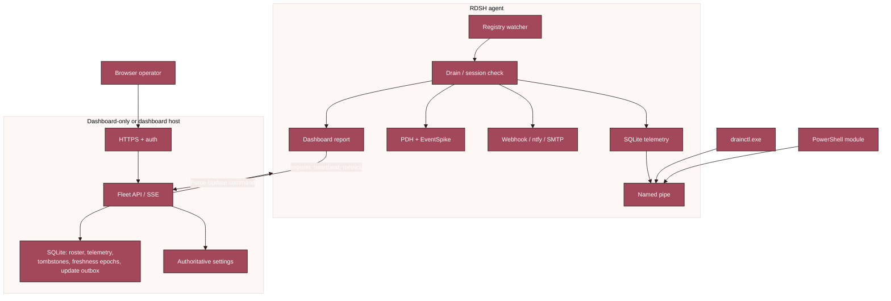

<p align="center">
  
</p>

<h1 align="center">LISSTech DrainCtl</h1>

<p align="center"><strong>Real-time RDSH drain-mode monitoring for Windows Server.<br/>Knows what changed, who changed it, and when — instantly.</strong></p>

<p align="center">
  
  
  
  
</p>

<p align="center">
  <a href="https://github.com/LISSConsulting/LISSTech.DrainCtl/releases/latest"></a>
  <a href="https://www.powershellgallery.com/packages/LISSTech.DrainCtl"></a>
</p>

DrainCtl is stable for production deployment. Install a lightweight Windows service on each RDSH host and, when needed, a dashboard-only coordinator for fleet visibility. Signed upgrades preserve configuration, telemetry, removed-server tombstones, the force-update outbox, EventSpike baseline and warm-up state, and protected crash-investigation artifacts.

**Operator docs:** [landing page](https://lissconsulting.github.io/LISSTech.DrainCtl/) · [setup guide](https://lissconsulting.github.io/LISSTech.DrainCtl/guide.html) · [latest stable release](https://github.com/LISSConsulting/LISSTech.DrainCtl/releases/latest)

```powershell
Install-Module LISSTech.DrainCtl
```

---

<h2 id="what-it-is">▎ What it is</h2>

A Windows service that watches `TSServerDrainMode` on RDSH hosts and tells you:

- **What changed** — open/drain/restart/denied, with sub-millisecond detection.
- **Who changed it** — Security event 4657 attribution, joined to the registry change.
- **When it changed** — append-only audit trail, persisted to local SQLite.
- **What it cost you** — CPU, memory, input delay, sessions, RemoteFX, and event-log anomalies, each on a per-poll cycle with threshold alerts.

Query from CLI, PowerShell, or your RMM. Local answers come from a named pipe in under 1 ms; registered agents report to the dashboard for fleet operations. No cloud is required, and DNS SRV discovery eliminates per-host dashboard URLs when your domain publishes `_drainctl._tcp`.


---

<h2 id="latest-release">▎ Latest stable release</h2>

The [latest stable release](https://github.com/LISSConsulting/LISSTech.DrainCtl/releases/latest) completes the runtime-resilience work while preserving existing fleet workflows:

- **Bounded service recovery** — Windows SCM restarts the first and second unexpected service exits after five seconds, then leaves a third failure stopped; the failure count resets after one day.
- **Protected local crash evidence** — WER LocalDumps creates up to three `drainctld.exe` mini dumps in a SYSTEM/Administrators-only ProgramData directory. DrainCtl never uploads or adds dump contents to telemetry.
- **Durable host freshness** — SQLite-backed report epochs survive dashboard restarts and produce one additive offline and one recovery SSE event per outage without changing the compatible `server_update` event.
- **Trustworthy RemoteFX history** — local and remote reports reject invalid values before persistence; inactive zero FPS/quality becomes a chart gap while valid lower-is-better zeroes remain meaningful.
- **Incident-ready diagnostics** — the installed hourly collector records service recovery policy, WER settings, crash events, and metadata-only dump inventory in protected local storage.

[Download the latest stable MSI](https://github.com/LISSConsulting/LISSTech.DrainCtl/releases/latest), install the [PowerShell module](https://www.powershellgallery.com/packages/LISSTech.DrainCtl), or use the [operator guide](https://lissconsulting.github.io/LISSTech.DrainCtl/guide.html).
---

<h2 id="toc">▎ Table of contents</h2>

[Latest stable release](#latest-release) · [Architecture](#architecture) · [Install](#install) · [Quick start](#quick-start) · [CLI](#cli) · [PowerShell](#powershell) · [Service](#service) · [Crash diagnostics](#crash-diagnostics) · [Notifications](#notifications) · [EventSpike](#evtspike) · [Configuration](#configuration) · [Telemetry & charts](#telemetry-charts) · [Troubleshooting](#troubleshooting) · [Audit setup](#audit-setup) · [Build](#build) · [Project layout](#project-layout) · [License](#license)

---

<h2 id="architecture">▎ Architecture</h2>





---

<h2 id="install">▎ Install</h2>

### MSI (recommended)

```powershell
msiexec /i LISSTech.DrainCtl.msi /qn
```

Lays down:

```
C:\Program Files\LISS Technologies\LISSTech DrainCtl\
  ├── bin\                 drainctl.exe + drainctld.exe + drainctl.dll
  ├── Scripts\             collect-diags.ps1, install-diag-task.ps1
  └── Tasks\               DrainCtl-Diags.xml (disabled hourly diagnostics)

C:\Program Files\WindowsPowerShell\Modules\LISSTech.DrainCtl\
  ├── LISSTech.DrainCtl.psd1
  └── LISSTech.DrainCtl.psm1

C:\ProgramData\LISS Technologies\LISSTech DrainCtl\
  ├── config.json          atomic-write JSON, hot-reloaded, preserved across upgrades
  ├── drainctl.db          SQLite telemetry (WAL)
  ├── drainctl*.log        active and rotated service logs
  ├── baseline.json        event-spike detector state
  ├── update-state.json    updater replay-defense state
  ├── dashboard-tls.*      auto-generated or installed dashboard certificate
  ├── updates\             downloaded update packages
  ├── dumps\               permanent WER mini dumps; SYSTEM/Administrators only
  └── diags\               permanent diagnostic output; SYSTEM/Administrators only

Service                    DrainCtl, auto-start, LocalSystem
                             SCM recovery: restart after failures 1 and 2 in 5 s;
                             no third restart; reset failure count after 1 day
ETW provider               LISS Technologies-DrainCtl (Operational + Debug)
Event log source           DrainCtl
```

Register an agent with a dashboard:

```powershell
msiexec /i LISSTech.DrainCtl.msi /qn `
  INSTALL_MODE=registration `
  DASHBOARD_URL=https://dash.example.com:49470
```

Install a dashboard-only coordinator, then configure it before the first service start (or edit the hot-reloaded file):

```powershell
msiexec /i LISSTech.DrainCtl.msi /qn INSTALL_MODE=dashboard DASHBOARD_PORT=49470

$path = "$env:ProgramData\LISS Technologies\LISSTech DrainCtl\config.json"
$config = Get-Content $path -Raw | ConvertFrom-Json
$config.dashboard_only = $true
$config | ConvertTo-Json -Depth 10 | Set-Content $path
Restart-Service DrainCtl
```

Dashboard-only mode runs the listener, authentication, SQLite, and retention only. It does **not** monitor the coordinator's drain state, collect performance or EventSpike data, register or report as an agent, send notifications, or run the updater.

The installer also creates protected, permanent `dumps` and `diags` directories and configures WER LocalDumps for `drainctld.exe` only: mini dumps, maximum three files. The installed `\LISS Technologies\DrainCtl-Diags` task is disabled until an operator enables it; once enabled, it runs hourly. Full uninstall removes the WER policy and diagnostic task but retains those protected directories and their contents for incident retention.

> Upgrading from v26-pre-007? First service start auto-migrates `audit.jsonl` into the SQLite store and renames the source file. No manual steps.

### PowerShell Gallery (module only)

```powershell
Install-Module -Name LISSTech.DrainCtl -Scope AllUsers
```

Cmdlets only — no service, no CLI. Queries hit the registry directly. See [PSGallery](https://www.powershellgallery.com/packages/LISSTech.DrainCtl).

### Manual (CLI only)

Copy `drainctl.exe` somewhere on PATH and run it. Service is optional.

---

<h2 id="quick-start">▎ Quick start</h2>

```powershell
PS> drainctl check
2026-04-29T13:03:01-04:00 [INF] source=service
2026-04-29T13:03:01-04:00 [INF] host=RDSH01
2026-04-29T13:03:01-04:00 [INF] drain_mode=ALLOW_ALL_CONNECTIONS value=0
2026-04-29T13:03:01-04:00 [INF] state_since=2026-04-29T11:24:05-04:00 state_duration=1h38m56s
2026-04-29T13:03:01-04:00 [INF] grace_period=1h0m0s
2026-04-29T13:03:01-04:00 [INF] sessions=12 active / 3 disconnected / 15 total (60% of 25)
2026-04-29T13:03:01-04:00 [OK ] status=Healthy connections_allowed=true exit=0

PS> drainctl check --format json | ConvertFrom-Json
PS> drainctl history --limit 5

PS> Get-RDSHDrainMode | Format-List
PS> if (Test-RDSHDrainMode) { 'OK' } else { 'ALERT' }
PS> Get-RDSHDrainHistory -ChangesOnly -Limit 10
```

---

<h2 id="cli">▎ CLI</h2>

```
drainctl check                Check drain-mode state
drainctl history              View audit trail
drainctl audit-setup          Configure registry auditing (one-time, admin)
drainctl service install      Install Windows service
drainctl service uninstall    Remove Windows service
drainctl service start        Start the service
drainctl service stop         Stop the service
drainctl notify add|remove|list|test
                              Manage notification targets
drainctl notify set-webhook|set-ntfy
                              Convenience: add/update a single target
drainctl register             Register this host with the dashboard
drainctl dashboard            Dashboard helpers (cert info, etc.)
drainctl configure            Interactive/flag-driven config editor
drainctl sessions             Show live RDSH session enumeration
drainctl baseline reset       Wipe the evtspike anomaly-detector baseline
drainctl broker-setup         Probe and save RD Connection Broker discovery
```

**Global flags**

| Flag | Default | What |
|---|---|---|
| `--db` | `%ProgramData%\…\drainctl.db` | Path to the SQLite DB or its parent dir. Always opened read-only — the service owns the writer. Legacy `audit.jsonl` paths are accepted and resolved to `drainctl.db` in the same folder. |
| `--format` | `plain` (check) / `table` (history) | `plain`, `table`, `csv`, `json` |
| `--log-level` | `info` | `debug`, `info`, `warn`, `error` |

**`check` flags** — `--grace <minutes>` (default 60), `--retention <days>` (legacy; service-side `retention.*` supersedes).
**`history` flags** — `--limit <n>` (default 50), `--changes-only`.

**Exit codes** — `0` healthy or in grace, `1` alert (drain past grace), `2` registry unreadable.

---

<h2 id="powershell">▎ PowerShell</h2>

```powershell
Import-Module LISSTech.DrainCtl
```

| Cmdlet | Returns | What |
|---|---|---|
| `Get-RDSHDrainMode` | `PSObject` | Full drain-mode state with audit data |
| `Test-RDSHDrainMode` | `bool` | `$true` if connections allowed |
| `Get-RDSHDrainHistory` | `PSObject[]` | Audit trail records |
| `Install-RDSHDrainAudit` | — | Configure registry auditing (one-time) |
| `Get-RDSHDrainNotification` | `PSObject` | Current notification configuration |
| `Test-RDSHDrainNotification` | — | Send test notification to all backends |
| `Get-RDSHDrainNotificationTarget` | `PSObject[]` | All configured targets, with detail |
| `Add-RDSHDrainNotificationTarget` | — | Add a target with per-target triggers |
| `Remove-RDSHDrainNotificationTarget` | — | Remove a target by URL |
| `Set-RDSHDrainNotification` | — | *(deprecated — use the target cmdlets)* |

```powershell
Get-RDSHDrainMode

if (-not (Test-RDSHDrainMode)) {
    Send-Alert "RDSH drain mode active on $env:COMPUTERNAME"
}

Get-RDSHDrainHistory -ChangesOnly -Limit 5 | Format-Table

Get-RDSHDrainMode -GraceMinutes 120
```

---

<h2 id="service">▎ Service</h2>

The `DrainCtl` service does the watching:

- `RegNotifyChangeKeyValue` — sub-millisecond change detection
- `EvtSubscribe` on Security 4657 — change attribution (~200 ms after the event)
- Poll ticker — safety net (default 5 min)
- `WTSEnumerateSessionsW` — session enumeration (active / disconnected / total / utilization%)
- SQLite telemetry store — single-writer service, read-only CLI, WAL mode
- Named pipe — instant CLI/PS answers without touching disk
- Event Log + ETW — every transition logged through both sinks
- Auto-discovery — DNS SRV `_drainctl._tcp.<domain>` finds the dashboard with zero per-machine config
- HTTPS by default — auto-generated self-signed cert or your own PEM files

Internally the service is split into lifecycle-owned subsystems with bounded
`Start`/`Stop` behavior: dashboard, telemetry, registry/config watchers, named
pipe IPC, auto-update, self-metrics, pprof, spike forwarding, registration, and
performance collection each own their workers and shutdown path. The remaining
Windows service loop is wiring and dispatch only.

### Unexpected-failure recovery

SCM is the only automatic restart authority. It restarts the first and second unexpected `drainctld.exe` exits after five seconds, takes no action on a third failure in the same one-day reset window, and resets the count after one day. Planned stops, upgrades, and uninstalls are not recovery failures. Confirm the installed policy with:

```powershell
sc.exe qfailure DrainCtl
```

### Diagnostic profiling (opt-in, loopback-only)

```powershell
[Environment]::SetEnvironmentVariable('DRAINCTL_PPROF_PORT','6060','Machine')
Restart-Service DrainCtl

go tool pprof http://127.0.0.1:6060/debug/pprof/heap
go tool pprof http://127.0.0.1:6060/debug/pprof/goroutine
curl -o heap.pprof http://127.0.0.1:6060/debug/pprof/heap
```

Bound to `127.0.0.1` only. Off by default. Unset the variable and restart to disable.

### Event log

Source `DrainCtl` on the Application channel:

| ID | Level | Meaning |
|---|---|---|
| 1000 | Info | Service started |
| 1001 | Info | Service stopped |
| 1002 | Info | Check: healthy |
| 1003 | Info | Configuration reloaded |
| 1004 | Info | State transition detected |
| 2000 | Warning | Drain mode in grace period |
| 3000 | Error | Drain mode alert (grace exceeded) |
| 3001 | Error | Registry read failure |

### Logging sinks

`slog`-based, two sinks in parallel:

- **File** — `…\drainctl.log`. Rotates at local midnight to `drainctl-YYYY-MM-DD.log`; archives older than 7 days are pruned. Level: `log_file_level` in `config.json`.
- **ETW** — manifest provider `LISS Technologies-DrainCtl` with Operational (INF+) and Debug (DBG) channels. Disabled by default; `wevtutil sl /e:true` to enable. Level: `log_event_level`.

Both accept `debug`, `info`, `warn`, `error`. CLI verbosity is separate (`--log-level`).

---

<h2 id="crash-diagnostics">▎ Crash diagnostics</h2>

The MSI provisions WER LocalDumps only for `drainctld.exe`: mini dumps (`DumpType=1`), up to three files, in `%ProgramData%\LISS Technologies\LISSTech DrainCtl\dumps`. Both `dumps` and `%ProgramData%\LISS Technologies\LISSTech DrainCtl\diags` have a protected DACL for `SYSTEM` and local `Administrators` only. WER owns dump retention; DrainCtl never adds a competing dump-deletion job.

The installed, disabled-by-default `\LISS Technologies\DrainCtl-Diags` task writes an hourly local diagnostic set to `diags` when enabled: service state and failure actions, WER LocalDumps configuration, relevant crash events, and a metadata-only dump inventory (name, size, creation time). It does not copy, hash, upload, or expose dump bytes by default.

For an approved local investigation only, set the machine environment variable `DRAINCTL_INCLUDE_CRASH_DUMPS=1` and run the collector. It hashes and gzip-copies only the newest `.dmp` **within the protected `dumps` directory**; the archive and SHA-256 sidecar are never placed in `diags` and are never uploaded. Remove the variable after the investigation. A missing dump does not prove a crash location: the historical stopped-agent incident had no dump, so its crash location remains unconfirmed.

```powershell
$dataRoot = Join-Path $env:ProgramData 'LISS Technologies\LISSTech DrainCtl'
Get-ItemProperty 'HKLM:\SOFTWARE\Microsoft\Windows\Windows Error Reporting\LocalDumps\drainctld.exe' |
  Select-Object DumpFolder, DumpType, DumpCount
Get-ChildItem -Force (Join-Path $dataRoot 'dumps') |
  Sort-Object CreationTimeUtc -Descending
```

Full uninstall removes the `drainctld.exe` WER policy and unregisters the diagnostics task, but intentionally retains the protected `dumps` and `diags` directories and their artifacts. Delete them only under the applicable incident-retention decision.

### Dashboard-authoritative configuration

For registered agents, dashboard settings are authoritative. The **Alerts & Performance**, **Event Spikes**, **Notifications**, and **System** tabs manage grace/session/performance settings, all operator-safe EventSpike fields, notification targets, and automatic-update policy. The **Servers** tab supports removed-server recovery and displays the current broker. Changes propagate to connected agents on their next poll and during local `config.json` reload; `evtspike.baseline_path` intentionally remains local-only.

The live **Servers** view groups hosts by their authoritative RD Connection Broker session-collection membership. Hosts with no assigned collection, or when discovery is unavailable, appear under **Ungrouped**. **Config → Servers** displays the current **RD Connection Broker** but cannot change it. Discovery imports the `RemoteDesktop` PowerShell module and uses `Get-RDSessionCollection` plus `Get-RDSessionHost`; the DrainCtl service identity needs the module and appropriate administrative/RDS-management rights on the selected Connection Broker. If a refresh fails, the dashboard retains the last good membership map.

### Validate and save a Connection Broker

Use the elevated, running-service path to prove collection discovery before persisting the broker:

```powershell
drainctl broker-setup --connection-broker rdc-broker.example.test
# Blank means the local machine running the DrainCtl service:
drainctl broker-setup
```

Blank succeeds only when that local DrainCtl service host is the Connection Broker. `broker-setup` calls the running DrainCtl service over its privileged named pipe, so `Get-RDSessionCollection` and `Get-RDSessionHost` run under the actual service identity, not the interactive administrator. It imports the `RemoteDesktop` module and requires appropriate administrative/RDS-management rights on the selected broker. The command probes first and saves only after a successful probe; it never creates accounts, changes group membership or permissions, installs Windows features, or changes the service identity. Manual `config.json` editing remains an advanced administrator-controlled path.

The supported installer service identity is currently `LocalSystem`; it accesses a remote broker as `DOMAIN\DASHBOARDHOST$`. RDSH agents also remain `LocalSystem`. gMSA support is future work and requires installer, ACL, and privilege support; Microsoft's [Manage Group Managed Service Accounts guidance](https://learn.microsoft.com/en-us/windows-server/identity/ad-ds/manage/group-managed-service-accounts/group-managed-service-accounts/manage-group-managed-service-accounts) is a future-planning reference only.

---

<h2 id="notifications">▎ Notifications</h2>

Multi-target. Any number of webhook + ntfy + email (SMTP) targets, each with its own trigger filter and repeat cadence.

```powershell
drainctl notify add webhook https://hooks.slack.com/services/T.../B.../xxx `
  --triggers drain_on,drain_off,alert,healthy --repeat 30
drainctl notify add ntfy https://ntfy.sh/my-alerts `
  --triggers alert,session_warning --repeat 0
drainctl notify add email smtp://smtp.example.com:587 `
  --to ops@example.com --from drainctl@example.com `
  --secret smtp-password --triggers drain_on,drain_off,alert

drainctl notify list
drainctl notify remove https://hooks.slack.com/services/T.../B.../xxx
drainctl notify test
```

### Triggers

| Name | When |
|---|---|
| `drain_on` | Drain activated (new connections blocked) |
| `drain_off` | Drain deactivated |
| `grace_entered` | Drain entered grace period |
| `alert` | Drain exceeded grace period |
| `healthy` | Returned to healthy |
| `session_warning` | Session utilization above threshold |
| `cpu_warning` / `cpu_critical` | CPU above threshold (2 consecutive polls) |
| `memory_warning` / `memory_critical` | Available memory below threshold (2 consecutive polls) |
| `input_delay_warning` / `input_delay_critical` | Input delay P95 above threshold |
| `event_spike` | Confirmed anomalous activity on a watched event-log channel while the detector is enabled |

Omit `--triggers` to receive every event type, including `event_spike`; configure an explicit list when a target should receive only selected alerts.

### Webhook payload

```json
{
  "event": "drain_on",
  "host": "RDSH01",
  "drain_mode": "ALLOW_RECONNECTIONS_PREVENT_NEW_LOGONS",
  "previous_mode": "ALLOW_ALL_CONNECTIONS",
  "status": "Grace",
  "message": "Drain mode active, within grace period (45m remaining).",
  "changed_by": "DOMAIN\\admin",
  "state_duration_seconds": 900,
  "timestamp": "2026-04-29T13:03:01-04:00",
  "sessions": {
    "active_sessions": 12, "disconnected_sessions": 3,
    "total_sessions": 15, "max_sessions": 25, "utilization_pct": 60
  },
  "performance": {
    "cpu_pct": 78.3, "mem_avail_mb": 2048, "mem_total_mb": 16384,
    "input_delay_p95_ms": 42, "input_delay_max_ms": 88, "disk_queue": 0.3
  }
}
```

ntfy uses priority `high` for alerts, `default` otherwise. Email renders through a card template — subject emoji (⚠️ / 🚨) reflects severity.

---

<h2 id="evtspike">▎ evtspike</h2>

Opt-in event-log anomaly detector. Watches 54 curated Windows channels (Winlogon, Kerberos, NTLM, LSA, SMB, FSLogix, TerminalServices, PrintService, User Profile Service, DNS, TCP/IP, Defender, …) and fires `event_spike` notifications on confirmed deviations from a learned per-slot Bayesian baseline. Designed to catch what fixed thresholds can't — auth bursts, SMB storms, print floods, profile-load failures.

- 96 time-of-day slots × per-channel baseline. Robust update cap blocks a single flood from poisoning the model — a follow-on smaller anomaly still flags.
- 2-of-3 confirmation across 10-second scoring windows. One-shot transients don't page.
- Persists `baseline.json` every 15 min and on shutdown, including a durable warm-up start. Restarts and upgrades cannot reset it.
- The status remains **TRAINING** for a durable seven-day warm-up while confirmed spikes continue to score, emit, and notify. Retrying or failed channel subscriptions neither observe nor mature slots.
- Routes through the existing notification pipeline. Severity is set per-target, not by the detector.

### Enable

```json
{
  "evtspike": { "enabled": true },
  "notifications": [
    {
      "type": "webhook",
      "url": "https://hooks.example.com/drainctl-spikes",
      "triggers": ["event_spike"],
      "repeat_minutes": 30
    }
  ]
}
```

Enable the detector and include `event_spike` in a target's trigger list when that target should receive spike alerts. Scalar tunables hot-reload; channel-list changes restart the subsystem without discarding the persisted baseline.

In the dashboard, **Chill**, **Steady**, and **Vigilant** presets each enable the detector; **Steady** is the default profile: minimum count `10`, threshold `1e-4`, 60-minute cooldown, 630 slot observations, 900-second persistence, 630-bucket half-life, prior `60`, and mean `0.1`.

### Channel tuning

```json
{
  "evtspike": {
    "enabled": true,
    "disabled_channels": ["Microsoft-Windows-Crashdump/Operational"],
    "added_channels": ["Microsoft-Windows-PowerShell/Operational"]
  }
}
```

The 54-channel default is in `internal/evtspike/channels.go`. Operators tailor by naming what to remove / add — no need to restate the whole list.

### Security channel opt-in

```json
{ "evtspike": { "enabled": true, "security_channel_enabled": true } }
```

> **Read first.** This grants the service the ability to read and clear the Security log, manage audit policy, and set SACLs on this host.

`LocalSystem` already has `SeSecurityPrivilege` in its token; the subsystem enables it at Start. A dedicated service account must be granted the privilege manually (User Rights Assignment → "Manage auditing and security log") before the subscription succeeds.

### Webhook payload

```json
{
  "event": "event_spike",
  "host": "RDSH01",
  "status": "warning",
  "message": "Event spike on Application (20 vs ~0.1)",
  "timestamp": "2026-04-29T13:03:01-04:00",
  "spike": {
    "channel": "Application",
    "observed": 20, "expected": 0.1, "tail_probability": 0,
    "window_start": "2026-04-29T13:02:51-04:00",
    "window_end":   "2026-04-29T13:03:01-04:00",
    "confirmation_count": 2
  }
}
```

ntfy uses priority 3 for `warning`, 4 for `alert`, with tags `["evtspike", <host>, <channel-basename>]`.

### Config

| Key | Type | Default | What |
|---|---|---|---|
| `evtspike.enabled` | bool | `false` | Master opt-in. When `false`, the subsystem is constructed but quiescent. |
| `evtspike.security_channel_enabled` | bool | `false` | Adds `Security` to the watched list; enables `SeSecurityPrivilege` on the service token at Start. |
| `evtspike.disabled_channels` | string[] | `[]` | Remove from the default list (case-insensitive). |
| `evtspike.added_channels` | string[] | `[]` | Extra channels beyond the default. |
| `evtspike.threshold` | float | `1e-4` | Negative-binomial tail probability threshold for "anomalous". |
| `evtspike.min_count` | int | `10` | Lower observed-event floor; below this never flags. |
| `evtspike.cooldown_minutes` | int | `60` | Default min time between spikes for the same `(host, channel)`; based on 81% of observed repeats arriving within one hour. |
| `evtspike.channel_cooldown_minutes` | object | `{}` | Exact Windows Event Log channel-name overrides (1–1440 minutes; maximum 256). In the dashboard enter each override as `Channel=Minutes`; unmatched channels use `cooldown_minutes`. |
| `evtspike.slot_maturity_observations` | int | `630` | Observations before a slot posterior is mature: seven visits at 90 observations/day. |
| `evtspike.persist_interval_seconds` | int | `900` | Baseline file write cadence. |
| `evtspike.half_life_buckets` | int | `630` | Exponential-forgetting half-life in 10-s buckets. |
| `evtspike.prior_strength` | float | `60.0` | Gamma prior α/β strength (bucket-equivalents of "pretend evidence"). |
| `evtspike.mean_per_bucket_prior` | float | `0.1` | Gamma prior mean: expected events per 10-s bucket before learning. |

All scalar fields hot-reload. See `specs/006-evtspike-detection/quickstart.md` for end-to-end setup, injection recipes, and troubleshooting.

---

<h2 id="configuration">▎ Configuration</h2>

JSON file, hot-reloaded via `ReadDirectoryChangesW` with poll fallback.

**Path** — `%ProgramData%\LISS Technologies\LISSTech DrainCtl\config.json`

- Atomic writes with cross-process mutex.
- Auto-migrates from the v26-pre-007 registry layout on first run.
- On registered agents, dashboard-authoritative fields are replaced by the dashboard; local-only fields such as `evtspike.baseline_path` remain local.

```json
{
  "grace_period": 60,
  "retention_days": 90,
  "retention": { "metrics_days": 30, "audit_days": 365 },
  "telemetry": { "aggregator_interval_seconds": 300, "retention_interval_minutes": 60 },
  "poll_interval": 300,
  "memory_limit_mb": 32,
  "session_warning_threshold": 80,
  "performance": {
    "enabled": true,
    "cpu_warn_pct": 70, "cpu_crit_pct": 85,
    "mem_warn_pct": 20, "mem_crit_pct": 10,
    "input_delay_warn_ms": 50, "input_delay_crit_ms": 100,
    "sample_interval_sec": 60,
    "load_alert_delay_sec": 120, "input_delay_alert_delay_sec": 180,
    "collect_remotefx": false, "collect_per_session": true
  },
  "dashboard": { "url": "", "rd_connection_broker": "" },
  "update": { "enabled": false, "channel": "stable", "poll_interval": "24h" },
  "notification_exclusions": ["rdsh01.example.test"],
  "notifications": [
    {
      "type": "webhook",
      "url": "https://hooks.slack.com/services/T.../B.../xxx",
      "triggers": ["drain_on", "drain_off", "alert", "healthy"],
      "server_exclusions": [
        { "server": "RDSH01", "triggers": ["alert", "healthy"] }
      ],
      "repeat_minutes": 30
    },
    {
      "type": "ntfy", "url": "https://ntfy.sh/my-alerts",
      "triggers": ["alert", "session_warning"], "repeat_minutes": 0
    },
    {
      "type": "email", "url": "smtp://smtp.example.com:587",
      "to": ["ops@example.com", "oncall@example.com"],
      "from": "drainctl@example.com", "secret": "smtp-password",
      "triggers": ["drain_on", "drain_off", "alert"]
    }
  ]
}
```

| Key | Type | Default | What |
|---|---|---|---|
| `grace_period` | int | `60` | Minutes drain must persist before alerting. |
| `retention_days` | int | `90` | Legacy audit-retention knob, preserved for pre-007 installs. New `retention.*` fields supersede. |
| `retention.metrics_days` | int | `30` | Hourly rollup retention, 1–365. Raw + 5-min tiers have fixed retention (25 h and 6 d) — only hourly is operator-tunable. |
| `retention.audit_days` | int | `365` | Audit-record retention, 1–3650. |
| `telemetry.aggregator_interval_seconds` | int | `300` | Tick interval for 5-min and hourly rollups. |
| `telemetry.retention_interval_minutes` | int | `60` | Cadence of the retention + WAL-checkpoint worker. |
| `poll_interval` | int | `300` | Safety-net poll interval; registry changes are still event-driven. |
| `memory_limit_mb` | int | `32` | Go runtime soft memory limit for non-dashboard agents. |
| `session_warning_threshold` | int | `80` | Session utilization % that triggers `session_warning` (0 = disabled). |
| `dashboard_only` | bool | `false` | Run listener, authentication, SQLite storage, and retention only—no local drain monitoring, performance/EventSpike collection, registration/reporting, notifications, or updater. |
| `dashboard.rd_connection_broker` | string | *(empty)* | Config/runtime field: `RDConnectionBroker`. This RD Connection Broker hostname drives authoritative session-collection discovery; blank means the local machine running the DrainCtl service and works only when that host is the broker. The dashboard displays it read-only; use elevated `drainctl broker-setup --connection-broker HOST` to change it. Manual `config.json` editing is an advanced administrator-controlled path. |
| `dashboard.tls_cert` / `tls_key` | string | *(empty)* | PEM paths; auto-generated self-signed if empty. |
| `dashboard.tls_fingerprint` | string | *(empty)* | SHA-256 cert fingerprint for agent-side pinning. |
| `update.enabled` / `channel` / `poll_interval` | bool / string / duration | `false` / `stable` / `24h` | Opt-in self-update policy for agents. Dashboard **System** settings distribute it to connected agents. |
| `performance.enabled` | bool | `false` | Master switch for PDH counter collection. |
| `performance.cpu_warn_pct` / `cpu_crit_pct` | int | `70` / `85` | CPU thresholds (`0` = use default, `-1` = disabled). |
| `performance.mem_warn_pct` / `mem_crit_pct` | int | `20` / `10` | Memory % free thresholds. |
| `performance.input_delay_warn_ms` / `input_delay_crit_ms` | int | `50` / `100` | Input delay P95 thresholds. |
| `performance.collect_remotefx` | bool | `false` | RemoteFX Graphics + Network counters. |
| `performance.collect_per_session` | bool | `true` | Per-session CPU, memory, input delay. |
| `performance.sample_interval_sec` | int | `60` | PDH sampling cadence; range 10–300 seconds. |
| `performance.load_alert_delay_sec` | int | `120` | CPU/memory threshold sustain window (two default samples). |
| `performance.input_delay_alert_delay_sec` | int | `180` | Input-delay threshold sustain window (three default samples). |
| `notifications` | array | `[]` | Notification targets — see below. |
| `notification_exclusions` | string[] | `[]` | Canonical hosts suppressed for every notification target and trigger. This catch-all policy is independent of `server_exclusions`; matching ignores case and a terminal DNS dot, but does not equate a short name with an FQDN. |

**Notification target fields**

| Field | Type | Required | What |
|---|---|---|---|
| `type` | string | yes | `"webhook"`, `"ntfy"`, or `"email"` |
| `url` | string | yes | Endpoint (`https://` for webhook/ntfy, `smtp://` or `smtps://` for email) |
| `to` | string[] | email | Recipient addresses |
| `from` | string | email | Sender address |
| `secret` | string | no | HMAC-SHA256 signing secret (webhook) or SMTP password (email) |
| `triggers` | string[] | no | Event types to notify on (omit for all) |
| `server_exclusions` | object[] | no | Per-server trigger suppressions. Each entry has a `server` hostname and `triggers` array; matching is case-insensitive and a short name matches its reported FQDN. |
| `repeat_minutes` | int | no | Re-alert interval while condition persists (`0` = once) |

> SMTP transport: authenticated send (`secret` set) requires STARTTLS or implicit TLS (`smtps://`). DrainCtl refuses to transmit `AUTH` over cleartext — the error names the offending host.

### Retention & storage

Telemetry: `…\drainctl.db` (SQLite, WAL). Service is the single writer; CLI opens read-only.

- **Raw samples** — fixed **25 h** (sized to back zoom-to-raw on the dashboard).
- **5-min rollups** — fixed **6 d** (mid-range zoom).
- `retention.metrics_days` (1–365) — hourly rollups, the long-horizon tier.
- `retention.audit_days` (1–3650) — drain-mode audit events (including reconciliation rows).

Retention worker runs every `telemetry.retention_interval_minutes` (default 60), deletes expired rows in chunks, then `PRAGMA incremental_vacuum`. The same worker owns a dedicated WAL-checkpoint connection — `PASSIVE` every pass, escalating to `TRUNCATE` when WAL > 16 MB.

> **The DB file does not shrink on disk after a purge.** `incremental_vacuum` returns freed pages to SQLite's free-list; subsequent inserts reuse them. A stable file size after a large purge is expected — not a sign that retention is broken. Verify via the `maintenance_jobs` table or the dashboard maintenance widget. Full compaction (`VACUUM INTO`) is a planned follow-up.

#### Upgrading from the JSONL store

Installs that previously wrote `audit.jsonl` migrate automatically on the first service start after 007: records imported into the SQLite audit table (idempotent — duplicates ignored), source file renamed to `audit.jsonl.bak.<UTC-timestamp>`. Migration progress is recorded in `maintenance_jobs` under `name="jsonl_migration"`.

### Dashboard API

Authenticated (Kerberos SSO via `Negotiate`) HTTP API on the dashboard listener. JSON. Schemas in `internal/dashboard/openapi.yaml`.

| Endpoint | Returns |
|---|---|
| `GET /api/v1/metrics/{host}` | Per-host time-series. `resolution=raw\|1min\|5min\|hourly\|auto`. Auto picks a tier from the requested window. |
| `GET /api/v1/metrics/_fleet` | Same shape, aggregated across every known host by default. Add repeated `host` filters only on this path (for example, `/api/v1/metrics/_fleet?host=RDSH-01&host=RDSH-02`) to aggregate a registered subset. Includes the synthetic `mem_used_pct` counter — per-host pressure averaged across hosts (not the total-weighted ratio). |
| `GET /api/evtspike/spikes` | With `host` and no range, returns the compatibility recent-list array. With `host`, `from`, and `to`, returns `{spikes, total, truncated, as_of_id}` for `window_start ∈ [from,to)`: `total` is exact, `spikes` contains at most 500 newest-first rows, and `as_of_id` lets live SSE updates avoid double-counting rows already included in the snapshot. |
| `GET /api/v1/audit` | Time-range query over drain-mode audit events. `host`, `actor`, `changes_only` filters. Cursor pagination. |

The legacy `GET /api/v1/history/{host}` endpoint was removed in 007 and now returns **HTTP 410 Gone** with `{"error":"use /api/v1/metrics/{host} or /api/v1/audit"}`.

<h2 id="telemetry-charts">▎ Telemetry & charts</h2>

LayerCake + Svelte 5 frontend embedded into the service binary:

- **Overview** — fleet charts driven by `/api/v1/metrics/_fleet`: **LOAD** (CPU / memory used / Sessions), **Health Indicators** (input delay, pages/sec, TCP retransmits, disk queue), **Sessions** (active / disconnected / total), and **RemoteFX** (when enabled for any host). Its optional multi-server filter applies to every chart family; with no selected hosts, every registered host participates.
- **Windows** — use `5M`, `15M` where the chart has sufficient source resolution, `1H`, `1D`, `3D`, `5D`, or `30D`. SQLite retained telemetry, not browser-local history, supplies the series.
- **Percentiles** — frame quality and FPS are higher-is-better: the displayed `P95` is the service-floor numeric `P5`, while `P50` is the median. Other `P95` metrics are conventional upper-tail values. Fleet Health Indicator P50 is the exact median across participating hosts for each bucket. At coarse resolution, Host Load CPU P95 is the maximum retained agent sampling-window P95 in its bucket, preserving spikes; it is not a percentile recomputed from the bucket's raw samples.
- **RemoteFX data quality** — local collection and remote reports validate each optional field before state, fleet aggregation, or SQLite persistence: FPS `(0,240]`, quality `(0,100]`, encode/RTT `[0,60000]`, loss `[0,100]`, and server/network skip rates `[0,1000000]`. `NaN`, infinity, negatives, and outliers are dropped individually without discarding valid sibling counters. Zero FPS or quality denotes an inactive stream and charts as a gap; zero encode time, RTT, loss, or skip rate is valid, including its P50.
- **Server Detail** — Host Load combines the host counters with drain-mode audit events on one time axis; Event Spikes provides detector state and recent confirmed spikes. Its header shows the exact number of spikes whose `window_start` is in the visible `[from, to)` range, while the swimlane renders at most 500 newest-first dots; incoming SSE spikes are deduplicated by ID.
- **Offline detection** — freshness is durable in SQLite schema v3 and keyed by canonical host plus accepted report epoch. A host becomes offline at exactly `3 × poll_interval`; an interval reload wakes the timer immediately. Each outage emits one additive `host_offline`, and the next accepted report emits one `host_recovered`; dashboard restart and repeated checks cannot duplicate them. Existing `server_update` remains available, and freshness transitions never rewrite `last_seen`.

### Force Update

From the Servers table, **Force Update** queues a durable command for each selected agent. It retries delivery until the agent acknowledges it, supports agents at v26.9.17 or later, and reports terminal `completed`, `failed`, `duplicate`, or `refused` outcomes in the dashboard. It is separate from the opt-in scheduled updater policy.

---

<h2 id="troubleshooting">▎ Troubleshooting</h2>

| Symptom | Check | Operator action |
|---|---|---|
| Service stays stopped after failures | `sc.exe qfailure DrainCtl` and SCM/Application events | The first two unexpected exits restart after five seconds; a third in one day is intentionally left stopped. Preserve the failure evidence and investigate the process fault—do not add an in-process restart loop. |
| No dump after an unexpected exit | WER LocalDumps registry key, protected `dumps` ACL, WER Operational events, free space | WER policy, service, storage, or ACL may have prevented collection. A missing historical dump does not establish where the process crashed. Repair the approved installation; do not create an unprotected or remote fallback. |
| Dump inventory shows more than three `.dmp` files | `DumpCount` under the `drainctld.exe` LocalDumps key | Preserve evidence and investigate the WER policy. DrainCtl does not delete WER-managed dumps because concurrent cleanup could race WER retention. |
| Repeated offline/recovery notices | Dashboard SSE timestamps and active `poll_interval` | Offline is exactly three effective heartbeat intervals. One event pair per report epoch is expected; duplicates without a new accepted report are actionable diagnostics. |
| RemoteFX looks empty or discontinuous | `collect_remotefx`, role/counter availability, diagnostic logs | Missing counters and inactive zero FPS/quality chart as gaps. Zero lower-is-better values are retained; invalid/outlier values are rejected before storage rather than rendered as a bad session. |
| Need a local incident bundle | Protected `diags` directory and `\LISS Technologies\DrainCtl-Diags` task | Enable the installed task for hourly metadata diagnostics. Use `DRAINCTL_INCLUDE_CRASH_DUMPS=1` only with approved local authorization; dump archives remain in protected `dumps` and are never uploaded. |

---

<h2 id="audit-setup">▎ Audit setup</h2>

To attribute drain-mode changes to specific users, run once as admin:

```powershell
drainctl audit-setup
# or
Install-RDSHDrainAudit
```

This configures:

1. `auditpol` — enables Registry subcategory auditing
2. SACL on `HKLM\…\Terminal Server` — tracks `SetValue` operations

> **Domain-joined hosts:** local `auditpol` settings are overwritten by Group Policy refresh (~90 min). Configure the equivalent GPO:
>
> *Computer Configuration → Policies → Windows Settings → Security Settings → Advanced Audit Policy Configuration → Object Access → Audit Registry → Success*

---

<h2 id="build">▎ Build</h2>

**Tested build toolchain** — Go 1.27.1, Node.js 24 LTS, pnpm 11.25.0, TypeScript 7.0.2, MinGW (`scoop install mingw`), and .NET SDK 10. The project restores WiX 7.0.0 and its extensions from NuGet; both installer projects record the accepted [`wix7` EULA](https://docs.firegiant.com/wix/osmf/). DrainCtl ships native Windows artifacts; the repository has no Docker image or container manifest to maintain.

```bash
cd frontend && pnpm install --frozen-lockfile
cd ..

just all          # CLI + DLL + PS module + MSI (unsigned)
just release      # build + sign everything (needs CODE_SIGNING_CERTIFICATE_THUMBPRINT in .env)
just lint         # go vet + gofmt + golangci-lint
just gotest       # Go tests
just vulncheck    # govulncheck
just clean        # nuke dist/
just resource     # recompile drainctl.syso (after changing .rc or .ico)
just version      # print the version the next build will embed
```

**Signing**

```bash
cp .env.example .env
# Set CODE_SIGNING_CERTIFICATE_THUMBPRINT=<your-cert-sha1>
```

`just release` signs in the right order: binaries + PS module → build MSI → sign MSI → sign the release manifest.

**Versioning** — the user-facing version is git-derived CalVer `YY.MM.BUILD` from `scripts/version.ps1`, injected into Go, PE resources, package naming, and the PowerShell module. MSI `ProductVersion` uses a separate `(100 + YY).MM.BUILD` schema from `scripts/msi-version.ps1`; the `100` epoch ensures legacy `YY.DOY.N` installers compare older and cannot replace current packages. Nothing is bumped by hand.

---

<h2 id="project-layout">▎ Project layout</h2>

```
LISSTech.DrainCtl/
├── drainctl.go              package root: version, defaults
├── registry.go              ReadDrainMode(), DrainMode, RegistryState
├── eventlog.go              QueryRegistryChangeUser() (wevtutil fallback)
├── audit.go                 AuditRecord (marshaled across DLL/CLI)
├── check.go                 Check() — core monitoring logic
├── history.go               GetHistory() — reads audit trail from SQLite
├── audit_setup.go           RunAuditSetup() — auditpol + SACL
├── format.go                output formatting (plain/table/csv/json)
├── log.go                   LogFunc, DefaultLogger, DiscardLogger
├── config.go                ServiceConfig, NotifyConfig, atomic-write JSON
├── notify.go                multi-target webhook + ntfy + SMTP dispatch
├── sessions.go              WTS session enum via wtsapi32.dll
├── internal/
│   ├── svc/                 Windows service loop, pipe RPC, dashboard sync,
│   │                        perf/evtspike supervisors, install/uninstall
│   ├── pipe/                named-pipe IPC server + client
│   ├── telemetry/           SQLite store: db, schema, audit, metrics,
│   │                        aggregator, retention, maintenance,
│   │                        reconcile, migrate_jsonl
│   ├── dashboard/           HTTPS listener + JSON API
│   ├── evtspike/            event-log anomaly detection (Bayesian)
│   ├── perfmon/             PDH performance counter collection
│   ├── selfmetrics/         service-process self-telemetry
│   ├── lifecycle/           subsystem start/stop scaffolding
│   └── watcher/             RegNotifyChangeKeyValue + EvtSubscribe
├── cmd/
│   ├── drainctl/            CLI entry point (cobra)
│   └── cshared/             C-shared DLL exports
├── powershell/              PS module (.psd1, .psm1)
├── installer/               WiX 7 MSI project + managed C# CA + PS scripts
├── frontend/                Svelte 5 dashboard (LayerCake charts)
├── assets/                  icon, ETW manifest, message file
├── docs/                    landing page + guide (GitHub Pages)
├── justfile                 build recipes
└── .env.example             signing configuration template
```

---

<h2 id="license">▎ License</h2>

**Apache License 2.0** — see [LICENSE](LICENSE).

---

<p align="center">
  <sub>Built by <a href="https://lisstech.com">LISS Consulting, Corp.</a> — d/b/a LISS Technologies.</sub>
</p>
