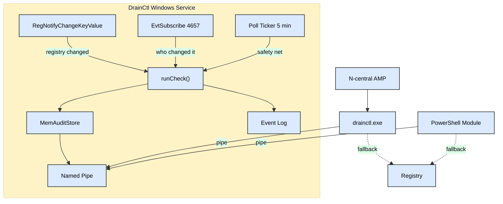
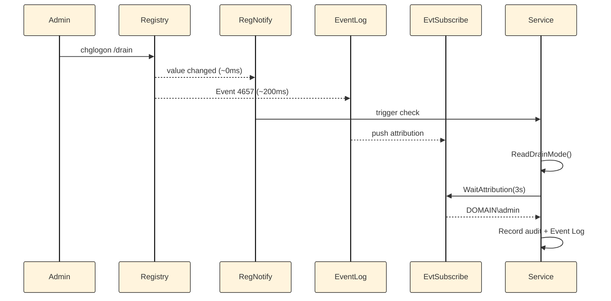

# 🚰 LISSTech DrainCtl

**Real-time Remote Desktop Session Host drain mode monitoring for Windows Server.**


[](https://www.powershellgallery.com/packages/LISSTech.DrainCtl)

Know the instant someone blocks new connections on your RDSH servers. DrainCtl runs as a Windows Service that detects drain mode changes in real time, maintains a 90-day audit trail, and tells you exactly who made the change. Query it from the CLI, PowerShell, or your RMM &mdash; the answer is always instant.

---

## 📑 Table of Contents

- [🔭 Overview](#-overview)
- [🏗️ Architecture](#️-architecture)
- [📦 Installation](#-installation)
- [🚀 Quick Start](#-quick-start)
- [⌨️ CLI Reference](#️-cli-reference)
- [🐚 PowerShell Module](#-powershell-module)
- [⚙️ Service](#️-service)
- [🔔 Notifications](#-notifications)
- [🔧 Configuration](#-configuration)
- [🔒 Audit Setup](#-audit-setup)
- [🛠️ Building from Source](#️-building-from-source)
- [📁 Project Structure](#-project-structure)
- [📄 License](#-license)

---

## 🔭 Overview

DrainCtl monitors the `TSServerDrainMode` registry value on RDSH servers and answers one question: **are new connections allowed?**

### Key Features

| Feature | Description |
|---------|-------------|
| 🔔 **Real-time detection** | `RegNotifyChangeKeyValue` — instant notification when drain mode changes |
| 📋 **Audit trail** | 90-day JSONL history of every state observation and transition |
| 👤 **Change attribution** | `EvtSubscribe` on Event ID 4657 — knows *who* changed drain mode |
| 🖥️ **Windows Service** | Runs as `DrainCtl`, auto-start, polls as safety net |
| ⚡ **Named pipe IPC** | CLI and PowerShell query the service instantly via `\\.\pipe\drainctl` |
| 📊 **N-central ready** | Exit codes + structured stdout for AMP threshold monitoring |
| 🐚 **PowerShell native** | `Get-RDSHDrainMode`, `Test-RDSHDrainMode`, `Get-RDSHDrainHistory` |
| 🔔 **Notifications** | Webhook + ntfy.sh alerts on state transitions and grace period exceedances |

---

## 🏗️ Architecture



### How Detection Works



---

## 📦 Installation

### MSI Installer (recommended)

```powershell
msiexec /i LISSTech.DrainCtl.msi /qn
```

The MSI installs:

| Component | Location |
|-----------|----------|
| CLI + DLL | `C:\Program Files\LISS Technologies\LISSTech DrainCtl\bin\` |
| PowerShell module | `C:\Program Files\WindowsPowerShell\Modules\LISSTech.DrainCtl\` |
| Data directory | `C:\ProgramData\LISS Technologies\LISSTech DrainCtl\` |
| Windows Service | `DrainCtl` — auto-start as LocalSystem |
| System PATH | `bin\` folder added |
| Event Log source | `DrainCtl` with custom message file |
| Registry config | `HKLM\...\Services\DrainCtl\Parameters` with defaults |

### PowerShell Gallery (module only)

```powershell
Install-Module -Name LISSTech.DrainCtl -Scope AllUsers
```

Just the cmdlets — no service, no CLI. Queries go directly to the registry. See [PSGallery](https://www.powershellgallery.com/packages/LISSTech.DrainCtl).

### Manual (CLI only, no service)

Copy `drainctl.exe` anywhere and run it. Works standalone — the service is optional.

---

## 🚀 Quick Start

```powershell
# Check current state (instant if service is running)
PS> drainctl check
2026-04-02T20:08:56-04:00 [INF] source=service
2026-04-02T20:08:56-04:00 [INF] host=RDSH01
2026-04-02T20:08:56-04:00 [INF] drain_mode=ALLOW_ALL_CONNECTIONS value=0
2026-04-02T20:08:56-04:00 [INF] state_since=2026-04-02T18:30:00-04:00 state_duration=1h38m56s
2026-04-02T20:08:56-04:00 [INF] grace_period=1h0m0s
2026-04-02T20:08:56-04:00 [OK ] status=Healthy connections_allowed=true exit=0

# JSON output
PS> drainctl check --format json

# View audit trail
PS> drainctl history --limit 5

# PowerShell
PS> Get-RDSHDrainMode | Format-List
PS> if (Test-RDSHDrainMode) { "OK" } else { "ALERT" }
PS> Get-RDSHDrainHistory -ChangesOnly -Limit 10
```

---

## ⌨️ CLI Reference

```
drainctl check              Check drain mode state
drainctl history            View audit trail
drainctl audit-setup        Configure registry auditing (one-time, admin)
drainctl service install    Install Windows service
drainctl service uninstall  Remove Windows service
drainctl service start      Start the service
drainctl service stop       Stop the service
```

### Global Flags

| Flag | Default | Description |
|------|---------|-------------|
| `--db` | `%ProgramData%\...\audit.jsonl` | Audit trail path |
| `--format` | `plain` (check) / `table` (history) | Output: `plain`, `table`, `csv`, `json` |
| `--quiet` | `false` | Suppress intermediate log lines |

### Check Flags

| Flag | Default | Description |
|------|---------|-------------|
| `--grace` | `60` | Minutes drain mode must persist before alerting |
| `--retention` | `90` | Days to retain audit records (max: 365) |

### History Flags

| Flag | Default | Description |
|------|---------|-------------|
| `--limit` | `50` | Maximum records to display |
| `--changes-only` | `false` | Show only state transitions |

### Exit Codes

| Code | Meaning |
|------|---------|
| `0` | Healthy or within grace period |
| `1` | Alert — drain mode active beyond grace period |
| `2` | Error — registry unreadable |

---

## 🐚 PowerShell Module

```powershell
Import-Module LISSTech.DrainCtl
```

### Cmdlets

| Cmdlet | Returns | Description |
|--------|---------|-------------|
| `Get-RDSHDrainMode` | `PSObject` | Full drain mode state with audit data |
| `Test-RDSHDrainMode` | `bool` | `$true` if connections allowed, `$false` if alert |
| `Get-RDSHDrainHistory` | `PSObject[]` | Audit trail records |
| `Install-RDSHDrainAudit` | — | Configure registry auditing (one-time) |
| `Get-RDSHDrainNotification` | `PSObject` | Current notification configuration |
| `Set-RDSHDrainNotification` | — | Update notification settings |
| `Test-RDSHDrainNotification` | — | Send test notification to configured backends |

### Examples

```powershell
# Rich status
Get-RDSHDrainMode

# Boolean check for scripts
if (-not (Test-RDSHDrainMode)) {
    Send-Alert "RDSH drain mode active on $env:COMPUTERNAME"
}

# Recent changes with attribution
Get-RDSHDrainHistory -ChangesOnly -Limit 5 | Format-Table

# Custom grace period
Get-RDSHDrainMode -GraceMinutes 120
```

---

## ⚙️ Service

The `DrainCtl` Windows Service provides:

- **Instant detection** via `RegNotifyChangeKeyValue` (~0ms)
- **Change attribution** via `EvtSubscribe` on Security Event ID 4657 (~200ms)
- **Safety-net polling** every 5 minutes (configurable)
- **Exclusive audit file** ownership — no corruption from concurrent access
- **In-memory store** — CLI/PS queries are instant (named pipe, no file I/O)
- **Event Log entries** — warnings for grace, errors for alerts, info for transitions

### Event Log

Events are written to `Application` log under source `DrainCtl`:

| Event ID | Level | Description |
|----------|-------|-------------|
| 1000 | Info | Service started |
| 1001 | Info | Service stopped |
| 1002 | Info | Check: healthy |
| 1003 | Info | Configuration reloaded |
| 1004 | Info | State transition detected |
| 2000 | Warning | Check: drain mode in grace period |
| 3000 | Error | Check: drain mode alert (grace exceeded) |
| 3001 | Error | Registry read failure |

---

## 🔔 Notifications

DrainCtl can send alerts via **webhook** (HTTP POST JSON) and **ntfy.sh** when drain mode changes.

### Setup

```powershell
# CLI
drainctl notify set-webhook https://hooks.example.com/drainctl
drainctl notify set-ntfy https://ntfy.sh/my-drainctl-alerts
drainctl notify test   # send a test notification

# PowerShell
Set-RDSHDrainNotification -WebhookURL "https://hooks.example.com/drainctl"
Set-RDSHDrainNotification -NtfyURL "https://ntfy.sh/my-alerts"
Test-RDSHDrainNotification

# Check current config
drainctl notify status
Get-RDSHDrainNotification
```

### Notification Triggers

| Setting | Default | Description |
|---------|---------|-------------|
| `NotifyOnTransition` | `1` (enabled) | Alert on any state change (drain on/off) |
| `NotifyOnGraceExceeded` | `1` (enabled) | Alert when drain mode exceeds grace period |
| `NotifyRepeatMinutes` | `0` (once) | Re-alert interval while in alert state (0 = notify once) |

### Webhook Payload

```json
{
  "event": "transition",
  "host": "RDSH01",
  "drain_mode": "ALLOW_RECONNECTIONS_PREVENT_NEW_LOGONS",
  "previous_mode": "ALLOW_ALL_CONNECTIONS",
  "status": "Grace",
  "message": "Drain mode active, within grace period (45m remaining).",
  "changed_by": "DOMAIN\\admin",
  "state_duration_seconds": 900,
  "timestamp": "2026-04-03T14:30:00-04:00"
}
```

ntfy messages use priority `high` for alerts, `default` for transitions.

---

## 🔧 Configuration

Configuration is stored in the registry and hot-reloaded when changed:

**Key:** `HKLM\SYSTEM\CurrentControlSet\Services\DrainCtl\Parameters`

| Value | Type | Default | Description |
|-------|------|---------|-------------|
| `GracePeriod` | REG_DWORD | `60` | Minutes before alerting |
| `RetentionDays` | REG_DWORD | `90` | Days to keep audit records (1-365) |
| `PollInterval` | REG_DWORD | `300` | Seconds between safety-net polls |
| `AuditPath` | REG_SZ | `%ProgramData%\...\audit.jsonl` | Audit file path |
| `WebhookURL` | REG_SZ | *(empty)* | Webhook endpoint for notifications |
| `NtfyURL` | REG_SZ | *(empty)* | ntfy.sh topic URL for notifications |
| `NotifyOnTransition` | REG_DWORD | `1` | Notify on state transitions |
| `NotifyOnGraceExceeded` | REG_DWORD | `1` | Notify when grace period exceeded |
| `NotifyRepeatMinutes` | REG_DWORD | `0` | Re-notify interval in alert (0 = once) |

Changes are picked up automatically — no service restart needed.

---

## 🔒 Audit Setup

To attribute drain mode changes to specific users, run once as admin:

```powershell
drainctl audit-setup
# or
Install-RDSHDrainAudit
```

This configures:
1. `auditpol` — enables Registry subcategory auditing
2. SACL on `HKLM\...\Terminal Server` — tracks `SetValue` operations

> **Domain-joined machines:** Local `auditpol` settings are overwritten by Group Policy refresh (~90 min). Configure the equivalent GPO:
> `Computer Configuration > Policies > Windows Settings > Security Settings > Advanced Audit Policy Configuration > Object Access > Audit Registry > Success`

---

## 🛠️ Building from Source

### Prerequisites

- Go 1.22+
- MinGW (for CGo / DLL build): `scoop install mingw`
- WiX Toolset 5.x: `dotnet tool install -g wix`
- .NET SDK 8.0+

### Build

```bash
just all          # Build CLI + DLL + PS module + MSI (unsigned)
just release      # Build + sign everything (requires CODE_SIGNING_CERTIFICATE_THUMBPRINT in .env)
just lint         # go vet + gofmt + golangci-lint
just test         # Test PowerShell module
just clean        # Remove dist/
just resource     # Recompile icon/version (after changing .rc or .ico)
```

### Signing

Create `.env` from the example:

```bash
cp .env.example .env
# Set CODE_SIGNING_CERTIFICATE_THUMBPRINT=<your-cert-sha1>
```

`just release` signs in the correct order: binaries + PS module first, then builds MSI (with signed contents), then signs the MSI.

---

## 📁 Project Structure

```
LISSTech.DrainCtl/
├── drainctl.go              # Package root: version, defaults
├── registry.go              # ReadDrainMode(), DrainMode, RegistryState
├── eventlog.go              # QueryRegistryChangeUser() (wevtutil fallback)
├── audit.go                 # AuditRecord, AuditStore (file-based)
├── check.go                 # Check() — core monitoring logic
├── history.go               # GetHistory() — audit trail query
├── audit_setup.go           # RunAuditSetup() — auditpol + SACL
├── format.go                # Output formatting (plain/table/csv/json)
├── log.go                   # LogFunc, DefaultLogger, DiscardLogger
├── config.go                # ServiceConfig, NotifyConfig, registry parameters
├── notify.go                # Webhook + ntfy.sh notification client
├── internal/
│   ├── svc/                 # Windows Service handler + install/uninstall
│   ├── pipe/                # Named pipe IPC server + client
│   ├── store/               # MemAuditStore (in-memory + JSONL flush)
│   └── watcher/             # RegNotifyChangeKeyValue + EvtSubscribe
├── cmd/
│   ├── drainctl/            # CLI entry point (cobra)
│   └── cshared/             # C-shared DLL exports
├── powershell/
│   ├── LISSTech.DrainCtl.psd1
│   └── LISSTech.DrainCtl.psm1
├── installer/               # WiX 5 MSI project
├── assets/                  # Icon, event log message file
├── docs/                    # Landing page (GitHub Pages)
├── justfile                 # Build recipes
└── .env.example             # Signing configuration template
```

---

## 📄 License

**Business Source License 1.1** — see [LICENSE](LICENSE).

You may use LISSTech DrainCtl for internal business operations on systems you own or manage. Production deployment to third-party customer environments requires a commercial license. On 2030-04-03, the license converts to Apache 2.0.

---

<p align="center">
  <sub>Built by <a href="https://lisstech.com">LISS Consulting, Corp.</a></sub>
</p>
