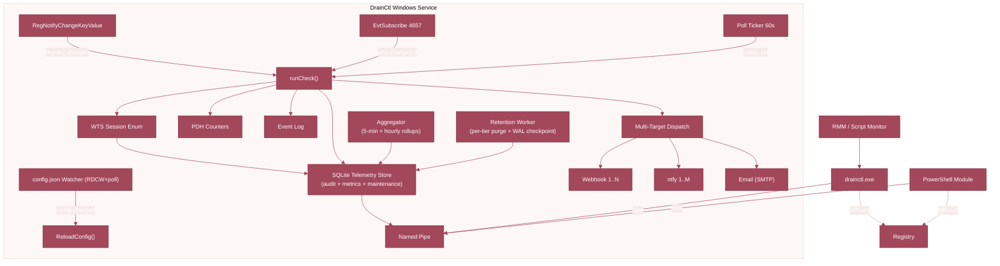
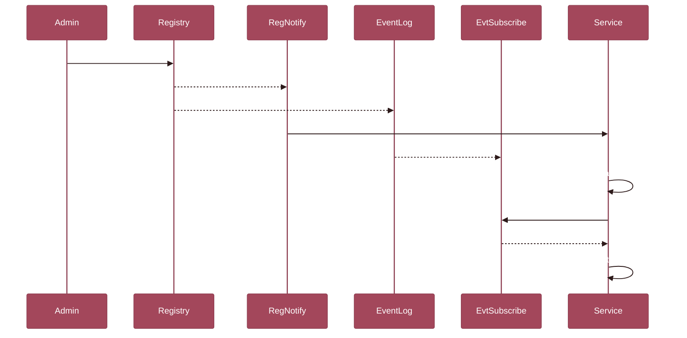

<p align="center">
  
</p>

<h1 align="center">LISSTech DrainCtl</h1>

<p align="center"><strong>Real-time Remote Desktop Session Host drain mode monitoring for Windows Server.</strong></p>


[](https://github.com/LISSConsulting/LISSTech.DrainCtl/releases/latest)
[](https://www.powershellgallery.com/packages/LISSTech.DrainCtl)

Know the instant someone blocks new connections on your RDSH servers. DrainCtl runs as a Windows Service that detects drain mode changes in real time, persists audit events and performance metrics to a local SQLite store, and tells you exactly who made the change. Query it from the CLI, PowerShell, or your RMM &mdash; the answer is always instant.

---

## 📑 Table of Contents

- [🔭 Overview](#-overview)
- [🏗️ Architecture](#️-architecture)
- [📦 Installation](#-installation)
- [🚀 Quick Start](#-quick-start)
- [⌨️ CLI Reference](#️-cli-reference)
- [🐚 PowerShell Module](#-powershell-module)
- [⚙️ Service](#️-service)
- [🔔 Notifications](#-notifications)
- [📈 Event Log Anomaly Detection](#-event-log-anomaly-detection-evtspike)
- [🔧 Configuration](#-configuration)
- [🔒 Audit Setup](#-audit-setup)
- [🛠️ Building from Source](#️-building-from-source)
- [📁 Project Structure](#-project-structure)
- [📄 License](#-license)

---

## 🔭 Overview

DrainCtl monitors the `TSServerDrainMode` registry value on RDSH servers and answers one question: **are new connections allowed?** And when performance matters: CPU, memory, input delay, and RemoteFX metrics — collected every poll cycle, with threshold alerts that fire before users open tickets.

### Key Features

| Feature | Description |
|---------|-------------|
| 🔔 **Real-time detection** | `RegNotifyChangeKeyValue` fires the instant drain mode flips -- zero polling delay |
| 📋 **Durable telemetry store** | Drain events, session counts, and performance samples persisted to a local SQLite database with WAL mode, per-tier retention, and hourly/5-minute rollups |
| 🕵️ **Change attribution** | `EvtSubscribe` on Event ID 4657 -- knows exactly *who* ran `chglogon /drain` |
| 🖥️ **Windows Service** | Runs as `DrainCtl` with auto-start; poll ticker as safety net in case events are lost |
| ⚡ **Named pipe IPC** | CLI and PowerShell get answers in <1 ms via `\\.\pipe\drainctl` -- no file I/O |
| 📊 **RMM ready** | Exit codes + structured stdout integrate with any RMM that supports script monitors |
| 🐚 **PowerShell native** | `Get-RDSHDrainMode`, `Test-RDSHDrainMode`, `Get-RDSHDrainHistory` -- pipeline-friendly |
| 📡 **Multi-target notifications** | N webhooks + M ntfy.sh + email (SMTP) -- each target gets its own triggers and repeat cadence |
| 🎯 **Granular triggers** | 12 trigger types: `drain_on`, `drain_off`, `alert`, `healthy`, `session_warning`, `cpu_warning`, `cpu_critical`, and more |
| 📈 **Live session tracking** | `WTSEnumerateSessionsW` counts active, disconnected, and total sessions with utilization % |
| 🚨 **Utilization alerts** | Configurable threshold fires `session_warning` before your RDSH boxes hit capacity |
| 📊 **Performance monitoring** | PDH counters track CPU, memory, disk queue, input delay, and RemoteFX metrics per poll cycle — with configurable thresholds that fire `cpu_warning`, `memory_critical`, `input_delay_warning`, and more |
| 📈 **Event log anomaly detection** | Opt-in subsystem watches 54 Windows event log channels, learns a per-slot Bayesian baseline, and fires `event_spike` notifications on confirmed deviations — without drowning operators in false positives |

---

## 🏗️ Architecture



### How Detection Works



---

## 📦 Installation

### MSI Installer (recommended)

```powershell
msiexec /i LISSTech.DrainCtl.msi /qn
```

The MSI installs:

| Component | Location |
|-----------|----------|
| CLI + DLL | `C:\Program Files\LISS Technologies\LISSTech DrainCtl\bin\` |
| PowerShell module | `C:\Program Files\WindowsPowerShell\Modules\LISSTech.DrainCtl\` |
| Data directory | `C:\ProgramData\LISS Technologies\LISSTech DrainCtl\` |
| Windows Service | `DrainCtl` — auto-start as LocalSystem |
| System PATH | `bin\` folder added |
| Event Log source | `DrainCtl` with custom message file |
| JSON config | `%ProgramData%\LISS Technologies\LISSTech DrainCtl\config.json` |

> **Upgrading from v26?** The first run auto-migrates your registry configuration to `config.json`. Existing installs upgrade seamlessly — no manual steps required.

The MSI installer provides a setup wizard with license acceptance, install mode selection, and configuration options. For unattended deployment, MSI properties can be passed directly:

```powershell
msiexec /i LISSTech.DrainCtl.msi /qn INSTALL_MODE=registration DASHBOARD_URL=https://dash.example.com:49470 WEBHOOK_URL=https://hooks.example.com/drain
```

### PowerShell Gallery (module only)

```powershell
Install-Module -Name LISSTech.DrainCtl -Scope AllUsers
```

Just the cmdlets — no service, no CLI. Queries go directly to the registry. See [PSGallery](https://www.powershellgallery.com/packages/LISSTech.DrainCtl).

### Manual (CLI only, no service)

Copy `drainctl.exe` anywhere and run it. Works standalone — the service is optional.

---

## 🚀 Quick Start

```powershell
# Check current state (instant if service is running)
PS> drainctl check
2026-04-02T20:08:56-04:00 [INF] source=service
2026-04-02T20:08:56-04:00 [INF] host=RDSH01
2026-04-02T20:08:56-04:00 [INF] drain_mode=ALLOW_ALL_CONNECTIONS value=0
2026-04-02T20:08:56-04:00 [INF] state_since=2026-04-02T18:30:00-04:00 state_duration=1h38m56s
2026-04-02T20:08:56-04:00 [INF] grace_period=1h0m0s
2026-04-02T20:08:56-04:00 [INF] sessions=12 active / 3 disconnected / 15 total (60% of 25)
2026-04-02T20:08:56-04:00 [OK ] status=Healthy connections_allowed=true exit=0

# JSON output
PS> drainctl check --format json

# View audit trail
PS> drainctl history --limit 5

# PowerShell
PS> Get-RDSHDrainMode | Format-List
PS> if (Test-RDSHDrainMode) { "OK" } else { "ALERT" }
PS> Get-RDSHDrainHistory -ChangesOnly -Limit 10
```

---

## ⌨️ CLI Reference

```
drainctl check              Check drain mode state
drainctl history            View audit trail
drainctl audit-setup        Configure registry auditing (one-time, admin)
drainctl service install    Install Windows service
drainctl service uninstall  Remove Windows service
drainctl service start      Start the service
drainctl service stop       Stop the service
drainctl notify add         Add a notification target
drainctl notify remove      Remove a notification target
drainctl notify list        List configured notification targets
drainctl notify test        Send a test notification to all targets
drainctl register           Register this host with the dashboard
drainctl dashboard          Dashboard-related helpers (cert info, etc.)
drainctl configure          Interactive/flag-driven config editor
drainctl sessions           Show live RDSH session enumeration
drainctl baseline reset     Wipe the evtspike anomaly-detector baseline
```

### Global Flags

| Flag | Default | Description |
|------|---------|-------------|
| `--db` | `%ProgramData%\...\drainctl.db` | Path to the SQLite telemetry/audit database. The CLI accepts either the DB file itself or the containing directory; either way it opens `drainctl.db` read-only — the service owns the writer. Legacy `audit.jsonl` paths are accepted and resolved to `drainctl.db` in the same parent directory |
| `--format` | `plain` (check) / `table` (history) | Output: `plain`, `table`, `csv`, `json` |
| `--log-level` | `info` | CLI log verbosity: `debug`, `info`, `warn`, `error` |

### Check Flags

| Flag | Default | Description |
|------|---------|-------------|
| `--grace` | `60` | Minutes drain mode must persist before alerting |
| `--retention` | `90` | Legacy flag; retention is configured in `config.json` (`retention.metrics_days`, `retention.audit_days`) when the service is running |

### History Flags

| Flag | Default | Description |
|------|---------|-------------|
| `--limit` | `50` | Maximum records to display |
| `--changes-only` | `false` | Show only state transitions |

### Notify Subcommands

| Command | Description |
|---------|-------------|
| `drainctl notify add <type> <url> [--triggers ...] [--repeat N]` | Add a webhook, ntfy, or email target with optional trigger filter and repeat interval |
| `drainctl notify remove <url>` | Remove a notification target by URL |
| `drainctl notify list` | List all configured notification targets and their settings |
| `drainctl notify test` | Send a test notification to all configured targets |
| `drainctl notify set-webhook <url>` | Convenience: add/update a single webhook target |
| `drainctl notify set-ntfy <url>` | Convenience: add/update a single ntfy target |

### Baseline Subcommands

| Command | Description |
|---------|-------------|
| `drainctl baseline reset` | Ask the running service (via named pipe) to wipe all in-memory evtspike detectors and delete `baseline.json`. Useful when a flood has poisoned the baseline and you want scoring to restart from the prior without restarting the service. The service must be running — the file on disk is rewritten from memory on every persistence tick, so `del baseline.json` on its own has no durable effect. |

### Exit Codes

| Code | Meaning |
|------|---------|
| `0` | Healthy or within grace period |
| `1` | Alert — drain mode active beyond grace period |
| `2` | Error — registry unreadable |

---

## 🐚 PowerShell Module

```powershell
Import-Module LISSTech.DrainCtl
```

### Cmdlets

| Cmdlet | Returns | Description |
|--------|---------|-------------|
| `Get-RDSHDrainMode` | `PSObject` | Full drain mode state with audit data |
| `Test-RDSHDrainMode` | `bool` | `$true` if connections allowed, `$false` if alert |
| `Get-RDSHDrainHistory` | `PSObject[]` | Audit trail records |
| `Install-RDSHDrainAudit` | — | Configure registry auditing (one-time) |
| `Get-RDSHDrainNotification` | `PSObject` | Current notification configuration |
| `Set-RDSHDrainNotification` | — | Update notification settings *(deprecated — use target cmdlets below)* |
| `Test-RDSHDrainNotification` | — | Send test notification to configured backends |
| `Get-RDSHDrainNotificationTarget` | `PSObject[]` | Lists all configured notification targets with full detail |
| `Add-RDSHDrainNotificationTarget` | — | Adds a notification target (webhook or ntfy) with per-target triggers |
| `Remove-RDSHDrainNotificationTarget` | — | Removes a notification target by URL |

### Examples

```powershell
# Rich status
Get-RDSHDrainMode

# Boolean check for scripts
if (-not (Test-RDSHDrainMode)) {
    Send-Alert "RDSH drain mode active on $env:COMPUTERNAME"
}

# Recent changes with attribution
Get-RDSHDrainHistory -ChangesOnly -Limit 5 | Format-Table

# Custom grace period
Get-RDSHDrainMode -GraceMinutes 120
```

---

## ⚙️ Service

The `DrainCtl` Windows Service provides:

- **Instant detection** via `RegNotifyChangeKeyValue` (~0ms)
- **Change attribution** via `EvtSubscribe` on Security Event ID 4657 (~200ms)
- **Safety-net polling** every 5 minutes (configurable)
- **Session tracking** via `WTSEnumerateSessionsW` — active, disconnected, and total counts
- **SQLite telemetry store** (`drainctl.db`, WAL mode) — single writer owned by the service; CLI opens it read-only
- **Named-pipe IPC** — CLI/PS status queries get instant answers without touching the DB
- **Event Log entries** — warnings for grace, errors for alerts, info for transitions
- **Auto-discovery** via DNS SRV (`_drainctl._tcp.<domain>`) — agents find the dashboard with zero per-machine config
- **Auto-registration** with dashboard on startup (via SRV discovery or explicit `dashboard.url`)
- **HTTPS by default** — auto-generated self-signed cert, or bring your own PEM files

### Diagnostic profiling (opt-in)

Set `DRAINCTL_PPROF_PORT` on the service environment to enable a loopback-only Go runtime/pprof debug HTTP server. Used for memory-leak and goroutine-leak diagnosis on production hosts without rebuilding:

```powershell
# On the service host, pick a free local port:
[Environment]::SetEnvironmentVariable('DRAINCTL_PPROF_PORT','6060','Machine')
Restart-Service DrainCtl

# From the same host:
go tool pprof http://127.0.0.1:6060/debug/pprof/heap        # heap snapshot
go tool pprof http://127.0.0.1:6060/debug/pprof/goroutine   # goroutine inventory
curl -o heap.pprof http://127.0.0.1:6060/debug/pprof/heap   # without `go` installed
```

The listener binds **`127.0.0.1` only** — never reachable from another host even by accident — and is off by default. Unset the variable and restart the service to disable.

### Event Log

Events are written to `Application` log under source `DrainCtl`:

| Event ID | Level | Description |
|----------|-------|-------------|
| 1000 | Info | Service started |
| 1001 | Info | Service stopped |
| 1002 | Info | Check: healthy |
| 1003 | Info | Configuration reloaded |
| 1004 | Info | State transition detected |
| 2000 | Warning | Check: drain mode in grace period |
| 3000 | Error | Check: drain mode alert (grace exceeded) |
| 3001 | Error | Registry read failure |

### Logging sinks

DrainCtl emits structured (`slog`) logs to two sinks in parallel:

- **File** — `%ProgramData%\LISS Technologies\LISSTech DrainCtl\drainctl.log`. Rotates at local midnight: the active file is renamed to `drainctl-YYYY-MM-DD.log` and a fresh `drainctl.log` is opened; archives older than 7 days are pruned automatically. File-sink level is controlled by `log_file_level` in `config.json`.
- **ETW** — manifest provider `LISS Technologies-DrainCtl` with Operational (INF+) and Debug (DBG) channels. Disabled by default; enable via `wevtutil` to stream to an ETL consumer. ETW-sink level is controlled by `log_event_level`.

Both levels accept `debug`, `info`, `warn`, `error`. The CLI's own verbosity is controlled separately by `--log-level`.

### Dashboard-authoritative configuration

When an agent is registered with a dashboard, the dashboard is the source of truth for: grace period, session/performance thresholds, `performance.*`, `evtspike.enabled`, and the notification target list. Agents pull the effective config on every poll cycle and also synchronously on local `config.json` reload, so edits made to the dashboard propagate within one poll interval and local edits do not diverge silently.

---

## 🔔 Notifications

DrainCtl supports **multi-target notifications** — configure any number of webhook, ntfy.sh, and email (SMTP) targets, each with its own trigger filter and repeat interval.

### Setup

```powershell
# Add notification targets
drainctl notify add webhook https://hooks.slack.com/services/T.../B.../xxx --triggers drain_on,drain_off,alert,healthy --repeat 30
drainctl notify add ntfy https://ntfy.sh/my-drainctl-alerts --triggers alert,session_warning --repeat 0
drainctl notify add email smtp://smtp.example.com:587 --to ops@example.com --from drainctl@example.com --secret smtp-password --triggers drain_on,drain_off,alert

# List configured targets
drainctl notify list

# Remove a target
drainctl notify remove https://hooks.slack.com/services/T.../B.../xxx

# Test all targets
drainctl notify test

# Convenience shortcuts (add/update a single target)
drainctl notify set-webhook https://hooks.example.com/drainctl
drainctl notify set-ntfy https://ntfy.sh/my-alerts

# PowerShell
Get-RDSHDrainNotification
Test-RDSHDrainNotification
```

### Granular Triggers

Each notification target can subscribe to specific event types:

| Trigger | Description |
|---------|-------------|
| `drain_on` | Drain mode activated (new connections blocked) |
| `drain_off` | Drain mode deactivated (connections restored) |
| `grace_entered` | Drain mode entered grace period |
| `alert` | Drain mode exceeded grace period |
| `healthy` | Returned to healthy state |
| `session_warning` | Session utilization threshold exceeded |
| `cpu_warning` | Host CPU exceeds warning threshold (2 consecutive polls) |
| `cpu_critical` | Host CPU exceeds critical threshold (2 consecutive polls) |
| `memory_warning` | Available memory below warning threshold (2 consecutive polls) |
| `memory_critical` | Available memory below critical threshold (2 consecutive polls) |
| `input_delay_warning` | User input delay P95 exceeds warning threshold |
| `input_delay_critical` | User input delay P95 exceeds critical threshold |
| `event_spike` | Confirmed anomalous activity on a watched event log channel (requires `evtspike.enabled: true`; not in default triggers) |

If no triggers are specified, the target receives all events.

### Config Example

Notification targets are defined in `config.json`:

```json
{
  "notifications": [
    {
      "type": "webhook",
      "url": "https://hooks.slack.com/services/T.../B.../xxx",
      "triggers": ["drain_on", "drain_off", "alert", "healthy"],
      "repeat_minutes": 30
    },
    {
      "type": "ntfy",
      "url": "https://ntfy.sh/my-alerts",
      "triggers": ["alert", "session_warning"],
      "repeat_minutes": 0
    },
    {
      "type": "email",
      "url": "smtp://smtp.example.com:587",
      "to": ["ops@example.com"],
      "from": "drainctl@example.com",
      "secret": "smtp-password",
      "triggers": ["drain_on", "drain_off", "alert"]
    }
  ]
}
```

### Webhook Payload

```json
{
  "event": "drain_on",
  "host": "RDSH01",
  "drain_mode": "ALLOW_RECONNECTIONS_PREVENT_NEW_LOGONS",
  "previous_mode": "ALLOW_ALL_CONNECTIONS",
  "status": "Grace",
  "message": "Drain mode active, within grace period (45m remaining).",
  "changed_by": "DOMAIN\\admin",
  "state_duration_seconds": 900,
  "timestamp": "2026-04-03T14:30:00-04:00",
  "sessions": {
    "active_sessions": 12,
    "disconnected_sessions": 3,
    "total_sessions": 15,
    "max_sessions": 25,
    "utilization_pct": 60
  },
  "performance": {
    "cpu_pct": 78.3,
    "mem_avail_mb": 2048,
    "mem_total_mb": 16384,
    "input_delay_p95_ms": 42,
    "input_delay_max_ms": 88,
    "disk_queue": 0.3
  }
}
```

The `event` field uses the trigger name (`drain_on`, `drain_off`, `grace_entered`, `alert`, `healthy`, `session_warning`, `cpu_warning`, `cpu_critical`, `memory_warning`, `memory_critical`, `input_delay_warning`, `input_delay_critical`, `event_spike`). ntfy messages use priority `high` for alerts, `default` for other events.

---

## 📈 Event Log Anomaly Detection (evtspike)

The `evtspike` subsystem watches a curated set of 54 Windows event log channels and fires an `event_spike` notification when it detects anomalous activity that the existing fixed-threshold alerts cannot catch — authentication bursts, SMB storms, print-service floods, FSLogix container errors, TCP/IP stack failures, and similar early-warning signals.

### What it does

- Subscribes to 54 curated channels by default (RDSH/Citrix-relevant: Winlogon, Kerberos, NTLM, LSA, SMB, FSLogix, TerminalServices, PrintService, User Profile Service, DNS, TCP/IP, Windows Defender, and more).
- Maintains a per-channel Bayesian baseline sliced into 96 time-of-day slots (15 min each). A robust update cap prevents a single flood from poisoning the baseline; a subsequent smaller anomaly still flags.
- Requires 2 of 3 consecutive 10-second scoring windows to confirm, so single-bucket transients (log rotations, one-shot admin actions) do not page operators.
- Persists baseline state to `baseline.json` every 15 minutes and on shutdown — service restarts do not re-enter warm-up on channels already mature.
- Delivers through the existing multi-target notification pipeline (webhook, ntfy, email). Spike severity is assigned by notification-target wiring, not the detector.
- Surfaces a status pill and a recent-spikes list in the dashboard server detail view.

### Enable

The subsystem ships **disabled by default**. Add to `config.json`:

```json
{
  "evtspike": {
    "enabled": true
  },
  "notifications": [
    {
      "type": "webhook",
      "url": "https://hooks.example.com/drainctl-spikes",
      "triggers": ["event_spike"],
      "repeat_minutes": 30
    }
  ]
}
```

`event_spike` is **not** in the default trigger set — existing notification targets that upgrade to a version with this feature do not silently start receiving spike notifications. Explicit opt-in is required.

Config is hot-reloaded; scalar tunables (threshold, cooldown, slot maturity) apply on the next scoring window. Channel-list changes trigger a clean subsystem restart.

### Channel list

The 54-channel default is defined in `internal/evtspike/channels.go`. Operators tailor it by naming specific channels to **disable** or **add** — there is no need to restate the full default list:

```json
{
  "evtspike": {
    "enabled": true,
    "disabled_channels": ["Microsoft-Windows-Crashdump/Operational"],
    "added_channels": ["Microsoft-Windows-PowerShell/Operational"]
  }
}
```

### Security channel opt-in

The `Security` channel is **not** in the default list because subscribing to it requires `SeSecurityPrivilege` on the service account and carries expanded capability. To enable:

```json
{
  "evtspike": {
    "enabled": true,
    "security_channel_enabled": true
  }
}
```

> **Read before enabling.** This enables the DrainCtl service to read the Security log, clear the Security log, manage audit policy, and set SACLs on this host.

The default `LocalSystem` service account already has `SeSecurityPrivilege` present in its token — the subsystem enables it at Start via `AdjustTokenPrivileges`. No `LsaAddAccountRights` operation is performed. Installations running under a dedicated service account must grant the privilege manually (User Rights Assignment → "Manage auditing and security log") before the subscription will succeed.

### Webhook payload

```json
{
  "event": "event_spike",
  "host": "RDSH01",
  "status": "warning",
  "message": "Event spike on Application (20 vs ~0.1)",
  "timestamp": "2026-04-19T11:48:17-04:00",
  "spike": {
    "channel": "Application",
    "observed": 20,
    "expected": 0.1,
    "tail_probability": 0,
    "window_start": "2026-04-19T11:48:07-04:00",
    "window_end": "2026-04-19T11:48:17-04:00",
    "confirmation_count": 2
  }
}
```

ntfy messages use priority 3 for `status: "warning"` and priority 4 for `status: "alert"`, with tags `["evtspike", <host>, <channel-basename>]`. Email renders through the same card template as other triggers — subject emoji (⚠️ / 🚨) reflects severity.

### Config reference

| Key | Type | Default | Description |
|-----|------|---------|-------------|
| `evtspike.enabled` | bool | `false` | Master opt-in. When `false` the subsystem is constructed but quiescent (no subscriptions, no scoring, no persistence — runtime cost is effectively zero, but the subsystem object exists in process memory) |
| `evtspike.security_channel_enabled` | bool | `false` | Adds `Security` to the watched list; enables `SeSecurityPrivilege` on the service token at Start |
| `evtspike.disabled_channels` | string[] | `[]` | Channel names to remove from the default list (case-insensitive match) |
| `evtspike.added_channels` | string[] | `[]` | Extra channels to subscribe to beyond the default list |
| `evtspike.threshold` | float | `1e-4` | Negative-binomial tail probability below which a bucket counts as anomalous |
| `evtspike.min_count` | int | `10` | Lower observed-event floor; buckets below this never flag regardless of tail probability |
| `evtspike.cooldown_minutes` | int | `10` | Minimum time between `event_spike` notifications for the same (host, channel) |
| `evtspike.slot_maturity_observations` | int | `90` | Observations before a per-slot baseline is considered mature. Scoring runs every 10 s, so one 15-minute visit to a time-of-day slot contributes up to 90 observations — 90 means "this slot has been populated for at least one full visit" before the detector is declared HEALTHY and scoring stops leaning on the global posterior |
| `evtspike.persist_interval_seconds` | int | `900` | Baseline file write cadence |
| `evtspike.half_life_buckets` | int | `360` | Exponential-forgetting half-life in 10 s buckets (~1 hour) for baseline adaptation. Lower = adapts faster to behaviour drift; higher = more stable across short incidents |
| `evtspike.prior_strength` | float | `60.0` | Gamma prior α/β strength expressed as bucket-equivalents of "pretend evidence." With 60 the baseline starts with the equivalent of 60 observations at the prior mean, so scoring is meaningful from minute one without being exquisitely sensitive |
| `evtspike.mean_per_bucket_prior` | float | `0.1` | Gamma prior mean; initial "expected events per 10-second bucket" before learning. 0.1 reflects the assumption that most curated channels are mostly quiet |

All scalar fields except the channel lists and `baseline_path` hot-reload without a subsystem restart. See `specs/006-evtspike-detection/quickstart.md` for end-to-end setup, injection recipes, and troubleshooting.

---

## 🔧 Configuration

Configuration lives in a JSON file, hot-reloaded via event-based (ReadDirectoryChangesW) with poll fallback:

**Path:** `%ProgramData%\LISS Technologies\LISSTech DrainCtl\config.json`

- Atomic writes with cross-process mutex — safe for concurrent access
- Auto-migrates from registry on first run (existing v26 installs upgrade seamlessly)
- No service restart needed — changes are picked up automatically

### Full config.json Example

```json
{
  "grace_period_minutes": 60,
  "retention_days": 90,
  "retention": {
    "metrics_days": 30,
    "audit_days": 365
  },
  "telemetry": {
    "aggregator_interval_seconds": 60,
    "retention_interval_minutes": 15
  },
  "poll_interval_seconds": 300,
  "session_warning_threshold": 80,
  "performance": {
    "enabled": true,
    "cpu_warn_pct": 70,
    "cpu_crit_pct": 85,
    "mem_warn_pct": 20,
    "mem_crit_pct": 10,
    "input_delay_warn_ms": 50,
    "input_delay_crit_ms": 100,
    "collect_remotefx": false,
    "collect_per_session": true
  },
  "dashboard": {
    "url": ""
  },
  "notifications": [
    {
      "type": "webhook",
      "url": "https://hooks.slack.com/services/T.../B.../xxx",
      "triggers": ["drain_on", "drain_off", "alert", "healthy"],
      "repeat_minutes": 30
    },
    {
      "type": "ntfy",
      "url": "https://ntfy.sh/my-alerts",
      "triggers": ["alert", "session_warning"],
      "repeat_minutes": 0
    },
    {
      "type": "email",
      "url": "smtp://smtp.example.com:587",
      "to": ["ops@example.com", "oncall@example.com"],
      "from": "drainctl@example.com",
      "secret": "smtp-password",
      "triggers": ["drain_on", "drain_off", "alert"]
    }
  ]
}
```

### Config Reference

| Key | Type | Default | Description |
|-----|------|---------|-------------|
| `grace_period_minutes` | int | `60` | Minutes before alerting on drain mode |
| `retention_days` | int | `90` | Legacy audit-retention knob preserved for pre-007 installs; new fields below supersede it |
| `retention.metrics_days` | int | `30` | Days to keep rolled-up **hourly** metric samples, 1–365. Raw and 5-min tiers have fixed retention (25 h and 6 d respectively) — only the hourly tier is operator-tunable |
| `retention.audit_days` | int | `365` | Days to keep audit records, 1–3650 |
| `telemetry.aggregator_interval_seconds` | int | `60` | Tick interval for 5-min and hourly rollup aggregators |
| `telemetry.retention_interval_minutes` | int | `15` | Cadence of the retention + WAL-checkpoint worker |
| `poll_interval_seconds` | int | `300` | Seconds between safety-net polls |
| `session_warning_threshold` | int | `80` | Session utilization % that triggers `session_warning` (0 = disabled) |
| `dashboard.url` | string | *(empty)* | Dashboard URL for auto-registration (or leave empty for SRV discovery) |
| `dashboard.tls_cert` | string | *(empty)* | Path to PEM certificate file (auto-generated if empty) |
| `dashboard.tls_key` | string | *(empty)* | Path to PEM private key file |
| `dashboard.tls_fingerprint` | string | *(empty)* | SHA-256 cert fingerprint for agent-side pinning |
| `performance.enabled` | bool | `false` | Enable PDH performance counter collection |
| `performance.cpu_warn_pct` | int | `70` | CPU % warning threshold (0=default, -1=disabled) |
| `performance.cpu_crit_pct` | int | `85` | CPU % critical threshold |
| `performance.mem_warn_pct` | int | `20` | Memory % free warning threshold |
| `performance.mem_crit_pct` | int | `10` | Memory % free critical threshold |
| `performance.input_delay_warn_ms` | int | `50` | Input delay P95 warning threshold (ms) |
| `performance.input_delay_crit_ms` | int | `100` | Input delay P95 critical threshold (ms) |
| `performance.collect_remotefx` | bool | `false` | Collect RemoteFX Graphics/Network counters |
| `performance.collect_per_session` | bool | `true` | Collect per-session CPU, memory, input delay |
| `notifications` | array | `[]` | Notification targets (see below) |

### Notification Target Fields

| Field | Type | Required | Description |
|-------|------|----------|-------------|
| `type` | string | yes | `"webhook"`, `"ntfy"`, or `"email"` |
| `url` | string | yes | Endpoint URL (`https://` for webhook/ntfy, `smtp://` or `smtps://` for email) |
| `to` | string[] | email only | Recipient addresses |
| `from` | string | email only | Sender address |
| `secret` | string | no | HMAC-SHA256 signing secret (webhook) or SMTP password (email) |
| `triggers` | string[] | no | Event types to notify on (omit for all) |
| `repeat_minutes` | int | no | Re-alert interval while condition persists (0 = notify once) |

**Notes on notification transport**:
- Authenticated SMTP (`secret` set) requires STARTTLS or implicit TLS (`smtps://`). DrainCtl refuses to transmit `AUTH` on a cleartext connection — the error message names the offending host.

### Retention & Storage

Telemetry lives in `%ProgramData%\LISS Technologies\LISSTech DrainCtl\drainctl.db` (SQLite, WAL mode). The service is the single writer; the CLI opens the file read-only. Retention is split per record class:

- **Raw metric samples** — fixed **25 hours** (not operator-tunable; sized to back zoom-to-raw on the dashboard).
- **5-minute rollups** — fixed **6 days** (backs mid-range zoom; not operator-tunable).
- `retention.metrics_days` (default `30`, range `1..365`) — hourly rollups, the long-horizon tier operators configure.
- `retention.audit_days` (default `365`, range `1..3650`) — drain-mode audit events (including reconciliation rows).

A background retention worker runs every `telemetry.retention_interval_minutes` (default `15`), deletes expired rows in chunks, then issues `PRAGMA incremental_vacuum`. The same worker owns a dedicated WAL-checkpoint connection — `PASSIVE` on every pass, escalating to `TRUNCATE` when the WAL file exceeds 16 MB.

**The database file does NOT shrink on disk after a retention purge.** `incremental_vacuum` returns freed pages to SQLite's internal free-list; subsequent inserts reuse those pages, so the file stays at its high-water mark. A stable `drainctl.db` size after a large purge is expected — not a sign that retention is broken. To verify retention is actually running, check the `maintenance_jobs` table or the dashboard maintenance widget.

Full compaction (shrinking the file back to its minimal size) requires a `VACUUM INTO` sweep and is a planned follow-up. Until then, plan capacity against the high-water mark a long retention window can reach, not against steady-state row count.

#### Upgrading from the JSONL store

Installs that previously wrote `audit.jsonl` migrate automatically on first service start after the 007 release: records are imported into the SQLite audit table (idempotent — duplicates are ignored), and the old file is renamed to `audit.jsonl.bak.<UTC-timestamp>`. No operator action is required. Migration progress and outcome are recorded in the `maintenance_jobs` table under `name="jsonl_migration"`.

### Dashboard API

The service exposes an authenticated (Kerberos SSO via `Negotiate`) HTTP API on the dashboard listener. All endpoints return JSON. Full request/response schemas live in `internal/dashboard/openapi.yaml`.

| Endpoint | Purpose |
|----------|---------|
| `GET /api/v1/metrics/{host}` | Per-host time-series of counters (`cpu_pct`, `mem_avail_mb`, …) at raw / 1-min / 5-min / hourly resolution; `resolution=auto` picks a tier from the requested window |
| `GET /api/v1/metrics/_fleet` | Same shape as per-host, but with the `_fleet` sentinel the server aggregates across every known host — used by the Overview charts (LOAD, Health Indicators, Sessions, RemoteFX) |
| `GET /api/v1/audit` | Time-range query over drain-mode audit events with `host` / `actor` / `changes_only` filters and cursor pagination |
| `GET /api/v1/maintenance/status` | Last-run timestamp, duration, outcome, and `overdue` flag for every background job (aggregator tiers, retention, jsonl_migration, drift_reconciliation) |

The legacy `GET /api/v1/history/{host}` endpoint was removed in the 007 release and now returns **HTTP 410 Gone** with `{"error":"use /api/v1/metrics/{host} or /api/v1/audit"}`. Consumers should split their calls: metrics to `/api/v1/metrics/{host}`, audit events to `/api/v1/audit`.

### Dashboard charts

The bundled dashboard frontend (LayerCake + Svelte 5) consumes the endpoints above:

- **Overview** — four fleet charts driven by `/api/v1/metrics/_fleet`: **LOAD** (CPU / memory used / disk queue), **Health Indicators** (input-delay p95, session utilization), **Sessions** (active / disconnected / total across the fleet), and **RemoteFX** (graphics + network counters when `performance.collect_remotefx` is enabled on any host). Fleet bucketing: raw samples are aligned into 10-second buckets across hosts before averaging; rolled-up tiers average each host's pre-computed bucket.
- **Server Detail → HostLoadChart** — a single-host, multi-counter view of the same LOAD panel, stacked against drain-mode audit events on the same time axis. Uses `/api/v1/metrics/{host}` directly.
- **Event Spikes** — status pill and recent-spikes list on Server Detail, fed from `/api/v1/evtspike/spikes` and the per-host detector status.

---

## 🔒 Audit Setup

To attribute drain mode changes to specific users, run once as admin:

```powershell
drainctl audit-setup
# or
Install-RDSHDrainAudit
```

This configures:
1. `auditpol` — enables Registry subcategory auditing
2. SACL on `HKLM\...\Terminal Server` — tracks `SetValue` operations

> **Domain-joined machines:** Local `auditpol` settings are overwritten by Group Policy refresh (~90 min). Configure the equivalent GPO:
> `Computer Configuration > Policies > Windows Settings > Security Settings > Advanced Audit Policy Configuration > Object Access > Audit Registry > Success`

---

## 🛠️ Building from Source

### Prerequisites

- Go 1.26+
- MinGW (for DLL build): `scoop install mingw`
- WiX Toolset 5.x: `dotnet tool install -g wix`
- .NET SDK 8.0+

### Build

```bash
just all          # Build CLI + DLL + PS module + MSI (unsigned)
just release      # Build + sign everything (requires CODE_SIGNING_CERTIFICATE_THUMBPRINT in .env)
just lint         # go vet + gofmt + golangci-lint
just test         # Test PowerShell module
just clean        # Remove dist/
just resource     # Recompile icon/version (after changing .rc or .ico)
```

### Signing

Create `.env` from the example:

```bash
cp .env.example .env
# Set CODE_SIGNING_CERTIFICATE_THUMBPRINT=<your-cert-sha1>
```

`just release` signs in the correct order: binaries + PS module first, then builds MSI (with signed contents), then signs the MSI.

---

## 📁 Project Structure

```
LISSTech.DrainCtl/
├── drainctl.go              # Package root: version, defaults
├── registry.go              # ReadDrainMode(), DrainMode, RegistryState
├── eventlog.go              # QueryRegistryChangeUser() (wevtutil fallback)
├── audit.go                 # Public AuditRecord type (marshaled over DLL/CLI)
├── check.go                 # Check() — core monitoring logic
├── history.go               # GetHistory() — reads audit trail from SQLite
├── audit_setup.go           # RunAuditSetup() — auditpol + SACL
├── format.go                # Output formatting (plain/table/csv/json)
├── log.go                   # LogFunc, DefaultLogger, DiscardLogger
├── config.go                # ServiceConfig, NotifyConfig, JSON file with atomic writes
├── notify.go                # Multi-target webhook + ntfy.sh notification dispatch
├── sessions.go              # WTS session enumeration via wtsapi32.dll
├── internal/
│   ├── svc/                 # Windows Service handler + install/uninstall
│   ├── pipe/                # Named pipe IPC server + client
│   ├── telemetry/           # SQLite store: db, schema, audit, metrics, aggregator, retention, maintenance, reconcile, migrate_jsonl
│   ├── dashboard/           # HTTPS listener + JSON API (metrics, audit, maintenance)
│   ├── perfmon/             # PDH performance counter collection
│   └── watcher/             # RegNotifyChangeKeyValue + EvtSubscribe
├── cmd/
│   ├── drainctl/            # CLI entry point (cobra)
│   └── cshared/             # C-shared DLL exports
├── powershell/
│   ├── LISSTech.DrainCtl.psd1
│   └── LISSTech.DrainCtl.psm1
├── installer/               # WiX 5 MSI project
├── assets/                  # Icon, event log message file
├── docs/                    # Landing page (GitHub Pages)
├── justfile                 # Build recipes
└── .env.example             # Signing configuration template
```

---

## 📄 License

**Apache License 2.0** — see [LICENSE](LICENSE).


---

<p align="center">
  <sub>Built by <a href="https://lisstech.com">LISS Consulting, Corp.</a></sub>
</p>
