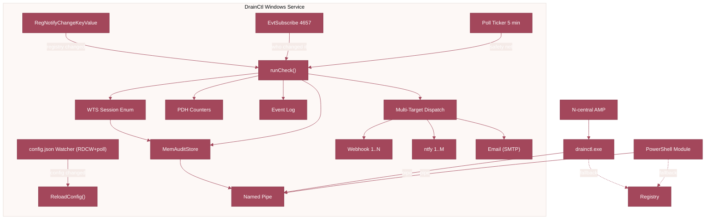
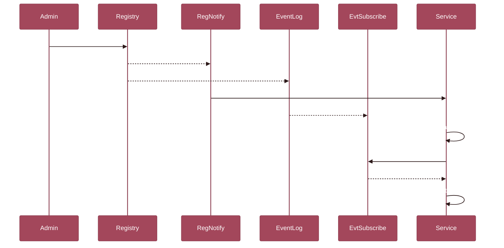

<p align="center">
  
</p>

<h1 align="center">LISSTech DrainCtl</h1>

<p align="center"><strong>Real-time Remote Desktop Session Host drain mode monitoring for Windows Server.</strong></p>


[](https://www.powershellgallery.com/packages/LISSTech.DrainCtl)

Know the instant someone blocks new connections on your RDSH servers. DrainCtl runs as a Windows Service that detects drain mode changes in real time, maintains a 90-day audit trail, and tells you exactly who made the change. Query it from the CLI, PowerShell, or your RMM &mdash; the answer is always instant.

---

## 📑 Table of Contents

- [🔭 Overview](#-overview)
- [🏗️ Architecture](#️-architecture)
- [📦 Installation](#-installation)
- [🚀 Quick Start](#-quick-start)
- [⌨️ CLI Reference](#️-cli-reference)
- [🐚 PowerShell Module](#-powershell-module)
- [⚙️ Service](#️-service)
- [🔔 Notifications](#-notifications)
- [🔧 Configuration](#-configuration)
- [🔒 Audit Setup](#-audit-setup)
- [🛠️ Building from Source](#️-building-from-source)
- [📁 Project Structure](#-project-structure)
- [📄 License](#-license)

---

## 🔭 Overview

DrainCtl monitors the `TSServerDrainMode` registry value on RDSH servers and answers one question: **are new connections allowed?** And when performance matters: CPU, memory, input delay, and RemoteFX metrics — collected every poll cycle, with threshold alerts that fire before users open tickets.

### Key Features

| Feature | Description |
|---------|-------------|
| 🔔 **Real-time detection** | `RegNotifyChangeKeyValue` fires the instant drain mode flips -- zero polling delay |
| 📋 **90-day audit trail** | Every state observation and transition, persisted as JSONL with automatic rotation |
| 🕵️ **Change attribution** | `EvtSubscribe` on Event ID 4657 -- knows exactly *who* ran `chglogon /drain` |
| 🖥️ **Windows Service** | Runs as `DrainCtl` with auto-start; poll ticker as safety net in case events are lost |
| ⚡ **Named pipe IPC** | CLI and PowerShell get answers in <1 ms via `\\.\pipe\drainctl` -- no file I/O |
| 📊 **N-central ready** | Exit codes + structured stdout slot directly into AMP threshold monitoring |
| 🐚 **PowerShell native** | `Get-RDSHDrainMode`, `Test-RDSHDrainMode`, `Get-RDSHDrainHistory` -- pipeline-friendly |
| 📡 **Multi-target notifications** | N webhooks + M ntfy.sh + email (SMTP) -- each target gets its own triggers and repeat cadence |
| 🎯 **Granular triggers** | 12 trigger types: `drain_on`, `drain_off`, `alert`, `healthy`, `session_warning`, `cpu_warning`, `cpu_critical`, and more |
| 📈 **Live session tracking** | `WTSEnumerateSessionsW` counts active, disconnected, and total sessions with utilization % |
| 🚨 **Utilization alerts** | Configurable threshold fires `session_warning` before your RDSH boxes hit capacity |
| 📊 **Performance monitoring** | PDH counters track CPU, memory, disk queue, input delay, and RemoteFX metrics per poll cycle — with configurable thresholds that fire `cpu_warning`, `memory_critical`, `input_delay_warning`, and more |

---

## 🏗️ Architecture



### How Detection Works



---

## 📦 Installation

### MSI Installer (recommended)

```powershell
msiexec /i LISSTech.DrainCtl.msi /qn
```

The MSI installs:

| Component | Location |
|-----------|----------|
| CLI + DLL | `C:\Program Files\LISS Technologies\LISSTech DrainCtl\bin\` |
| PowerShell module | `C:\Program Files\WindowsPowerShell\Modules\LISSTech.DrainCtl\` |
| Data directory | `C:\ProgramData\LISS Technologies\LISSTech DrainCtl\` |
| Windows Service | `DrainCtl` — auto-start as LocalSystem |
| System PATH | `bin\` folder added |
| Event Log source | `DrainCtl` with custom message file |
| JSON config | `%ProgramData%\LISS Technologies\LISSTech DrainCtl\config.json` |

> **Upgrading from v26?** The first run auto-migrates your registry configuration to `config.json`. Existing installs upgrade seamlessly — no manual steps required.

The MSI installer provides a setup wizard with license acceptance, install mode selection, and configuration options. For unattended deployment, MSI properties can be passed directly:

```powershell
msiexec /i LISSTech.DrainCtl.msi /qn INSTALL_MODE=registration DASHBOARD_URL=https://dash.example.com:49470 WEBHOOK_URL=https://hooks.example.com/drain
```

### PowerShell Gallery (module only)

```powershell
Install-Module -Name LISSTech.DrainCtl -Scope AllUsers
```

Just the cmdlets — no service, no CLI. Queries go directly to the registry. See [PSGallery](https://www.powershellgallery.com/packages/LISSTech.DrainCtl).

### Manual (CLI only, no service)

Copy `drainctl.exe` anywhere and run it. Works standalone — the service is optional.

---

## 🚀 Quick Start

```powershell
# Check current state (instant if service is running)
PS> drainctl check
2026-04-02T20:08:56-04:00 [INF] source=service
2026-04-02T20:08:56-04:00 [INF] host=RDSH01
2026-04-02T20:08:56-04:00 [INF] drain_mode=ALLOW_ALL_CONNECTIONS value=0
2026-04-02T20:08:56-04:00 [INF] state_since=2026-04-02T18:30:00-04:00 state_duration=1h38m56s
2026-04-02T20:08:56-04:00 [INF] grace_period=1h0m0s
2026-04-02T20:08:56-04:00 [INF] sessions=12 active / 3 disconnected / 15 total (60% of 25)
2026-04-02T20:08:56-04:00 [OK ] status=Healthy connections_allowed=true exit=0

# JSON output
PS> drainctl check --format json

# View audit trail
PS> drainctl history --limit 5

# PowerShell
PS> Get-RDSHDrainMode | Format-List
PS> if (Test-RDSHDrainMode) { "OK" } else { "ALERT" }
PS> Get-RDSHDrainHistory -ChangesOnly -Limit 10
```

---

## ⌨️ CLI Reference

```
drainctl check              Check drain mode state
drainctl history            View audit trail
drainctl audit-setup        Configure registry auditing (one-time, admin)
drainctl service install    Install Windows service
drainctl service uninstall  Remove Windows service
drainctl service start      Start the service
drainctl service stop       Stop the service
drainctl notify add         Add a notification target
drainctl notify remove      Remove a notification target
drainctl notify list        List configured notification targets
drainctl notify test        Send a test notification to all targets
```

### Global Flags

| Flag | Default | Description |
|------|---------|-------------|
| `--db` | `%ProgramData%\...\audit.jsonl` | Audit trail path |
| `--format` | `plain` (check) / `table` (history) | Output: `plain`, `table`, `csv`, `json` |
| `--quiet` | `false` | Suppress intermediate log lines |

### Check Flags

| Flag | Default | Description |
|------|---------|-------------|
| `--grace` | `60` | Minutes drain mode must persist before alerting |
| `--retention` | `90` | Days to retain audit records (max: 365) |

### History Flags

| Flag | Default | Description |
|------|---------|-------------|
| `--limit` | `50` | Maximum records to display |
| `--changes-only` | `false` | Show only state transitions |

### Notify Subcommands

| Command | Description |
|---------|-------------|
| `drainctl notify add <type> <url> [--triggers ...] [--repeat N]` | Add a webhook, ntfy, or email target with optional trigger filter and repeat interval |
| `drainctl notify remove <url>` | Remove a notification target by URL |
| `drainctl notify list` | List all configured notification targets and their settings |
| `drainctl notify test` | Send a test notification to all configured targets |
| `drainctl notify set-webhook <url>` | Convenience: add/update a single webhook target |
| `drainctl notify set-ntfy <url>` | Convenience: add/update a single ntfy target |

### Exit Codes

| Code | Meaning |
|------|---------|
| `0` | Healthy or within grace period |
| `1` | Alert — drain mode active beyond grace period |
| `2` | Error — registry unreadable |

---

## 🐚 PowerShell Module

```powershell
Import-Module LISSTech.DrainCtl
```

### Cmdlets

| Cmdlet | Returns | Description |
|--------|---------|-------------|
| `Get-RDSHDrainMode` | `PSObject` | Full drain mode state with audit data |
| `Test-RDSHDrainMode` | `bool` | `$true` if connections allowed, `$false` if alert |
| `Get-RDSHDrainHistory` | `PSObject[]` | Audit trail records |
| `Install-RDSHDrainAudit` | — | Configure registry auditing (one-time) |
| `Get-RDSHDrainNotification` | `PSObject` | Current notification configuration |
| `Set-RDSHDrainNotification` | — | Update notification settings *(deprecated — use target cmdlets below)* |
| `Test-RDSHDrainNotification` | — | Send test notification to configured backends |
| `Get-RDSHDrainNotificationTarget` | `PSObject[]` | Lists all configured notification targets with full detail |
| `Add-RDSHDrainNotificationTarget` | — | Adds a notification target (webhook or ntfy) with per-target triggers |
| `Remove-RDSHDrainNotificationTarget` | — | Removes a notification target by URL |

### Examples

```powershell
# Rich status
Get-RDSHDrainMode

# Boolean check for scripts
if (-not (Test-RDSHDrainMode)) {
    Send-Alert "RDSH drain mode active on $env:COMPUTERNAME"
}

# Recent changes with attribution
Get-RDSHDrainHistory -ChangesOnly -Limit 5 | Format-Table

# Custom grace period
Get-RDSHDrainMode -GraceMinutes 120
```

---

## ⚙️ Service

The `DrainCtl` Windows Service provides:

- **Instant detection** via `RegNotifyChangeKeyValue` (~0ms)
- **Change attribution** via `EvtSubscribe` on Security Event ID 4657 (~200ms)
- **Safety-net polling** every 5 minutes (configurable)
- **Session tracking** via `WTSEnumerateSessionsW` — active, disconnected, and total counts
- **Exclusive audit file** ownership — no corruption from concurrent access
- **In-memory store** — CLI/PS queries are instant (named pipe, no file I/O)
- **Event Log entries** — warnings for grace, errors for alerts, info for transitions
- **Auto-discovery** via DNS SRV (`_drainctl._tcp.<domain>`) — agents find the dashboard with zero per-machine config
- **Auto-registration** with dashboard on startup (via SRV discovery or explicit `dashboard.url`)
- **HTTPS by default** — auto-generated self-signed cert, or bring your own PEM files

### Event Log

Events are written to `Application` log under source `DrainCtl`:

| Event ID | Level | Description |
|----------|-------|-------------|
| 1000 | Info | Service started |
| 1001 | Info | Service stopped |
| 1002 | Info | Check: healthy |
| 1003 | Info | Configuration reloaded |
| 1004 | Info | State transition detected |
| 2000 | Warning | Check: drain mode in grace period |
| 3000 | Error | Check: drain mode alert (grace exceeded) |
| 3001 | Error | Registry read failure |

---

## 🔔 Notifications

DrainCtl supports **multi-target notifications** — configure any number of webhook, ntfy.sh, and email (SMTP) targets, each with its own trigger filter and repeat interval.

### Setup

```powershell
# Add notification targets
drainctl notify add webhook https://hooks.slack.com/services/T.../B.../xxx --triggers drain_on,drain_off,alert,healthy --repeat 30
drainctl notify add ntfy https://ntfy.sh/my-drainctl-alerts --triggers alert,session_warning --repeat 0
drainctl notify add email smtp://smtp.example.com:587 --to ops@example.com --from drainctl@example.com --secret smtp-password --triggers drain_on,drain_off,alert

# List configured targets
drainctl notify list

# Remove a target
drainctl notify remove https://hooks.slack.com/services/T.../B.../xxx

# Test all targets
drainctl notify test

# Convenience shortcuts (add/update a single target)
drainctl notify set-webhook https://hooks.example.com/drainctl
drainctl notify set-ntfy https://ntfy.sh/my-alerts

# PowerShell
Get-RDSHDrainNotification
Test-RDSHDrainNotification
```

### Granular Triggers

Each notification target can subscribe to specific event types:

| Trigger | Description |
|---------|-------------|
| `drain_on` | Drain mode activated (new connections blocked) |
| `drain_off` | Drain mode deactivated (connections restored) |
| `grace_entered` | Drain mode entered grace period |
| `alert` | Drain mode exceeded grace period |
| `healthy` | Returned to healthy state |
| `session_warning` | Session utilization threshold exceeded |
| `cpu_warning` | Host CPU exceeds warning threshold (2 consecutive polls) |
| `cpu_critical` | Host CPU exceeds critical threshold (2 consecutive polls) |
| `memory_warning` | Available memory below warning threshold (2 consecutive polls) |
| `memory_critical` | Available memory below critical threshold (2 consecutive polls) |
| `input_delay_warning` | User input delay P95 exceeds warning threshold |
| `input_delay_critical` | User input delay P95 exceeds critical threshold |

If no triggers are specified, the target receives all events.

### Config Example

Notification targets are defined in `config.json`:

```json
{
  "notifications": [
    {
      "type": "webhook",
      "url": "https://hooks.slack.com/services/T.../B.../xxx",
      "triggers": ["drain_on", "drain_off", "alert", "healthy"],
      "repeat_minutes": 30
    },
    {
      "type": "ntfy",
      "url": "https://ntfy.sh/my-alerts",
      "triggers": ["alert", "session_warning"],
      "repeat_minutes": 0
    },
    {
      "type": "email",
      "url": "smtp://smtp.example.com:587",
      "to": ["ops@example.com"],
      "from": "drainctl@example.com",
      "secret": "smtp-password",
      "triggers": ["drain_on", "drain_off", "alert"]
    }
  ]
}
```

### Webhook Payload

```json
{
  "event": "drain_on",
  "host": "RDSH01",
  "drain_mode": "ALLOW_RECONNECTIONS_PREVENT_NEW_LOGONS",
  "previous_mode": "ALLOW_ALL_CONNECTIONS",
  "status": "Grace",
  "message": "Drain mode active, within grace period (45m remaining).",
  "changed_by": "DOMAIN\\admin",
  "state_duration_seconds": 900,
  "timestamp": "2026-04-03T14:30:00-04:00",
  "sessions": {
    "active_sessions": 12,
    "disconnected_sessions": 3,
    "total_sessions": 15,
    "max_sessions": 25,
    "utilization_pct": 60
  },
  "performance": {
    "cpu_pct": 78.3,
    "mem_avail_mb": 2048,
    "mem_total_mb": 16384,
    "input_delay_p95_ms": 42,
    "input_delay_max_ms": 88,
    "disk_queue": 0.3
  }
}
```

The `event` field uses the trigger name (`drain_on`, `drain_off`, `grace_entered`, `alert`, `healthy`, `session_warning`, `cpu_warning`, `cpu_critical`, `memory_warning`, `memory_critical`, `input_delay_warning`, `input_delay_critical`). ntfy messages use priority `high` for alerts, `default` for other events.

---

## 🔧 Configuration

Configuration lives in a JSON file, hot-reloaded via event-based (ReadDirectoryChangesW) with poll fallback:

**Path:** `%ProgramData%\LISS Technologies\LISSTech DrainCtl\config.json`

- Atomic writes with cross-process mutex — safe for concurrent access
- Auto-migrates from registry on first run (existing v26 installs upgrade seamlessly)
- No service restart needed — changes are picked up automatically

### Full config.json Example

```json
{
  "grace_period_minutes": 60,
  "retention_days": 90,
  "poll_interval_seconds": 300,
  "audit_path": "C:\\ProgramData\\LISS Technologies\\LISSTech DrainCtl\\audit.jsonl",
  "session_warning_threshold": 80,
  "performance": {
    "enabled": true,
    "cpu_warn_pct": 70,
    "cpu_crit_pct": 85,
    "mem_warn_pct": 20,
    "mem_crit_pct": 10,
    "input_delay_warn_ms": 50,
    "input_delay_crit_ms": 100,
    "collect_remotefx": false,
    "collect_per_session": true
  },
  "dashboard": {
    "url": ""
  },
  "notifications": [
    {
      "type": "webhook",
      "url": "https://hooks.slack.com/services/T.../B.../xxx",
      "triggers": ["drain_on", "drain_off", "alert", "healthy"],
      "repeat_minutes": 30
    },
    {
      "type": "ntfy",
      "url": "https://ntfy.sh/my-alerts",
      "triggers": ["alert", "session_warning"],
      "repeat_minutes": 0
    },
    {
      "type": "email",
      "url": "smtp://smtp.example.com:587",
      "to": ["ops@example.com", "oncall@example.com"],
      "from": "drainctl@example.com",
      "secret": "smtp-password",
      "triggers": ["drain_on", "drain_off", "alert"]
    }
  ]
}
```

### Config Reference

| Key | Type | Default | Description |
|-----|------|---------|-------------|
| `grace_period_minutes` | int | `60` | Minutes before alerting on drain mode |
| `retention_days` | int | `90` | Days to keep audit records (1–365) |
| `poll_interval_seconds` | int | `300` | Seconds between safety-net polls |
| `audit_path` | string | `%ProgramData%\...\audit.jsonl` | Audit file path |
| `session_warning_threshold` | int | `80` | Session utilization % that triggers `session_warning` (0 = disabled) |
| `dashboard.url` | string | *(empty)* | Dashboard URL for auto-registration (or leave empty for SRV discovery) |
| `dashboard.tls_cert` | string | *(empty)* | Path to PEM certificate file (auto-generated if empty) |
| `dashboard.tls_key` | string | *(empty)* | Path to PEM private key file |
| `dashboard.tls_fingerprint` | string | *(empty)* | SHA-256 cert fingerprint for agent-side pinning |
| `performance.enabled` | bool | `false` | Enable PDH performance counter collection |
| `performance.cpu_warn_pct` | int | `70` | CPU % warning threshold (0=default, -1=disabled) |
| `performance.cpu_crit_pct` | int | `85` | CPU % critical threshold |
| `performance.mem_warn_pct` | int | `20` | Memory % free warning threshold |
| `performance.mem_crit_pct` | int | `10` | Memory % free critical threshold |
| `performance.input_delay_warn_ms` | int | `50` | Input delay P95 warning threshold (ms) |
| `performance.input_delay_crit_ms` | int | `100` | Input delay P95 critical threshold (ms) |
| `performance.collect_remotefx` | bool | `false` | Collect RemoteFX Graphics/Network counters |
| `performance.collect_per_session` | bool | `true` | Collect per-session CPU, memory, input delay |
| `notifications` | array | `[]` | Notification targets (see below) |

### Notification Target Fields

| Field | Type | Required | Description |
|-------|------|----------|-------------|
| `type` | string | yes | `"webhook"`, `"ntfy"`, or `"email"` |
| `url` | string | yes | Endpoint URL (`https://` for webhook/ntfy, `smtp://` or `smtps://` for email) |
| `to` | string[] | email only | Recipient addresses |
| `from` | string | email only | Sender address |
| `secret` | string | no | HMAC-SHA256 signing secret (webhook) or SMTP password (email) |
| `triggers` | string[] | no | Event types to notify on (omit for all) |
| `repeat_minutes` | int | no | Re-alert interval while condition persists (0 = notify once) |

---

## 🔒 Audit Setup

To attribute drain mode changes to specific users, run once as admin:

```powershell
drainctl audit-setup
# or
Install-RDSHDrainAudit
```

This configures:
1. `auditpol` — enables Registry subcategory auditing
2. SACL on `HKLM\...\Terminal Server` — tracks `SetValue` operations

> **Domain-joined machines:** Local `auditpol` settings are overwritten by Group Policy refresh (~90 min). Configure the equivalent GPO:
> `Computer Configuration > Policies > Windows Settings > Security Settings > Advanced Audit Policy Configuration > Object Access > Audit Registry > Success`

---

## 🛠️ Building from Source

### Prerequisites

- Go 1.22+
- MinGW (for CGo / DLL build): `scoop install mingw`
- WiX Toolset 5.x: `dotnet tool install -g wix`
- .NET SDK 8.0+

### Build

```bash
just all          # Build CLI + DLL + PS module + MSI (unsigned)
just release      # Build + sign everything (requires CODE_SIGNING_CERTIFICATE_THUMBPRINT in .env)
just lint         # go vet + gofmt + golangci-lint
just test         # Test PowerShell module
just clean        # Remove dist/
just resource     # Recompile icon/version (after changing .rc or .ico)
```

### Signing

Create `.env` from the example:

```bash
cp .env.example .env
# Set CODE_SIGNING_CERTIFICATE_THUMBPRINT=<your-cert-sha1>
```

`just release` signs in the correct order: binaries + PS module first, then builds MSI (with signed contents), then signs the MSI.

---

## 📁 Project Structure

```
LISSTech.DrainCtl/
├── drainctl.go              # Package root: version, defaults
├── registry.go              # ReadDrainMode(), DrainMode, RegistryState
├── eventlog.go              # QueryRegistryChangeUser() (wevtutil fallback)
├── audit.go                 # AuditRecord, AuditStore (file-based)
├── check.go                 # Check() — core monitoring logic
├── history.go               # GetHistory() — audit trail query
├── audit_setup.go           # RunAuditSetup() — auditpol + SACL
├── format.go                # Output formatting (plain/table/csv/json)
├── log.go                   # LogFunc, DefaultLogger, DiscardLogger
├── config.go                # ServiceConfig, NotifyConfig, JSON file with atomic writes
├── notify.go                # Multi-target webhook + ntfy.sh notification dispatch
├── sessions.go              # WTS session enumeration via wtsapi32.dll
├── internal/
│   ├── svc/                 # Windows Service handler + install/uninstall
│   ├── pipe/                # Named pipe IPC server + client
│   ├── store/               # MemAuditStore (in-memory + JSONL flush)
│   ├── perfmon/             # PDH performance counter collection
│   └── watcher/             # RegNotifyChangeKeyValue + EvtSubscribe
├── cmd/
│   ├── drainctl/            # CLI entry point (cobra)
│   └── cshared/             # C-shared DLL exports
├── powershell/
│   ├── LISSTech.DrainCtl.psd1
│   └── LISSTech.DrainCtl.psm1
├── installer/               # WiX 5 MSI project
├── assets/                  # Icon, event log message file
├── docs/                    # Landing page (GitHub Pages)
├── justfile                 # Build recipes
└── .env.example             # Signing configuration template
```

---

## 📄 License

**Apache License 2.0** — see [LICENSE](LICENSE).


---

<p align="center">
  <sub>Built by <a href="https://lisstech.com">LISS Consulting, Corp.</a></sub>
</p>
