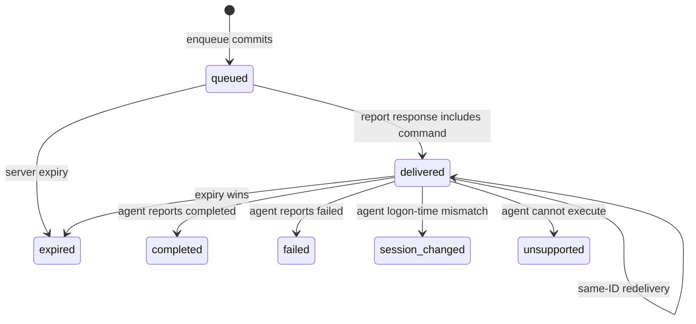

# Contract: Session Actions

Session actions are administrator-only, explicitly confirmed browser requests. The server never opens Remote Desktop, shadows a session, or calls WTS: it durably queues commands for delivery through authenticated normal reports, with each response bounded to 20 active commands. Action routes always exist for admins; when sessions or actions are disabled they return `409 {"error":"sessions_disabled"}` rather than disappearing.

## POST `/api/v1/sessions/{host}/{session_id}/actions`

```http
POST /api/v1/sessions/rdsh-07.example.test/3/actions
Content-Type: application/json
Idempotency-Key: 0195a584-5b25-7a00-91a5-7cbb4dac92d9

{"type":"message","expected_logon_at_ms":1769990000000,"message":"Please save your work."}
```

`{host}` is a canonical RFC 1123 host and `{session_id}` is decimal ASCII `uint32` (`0..4294967295`). `Idempotency-Key` is required and is a UUID string. Its durable scope is the authenticated admin principal plus the canonical endpoint (HTTP method, canonical host, numeric session ID). The outbox persists `requested_by`, `idempotency_endpoint`, `idempotency_key`, and a cryptographic `request_fingerprint` of the normalized request. Thus a same-scope key with the same normalized request replays the original response, while a different request fingerprint returns `409 {"error":"idempotency_conflict"}`. This holds for concurrent requests by the unique outbox index.

The body permits exactly `type` and `expected_logon_at_ms`, with optional `message`; unknown keys are rejected:

| Field | Rule |
|---|---|
| `type` | exact `disconnect`, `logoff`, or `message` |
| `expected_logon_at_ms` | non-null integer Unix ms; exactly equals the stored live row |
| `message` | for `disconnect` and `logoff`, omitted or exactly `""`; for `message`, required UTF-8 1–256 Unicode scalar values after trim, no NUL/control except LF |

Normalization used for the fingerprint is the validated action type, decimal expected logon time, and normalized message (trimmed message for `message`; empty for `disconnect` and `logoff`), encoded in a fixed unambiguous canonical form. JSON whitespace and key order therefore do not change replay behavior.

The confirmation dialog immediately before POST displays exact host, numeric session ID, action, redacted target identity, and exact message where applicable. Server validation is independent of browser confirmation.

## Atomic enqueue preconditions

In one write transaction, after resolving an idempotency replay, the server rechecks: caller is admin; sessions and actions are enabled; the host has a fresh successful snapshot; the latest attempt has no collection error; its successful snapshot reports `session_actions`; the live row exists; and its non-null stored `logon_at_ms` exactly equals the request. It creates a UUIDv7 action ID, `queued` outbox row, append-only redacted queued audit event, and idempotency data atomically.

Only a message action protects plaintext with the product's existing protected-secret mechanism before persistence. SQLite stores `message_ciphertext` and `message_protection` only for an active message action, never plaintext; disconnect and logoff persist neither field. The protected payload is erased on every terminal transition. Message content never appears in responses, SSE, audit, logs, errors, or telemetry.

A new action returns `202`; a replay returns `200`:

```json
{"action":{"action_id":"0195a584-5b25-7a00-91a5-7cbb4dac92d9","type":"message","host":"rdsh-07.example.test","session_id":3,"expected_logon_at_ms":1769990000000,"state":"queued","created_at_ms":1770000123999,"expires_at_ms":1770000423999}}
```

The response deliberately omits identity, client, process, and message. `expires_at_ms` is exactly `created_at_ms + 300000`.

## Privacy-policy changes

Changing any session visibility policy (`identity_visibility`, `client_visibility`, or `process_visibility`) immediately deletes all `session_snapshots` rows and cascades deletion of `session_latest`. In the same settings transaction, every active action for every host (`queued` or `delivered`) transitions to terminal `expired` with result code `privacy_policy_changed`; message ciphertext/protection is erased and an `expired` audit event is written. Thus no command can be delivered from a snapshot invalidated by a policy change. A subsequent accepted successful projected snapshot is required before an action can be queued again. This applies to loosening as well as tightening policy; loosening does not restore deleted telemetry.

| Status | `error` | Condition |
|---:|---|---|
| 400 | `invalid_action_request` | malformed host/session/body/key or message bound violation |
| 401 | `unauthorized` | existing authentication failure |
| 403 | `admin_required` | authenticated non-admin |
| 404 | `session_snapshot_not_found` / `session_not_found` | absent retained host or session |
| 409 | `sessions_disabled` / `host_not_fresh` / `actions_unsupported` / `session_identity_changed` / `idempotency_conflict` | failed enqueue precondition |
| 429 | `rate_limited` | existing API limiter |
| 503 | `storage_error` | no action queued |

## Delivery, redelivery, and terminal state



The durable vocabulary is exactly `queued`, `delivered`, `completed`, `failed`, `expired`, `session_changed`, and `unsupported`; all but the first two are terminal. A report response selects at most 20 unexpired active rows for its authenticated host in `queued` **or** `delivered` state, ordered by `created_at_ms` ascending. It atomically changes selected queued rows to delivered and records `delivered_at_ms` once. It may select delivered rows again, unchanged, until their terminal result or expiry. Therefore report retries and subsequent reports can redeliver the same action ID; they must never receive a newly minted substitute ID.

Immediately before execution, the agent transactionally inserts `action_id` as `claimed` in its durable local ledger, then checks expiry, re-enumerates the target, and compares exact logon time. Only after a match does it call `WTSDisconnectSession(..., false)` for disconnect, `WTSLogoffSession(..., false)` for logoff, or `WTSSendMessageW` for message. It records terminal outcome in that ledger before reporting. It never re-executes a claimed ID after restart or redelivery; it returns a safe `failed` or `duplicate` outcome. The next report contains at most 20 terminal outcome objects: `completed`, `failed`, `expired`, `session_changed`, `unsupported`, or `duplicate`; `duplicate` acknowledges the locally known ID and does not alter an already terminal server state.

The server accepts a terminal completion only for its expected host, type, and active delivered state. It rejects a mismatched or invalid completion without changing the outbox and appends only a redacted `protocol_invalid` audit event. Expiry wins over unprocessed delivery. Every delivery, terminal result, expiry, and invalid completion gets an immutable audit record. Expiry and terminal transitions erase message protection/ciphertext atomically with their state transition.

## GET `/api/v1/session-actions/{action_id}`

This admin-only status route returns the same safe action projection as enqueue (`action_id`, type, host, numeric session ID, expected logon time, state, created/expiry time, and terminal `completed_at_ms`/`result_code` when applicable), never identity, client, process, message, ciphertext, or raw diagnostics. It returns `200` for a retained action, `404 {"error":"session_action_not_found"}` after independent action retention, `403 {"error":"admin_required"}` for non-admins, and `503 {"error":"storage_error"}` on storage failure. The browser polls it every two seconds for each queued or delivered action, aborting on terminal state or navigation. It tracks pending action IDs in `sessionStorage` before enqueue navigation/reload risk, restores polling after reload, and maps each terminal result to a toast.

## Audit, retention, and shadow helper

Each audit record contains only timestamp, action ID, queue actor (`requested_by`, for queued only), action type, canonical host, numeric session ID, expected logon time, transition, and result code. It never contains username, domain, station, client, process, message, or raw WTS diagnostics. The outbox persists the complete idempotency scope and fingerprint for as long as the action exists, so a same-key replay remains deterministic during that retention window.

At least hourly, and immediately after a retention reduction, maintenance first expires unexpired queued/delivered rows, then independently removes terminal outbox rows by terminal timestamp and audit rows by audit timestamp. These action-relative cutoffs are independent of snapshot retention: terminal actions and audits may survive after their host snapshot has been purged. The agent removes a terminal ledger row only after the dashboard acknowledges its completion, or after its expiry plus the configured retention period; it likewise never couples ledger cleanup to snapshot deletion. Deletion of an old outbox record removes its idempotency record, so a request after that action retention window is a new request. Retention does not alter terminal-state semantics before deletion.

The UI may offer Shadow whenever its inputs are safe, independent of `allow_actions`. The fresh-session endpoint returns both the exact endpoint-owned `drainctl-shadow://shadow?host=<RFC1123-host>&session=<numeric-session-id>` URI for local browser navigation and `mstsc.exe /v:<RFC1123-host> /shadow:<numeric-session-id> /control` as an accessible copy fallback. The UI never constructs a launch URI; it verifies the endpoint value exactly before navigation. Any site or local app may invoke the installed protocol, so the GUI helper is the security boundary: it strictly accepts only the complete URI shape and starts local mstsc with fixed separate arguments. Browser/Windows external-protocol confirmation and normal mstsc consent remain. It never includes `/noConsentPrompt`, credentials, identity, client address, shell quoting, or arbitrary arguments.
