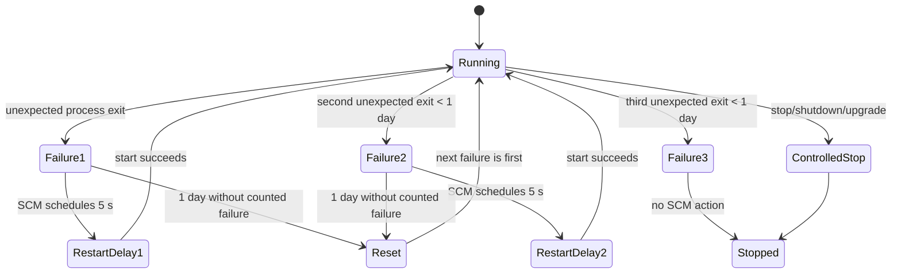
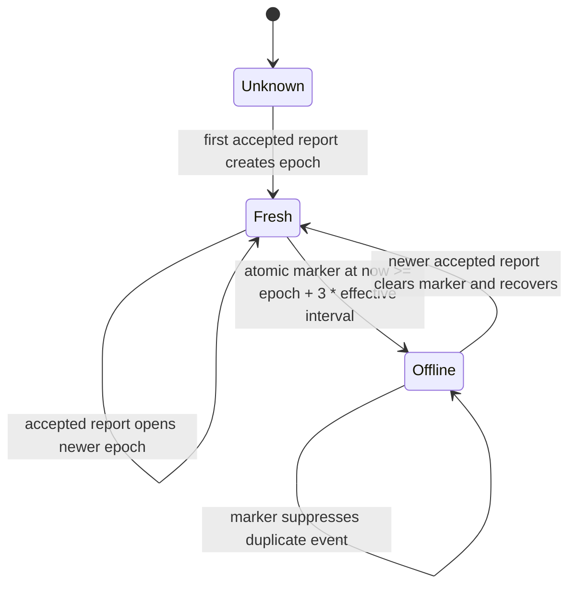

# Implementation Plan: Runtime Resilience and Diagnostics (012)

**Branch**: `012-runtime-resilience` | **Date**: 2026-09-26 | **Spec**: [spec.md](./spec.md)
**Input**: Evidence-backed runtime-resilience specification.

## Summary

Make service recovery deterministic and inspectable, collect the next `drainctld.exe` crash locally without exfiltrating memory, turn stale-host derivation into durable one-shot offline/recovery events, and make RemoteFX persistence reject invalid data while preserving directional percentile meaning.

Technical approach in one sentence: retain SCM as the recovery authority, provision a protected WER LocalDumps folder through installer-owned configuration, persist freshness epochs atomically in telemetry SQLite schema v3 and publish additive SSE transitions, and normalize RemoteFX values before the existing telemetry pipeline.

## Technical context

**Language/version**: Go 1.26.2; WiX installer; Svelte dashboard client.
**Primary dependencies**: `golang.org/x/sys/windows`, existing `modernc.org/sqlite`, Windows SCM, and WER registry configuration.
**Storage**: Existing ProgramData product root, SQLite dashboard/telemetry database, and a new local-only `dumps` directory.
**Target platform**: Windows Server LocalSystem service (`drainctld.exe`) and authenticated browser dashboard.
**Testing**: Focused Go unit/integration tests around installer configuration helpers, freshness transitions, report ingest, and metric persistence; controlled service smoke test on an isolated Windows test VM; manual local dump workflow.
**Performance goals**: No per-heartbeat network call or dump-directory scan; one bounded local transition write only on state boundary; RemoteFX validation is O(number of optional fields).
**Constraints**:

- SCM is the sole automatic restart owner. Do not implement a second in-process restart loop.
- WER dumps are protected local diagnostic artifacts. Never upload, transmit, add to SQLite, or include dump bytes in events/logs/notifications; only optional newest-dump gzip/hash processing requires explicit local authorization.
- Do not change core report compatibility: all new report and SSE data is additive.
- Use the effective heartbeat interval already exposed by `DashboardConfig.HeartbeatInterval`; offline means exactly three intervals.
- Preserve the existing `server_update` contract and existing directional aggregation semantics.
- Do not place customer-specific hostnames, URLs, secrets, credentials, or dump data in the repository.

## Evidence and decision record

| Decision | Basis | Result |
|---|---|---|
| Preserve SCM recovery policy | The installer configures two 5-second restarts, third none, 1-day reset (`installer/LISSTech.DrainCtl.wxs`). | Retain that configuration; service panics continue to surface as failed process exits. |
| Provision WER LocalDumps | Installer configuration targets only `drainctld.exe` with mini dumps, a 3-file cap, and a protected product-local directory. | WER owns crash-dump creation and retention; no application crash-path dumper is used. |
| Persist freshness epochs | SQLite schema v3 contains `host_freshness(host, report_epoch_ms, offline_emitted_at_ms)`. | Serialized writer transactions dedupe each canonical-host/accepted-report epoch across requests and dashboard restarts without changing `last_result` or `last_seen`. |
| Treat zero FPS/quality as gap | Existing `checkResultSamples` already omits zero FPS/quality (`internal/dashboard/samples.go`). Evidence is sparse/nonzero FPS. | Make this an ingest invariant and do not create synthetic zero buckets. |
| Reject sentinel/outlier RemoteFX values | v26.9.47 evidence includes an encoding value near `2^32`; current PDH output is not bounded. | Validate per field before percentiles/persistence; retain valid siblings. |
| Preserve percentile direction | Existing `AggregateServicePercentiles` uses numeric P5 for higher-is-better FPS/quality and P95 for other fields. | Keep semantics and make labels/API explicit. |

**Inference caution**: Evidence does not establish why the v26.9.17 service remained stopped or prove the meaning of the near-`2^32` encoding value. The design treats both as diagnostic/validity risks, not as a root-cause claim.

## Constitution check

- **Windows-first delivery**: PASS. Runtime changes target Windows service, WiX setup, WER, PDH, and dashboard backend; all net-new Go files require `//go:build windows`.
- **Stable operator surfaces**: PASS. Existing reports and `server_update` remain compatible. New SSE types and any diagnostics endpoint are additive. Dumps are local-only and do not alter the network contract.
- **Tests and zero-noise verification**: PASS. Boundary and transition tests must be deterministic. The controlled crash test runs only on a dedicated test machine, never a production service.
- **Config and release discipline**: PASS. Reuse existing installer/config flow and product ProgramData root. No hand-maintained release version or parallel configuration system.
- **Operational observability**: PASS. Surface setup failures, recovery configuration, dump inventory metadata, freshness boundaries, and invalid RemoteFX drops without leaking sensitive values.

## Architecture

### 1. Service recovery state machine

- WiX `util:ServiceConfig` remains the installer source of truth for failure actions.
- `internal/svc/service_loop.go` deliberately re-panics after logging a recovered panic so SCM observes failure. Do not add a `recover` that returns a clean stop.
- SCM event IDs and dump metadata are complementary: service-control history explains recovery decisions; WER preserves the process evidence. Neither is automatically sent elsewhere.

### 2. WER LocalDumps lifecycle and security

**Provisioning path**:

1. Installer/repair creates `%ProgramData%\LISS Technologies\LISSTech DrainCtl\dumps`.
2. It applies a protected DACL: LocalSystem and local Administrators full control; removes broad inherited access.
3. It writes the per-executable WER key under `HKLM\Software\Microsoft\Windows\Windows Error Reporting\LocalDumps\drainctld.exe` with `DumpFolder`, `DumpType=1`, and `DumpCount=3`.
4. It logs success/failure as setup metadata. WER, rather than application code, owns dump creation and count-based retention.

**Runtime lifecycle**:

- Unexpected crash → WER may create mini dump locally → SCM applies configured action.
- Normal planned service stop → no crash dump expected.
- WER retention evicts oldest dumps after its count cap. Product code does not race this behavior.
- Operator copies a selected file to approved incident storage manually; the product never does it.

**Security boundary**:

- A dump can contain credentials, memory, and operator data. It must not inherit ProgramData's broad read permissions.
- Expose only inventory metadata to an authorized local/admin surface; never raw dump content through HTTP, named pipe, logs, notification payloads, or telemetry.
- Directory or registry provisioning failure is a visible degraded-diagnostics condition, not permission to use an unprotected fallback directory.

### 3. Stale-host transition architecture

Current source surfaces:

- `internal/dashboard/store.go`: `ServerState.Update` persists `LastSeen` and calls `OnUpdate`.
- `internal/dashboard/server.go`: `staleAfter()` calculates `missedHeartbeatLimit * HeartbeatInterval`.
- `internal/dashboard/handlers_servers.go` and `handlers_status.go`: derive `off`/offline for read responses.
- `internal/dashboard/sse.go` and `broker.go`: publish typed SSE envelopes.

Add the durable `host_freshness` SQLite schema-v3 record keyed by canonical hostname: `report_epoch_ms` is the dashboard accepted-report epoch and nullable `offline_emitted_at_ms` records the single offline transition for that epoch. The report path and freshness evaluator use serialized writer transactions:

- `Unknown` has no accepted report and is not a missed-heartbeat state.
- The offline transaction requires the matching current epoch and writes `offline_emitted_at_ms` before broadcasting `host_offline`; a stale evaluator cannot overwrite a newer report.
- The accepted-report transaction writes the newer epoch and clears the marker. If it cleared an offline marker, it emits one `host_recovered`, then retains the normal `server_update` publication.
- Offline transitions do not rewrite server `last_seen` or `last_result`.
- Existing `server_update` remains emitted for live result updates. `host_offline` and `host_recovered` are additive envelopes.
- Interval reload signals the freshness worker immediately, stops its old wait, and recomputes both sweep cadence and the `3 × effective interval` threshold without restarting the listener.

### 4. RemoteFX normalization pipeline

Current source surfaces:

- `internal/perfmon/collector.go`: reads PDH arrays and calls `AggregateServicePercentiles`.
- `internal/perfmon/snapshot.go`: defines P5-for-floor / P95-for-upper-tail directionality.
- `internal/dashboard/samples.go`: maps `PerfSnapshot` into retained telemetry samples.
- `internal/dashboard/handlers_metrics.go` and frontend chart consumers expose retained series.

Normalization boundary: immediately after PDH array retrieval and again at remote-report ingestion before a `PerfSnapshot` can reach `checkResultSamples`. This protects both local and remotely supplied values. Do not use clamping: an outlier is invalid and must disappear, not be turned into a plausible maximum.

| Field family | Valid range | Zero treatment | P95 meaning |
|---|---:|---|---|
| FPS | `(0, 240]` | inactive/missing | numeric P5 floor |
| Quality (%) | `(0, 100]` | inactive/missing | numeric P5 floor |
| Encode time (ms), RTT (ms) | `[0, 60000]` | valid | numeric P95 upper tail |
| Loss (%) | `[0, 100]` | valid | numeric P95 upper tail |
| Server/network skipped frames/sec | `[0, 1000000]` | valid | numeric P95 upper tail |

NaN, ±Inf, negatives, and values above the family maximum are invalid. Reject independently by field and increment a rate-limited diagnostic count tagged only with metric name/reason—not sample values or host identifiers where unnecessary.

### 5. Rolling upgrade and downgrade

| Direction | Expected behavior |
|---|---|
| New dashboard restart | Durable schema-v3 freshness state prevents a duplicate `host_offline` event for an already stale report epoch. |
| Heartbeat interval reload | The worker wakes immediately and evaluates using the new effective interval; it does not wait out the previous cadence. |
| Upgrade stop/start | MSI `ServiceControl` controls stop/install/start. Do not depend on recovery action during planned upgrade. |
| Rollback | Preserve config/database/dumps. Older binary may ignore additive freshness state and has no automatic dump deletion behavior. Existing state view still derives freshness from `LastSeen`. |

## Delivery phases

1. **Installer and WER diagnostics**
   - Maintain the installer-owned protected dump directory and `drainctld.exe` LocalDumps registry configuration.
   - Verify the DACL permits LocalSystem and local Administrators only; a failed hardening attempt remains visible and has no unprotected fallback.
   - Confirm the service declaration remains exactly two restarts then none.

2. **Freshness epochs and SSE transitions**
   - Maintain the additive schema-v3 `host_freshness` table and migration.
   - Serialize report/recovery and fresh/offline transitions by canonical host and accepted-report epoch.
   - Wake and reset freshness cadence immediately when `HeartbeatInterval` reloads.
   - Keep `server_update` compatible while publishing the additive transition events.

3. **RemoteFX validation**
   - Normalize locally collected and remotely reported values before any `PerfSnapshot` reaches persistence.
   - Keep unavailable/missing values absent, omit inactive FPS/quality zeroes, and drop only invalid field siblings.
   - Preserve numeric-P5 service-floor semantics behind FPS/quality P95 labels and conventional numeric P95 elsewhere.

4. **Operational proof and release readiness**
   - Execute isolated Windows service/SCM/WER smoke tests.
   - Exercise restart-safe freshness deduplication, immediate interval reload, mixed-version reports, and invalid-value matrix.
   - Document metadata-only dump inventory, authorized local opt-in gzip/hash behavior, and manual incident handling.

## Observability contract

| Signal | Purpose | Sensitive data rule |
|---|---|---|
| `service_recovery_policy` startup/install record | Shows configured actions and reset period | No dump contents or tenant path. |
| `wer_localdumps_configured` / `wer_localdumps_setup_failed` | Shows availability of local diagnostics | Metadata only. |
| Metadata-only local dump inventory | Indicates filename, size, creation time, count | Admin/local only; default inventory does not hash or read bytes. |
| `host_offline` / `host_recovered` SSE | One state boundary per canonical-host report epoch | Dashboard acceptance times and threshold only. |
| `remotefx_value_dropped` | Detects provider/sentinel quality issues | Metric family and reason; rate-limit; no raw sensitive payload. |
| Existing SCM 7034/1067 and service logs | Correlate failure/restart outcome | Retain existing logging policy. |

## Required acceptance coverage

- Installer configuration inspection: service failure action values and WER LocalDumps values match exact requirements.
- SCM controlled fault scenario: first two failures restart after approximately five seconds; third remains stopped; planned stop does not trigger recovery.
- Protected dump scenario: induce controlled crash on an isolated test machine, observe a mini dump capped at three, inspect ACL, and observe no network traffic/product event containing dump bytes.
- Deterministic freshness boundary, duplicate-suppression, process-restart persistence, recovery, and interval-hot-reload tests.
- RemoteFX table-driven field/range/NaN/Inf/inactive-zero tests; report with one invalid sibling keeps valid samples.
- Directional percentile tests at local aggregation and retained API/chart serialization boundaries.
- Mixed-version report decode tests and rollback smoke test against a copy of existing state.

## Complexity tracking

| Potential complexity | Why needed | Simpler alternative rejected |
|---|---|---|
| Durable freshness epoch record | Prevents duplicate offline SSE after restart or repeated status reads | In-memory boolean loses correctness at restart and cannot identify a new report epoch. |
| WER configuration + protected directory | Captures OS-level process failure evidence with bounded retention | Application-written dumps require unsafe crash-path work and still do not cover all fault modes. |
| Shared RemoteFX validator | Both local PDH and remote report data can reach persistence | Validating only chart output leaves bad values in retained telemetry and alert/fleet paths. |
