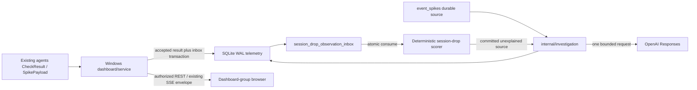

# Implementation Plan: AI Anomaly Investigation (013)

**Branch**: `013-ai-anomaly-investigation` | **Date**: 2026-09-27 | **Spec**: [spec.md](./spec.md)
**Input**: Revised specification, Phase 0 research, OpenAI Responses structured-output/create/data-controls guidance, and Constitution 1.0.0.

## Summary

Add an opt-in, centrally owned reasoning investigator for confirmed durable evtspike sources and eligible deterministic lower-tail session-drop anomalies. It creates one immutable, evidence-persisted attempt and sends at most one stateless OpenAI Responses request. It retains only validated bounded `anomaly_investigation_v1` results and closed local provenance; model text is untrusted escaped plain text that is never executed or treated as authorization.

The Windows dashboard/service, current JSON/DPAPI configuration flow, SQLite WAL store, dashboard-session REST APIs, and established SSE broker receive additive v4 support. Agents, `CheckResult`, `SpikePayload`, notifications, CLI, PowerShell, installer, drain control, remediation, and existing detector semantics remain unchanged.

## Technical Context

| Concern | Binding decision |
|---|---|
| Runtime | Go 1.26.2; every new Go source file carries `//go:build windows`; Svelte 5 with Vite 8. |
| Provider | Dedicated direct `net/http` transport only: `POST https://api.openai.com/v1/responses`, TLS 1.2+ validation, redirects disabled, `Proxy:nil` (never `ProxyFromEnvironment`), fixed `gpt-6-astra`, `Content-Type`/`Accept: application/json`, `Accept-Encoding: gzip`, and exactly one bearer header. No SDK, proxy credentials/configuration/custom endpoint/model, fallback, retry, URL credential/query/fragment, or organization/project header. |
| Request | `store:false`, `background:false`, `stream:false`, `max_output_tokens:8192`, `reasoning:{"effort":"high"}`, `truncation:"disabled"`, `parallel_tool_calls:false`, `tool_choice:"none"`, `tools:[]`; no conversation, previous response, polling, summary, encrypted reasoning, or tool/web/file/MCP/code/computer/shell capability. |
| Bounds | Evidence ≤8,000 UTF-8 bytes; complete compact request ≤16,384; request/response headers ≤16,384; decompressed 2xx JSON body ≤32,768; discard non-2xx body ≤4,096. Facts `F001`–`F134`: 3 mandatory, ≤61 local, ≤61 fleet, ≤9 omissions. |
| Authority | Dashboard-group sessions are sole provider administrators/operators. Agents and machine routes are provider-blind. LocalSystem is the supported service identity. Authorization uses only an existing login-time session and its stored group snapshot against the atomically current configured group; it performs no live directory-membership lookup. A `Dashboard.Group` change invalidates every session and closes every SSE stream, requiring reauthentication. |
| Throughput and retention | One worker; a transactional global maximum of 100 queued-plus-running attempts across all sources, checked before evidence or attempt insertion for manual/retry/automatic roots (`429 queue_full` for interactive requests; zero automatic work); a separate fixed retained cap of 100 attempts per source for every root/retry including local insufficiency (`409 attempt_limit_reached` thereafter); 10 sends/minute, burst two; and a 30-second complete-request deadline. Queue claim sets only `running` and `started_at_ms`. Immediately before `Client.Do`, the worker atomically commits `send_authorized_at_ms` with a 30-second send lease; after local HTTP return, it atomically commits `send_completed_at_ms`, clears the send lease, and sets the fixed two-minute same-process finalization lease. Authorization means a transmission MAY have begun, never provider receipt, and permanently forbids automatic resend.
| Verification | Unit/transport/store/browser boundaries, including a trigger-body migration test through `internal/telemetry/schema.go`, decrypt-for-send plaintext-lifetime tests, closed acknowledgement-object/append-only-audit/reference tests, session acceptance-time and normal-training readiness tests, durable-inbox crash/restart tests, and a real-browser synthetic route/SSE fixture in `frontend/dev/mock-api.js`. Proxy isolation exercises the production-owned `http.Transport` and provider-client wiring with `Proxy:nil`: hostile `HTTP_PROXY`/`HTTPS_PROXY`/`NO_PROXY` listeners receive zero connections while an injected recording/failing `DialContext` or resolver observes only `api.openai.com:443`. Keep that test separate from fake-`RoundTripper` synthetic-response tests. Lifecycle tests inject crashes immediately after authorization persistence and after the transport returns; recovery proves no resend or result/provenance reconstruction. Auth/SSE tests prove stale group snapshots and `Dashboard.Group` changes invalidate sessions and close streams. |

## Security, Consent, and Deployment Boundary

The encrypted OpenAI key lives only in long-lived root `Config`/`config.json`, protected using the existing machine-scope DPAPI/atomic-write flow. It is never a plaintext field in `Config`, `ServiceConfig`, `DashboardConfig`, `RemoteSettings`, worker/closure state, DTOs, APIs, logs, SQLite, SSE, or browser state. `internal/investigation` owns a narrow decrypt-for-send accessor: it runs all enabled/acknowledgement/credential configuration checks before DPAPI decrypt; decrypts only into temporary bytes; constructs the request and Authorization header; then zeroes and releases every temporary plaintext buffer before invoking response processing. It neither returns nor caches plaintext. Settings `PUT` always contains exactly one command: `preserve`, `replace` with a non-empty key, or `clear`; null/missing/empty/unknown/conflicting commands fail closed.

Provider access and automatic investigation default false. Enablement requires the closed server-verifiable acknowledgement object with `version:"openai_responses_privacy_v1"` and exactly these eight true Boolean clauses: `third_party_subprocessors`, `no_training_without_opt_in`, `default_abuse_monitoring_up_to_30_days`, `store_false_application_state_only`, `temporary_prompt_cache_possible`, `zdr_mam_separate_approval`, `audit_days_local_only`, and `global_endpoint_no_regional_guarantee`. Unknown, missing, non-Boolean, false, or differently versioned clauses reject enablement. SQLite `investigation_privacy_acknowledgements` is append-only and records `id`, fixed version, authenticated actor, `accepted_at_ms`, and `clause_set_hash` (or a fixed complete-clause marker). Validate every clause, append the immutable audit row first, then atomically write config’s current version and `privacy_acknowledgement_audit_id`; config failure may leave an unreferenced harmless audit. `acknowledged` derives true only when that exact version and referenced ID match an audit row. Migration, rollback, or rewrite clears/invalidates version and ID. Retention deletes unreferenced audit rows older than `AuditDays`, never the current referenced row. GET returns only safe version/derived `acknowledged`, not clauses, audit, or ID. The clauses cover third-party subprocessors, no training without opt-in, up-to-30-day default abuse monitoring, the application-state-only scope of `store:false`, possible temporary prompt cache, separately approved ZDR/MAM, local-only `AuditDays`, and no global-endpoint regional guarantee.

Source, customer, user, and session identities, and arbitrary or nonfixed URLs, are forbidden from investigation evidence, results, attempts, provenance, and diagnostics. The consent audit alone MAY retain the authenticated actor for local accountability; closed provenance alone MAY retain the fixed literal OpenAI endpoint as a local constant. Those exceptions never egress and remain ACL- and `AuditDays`-governed.

Update `README.md`, `CLAUDE.md`, `docs/guide.html`, `internal/dashboard/openapi.yaml`, quickstart material, and contracts with that consent copy, no-action handling, LocalSystem, machine-scope DPAPI ownership, dashboard-group administration, outbound TLS/firewall allowlist only for `https://api.openai.com`, and explicit provision/rotate (`replace`)/preserve/clear procedures. No user-profile key, agent key, plaintext env/registry key, alternative endpoint, or inferred ZDR/MAM support exists.

## Architecture and Ownership



1. `internal/dashboard/store.go` accepts registered-host results through `ServerState.Update`; its `telemetry.ServerStore.Update` transaction persists `servers.last_result_json` and the idempotent session-drop observation inbox row together. HTTP intake and `internal/svc/check.go` retain that shared path without changing the agent wire/audit contract. The post-commit callback only wakes the detector; it is never the observation's correctness handoff.
2. `session_drop_observation_inbox` has `accepted_sequence INTEGER PRIMARY KEY AUTOINCREMENT` as its private global acceptance order and `UNIQUE(canonical_host, report_epoch_ms)` for idempotency. It records `accepted_at_ms` solely as evidence/time, plus source-local offset/date, typed session presence/counts, and freshness/drain/classification context. `internal/sessiondrop` drains strictly by `accepted_sequence` and atomically consumes each row with its watermark/baseline/source updates before deleting or marking it consumed. Startup drains pending rows before accepting newer reports; permanent host removal deletes that host's pending rows in the same removal transaction. `event_spikes` retains its insert/range/notification/`SpikePayload` consumers; source lookup is additive.
3. `internal/investigation` owns eligibility, decrypt-for-send, attempt dedupe/lineage, worker-versus-egress timestamps, bounded same-process terminal-write retry, EvidenceV1, fixed proxy-disabled request/schema, response validation, one worker, and lifecycle policy. `internal/telemetry` owns v4 transactions, inbox persistence/ordered consumption, global admission, retained-source caps, append-only privacy acknowledgement audit, and recovery/retention. Dashboard handlers authorize before source lookup or host projection.
4. Both initial construction and service-loop re-enable paths receive the same stores, inbox consumer/wakeup, worker wiring, startup inbox drain, and cancellation behavior.

## Evidence, Report, and Response Lifecycle

1. An automatic source gets at most one prospective root. A manual root may be created only when none exists; queued/running duplicates return its ID; a completed source gets none. Only failed/insufficient attempts can receive authorized linked retry with a fresh snapshot. Before evidence assembly or attempt/evidence insertion, every manual, retry, and automatic root transaction enforces the global 100 queued-plus-running maximum across all sources: full interactive calls return `429 queue_full`; automatic roots create zero work. Independently, the transaction enforces the fixed 100 retained-attempt cap per source (including an immutable local-insufficiency row), returns `409 attempt_limit_reached` without deleting lineage when full, and preserves complete bounded detail lineage. Predecessor/authorization checks occur before source lookup; expired source is `404 source_not_found` before evidence, row, or provider work.
2. Build a typed `EvidenceV1` object from the field-by-field allowlist, source-relative ±30 minute snapshot-clipped window, and deterministic omissions. It contains no host/FQDN/domain/IP/customer/user/session identity, `changed_by`, source free text, URL/path, Event Log/XML, dump, credential, secret, arbitrary file content, generic map, or raw struct. Select units first, then assign `F001` window, `F002` source, `F003` context, local points, fleet points, omissions. Use source kind/ID only and fleet labels `peer_1`–`peer_60`.
3. Canonicalize EvidenceV1 as compact JSON object bytes. Put those bytes once immediately after literal `EVIDENCE_JSON_V1\n` in the user `input_text`; outer request JSON serialization is the only escape. Do not encode EvidenceV1 as a JSON string inside that input. Trim last fleet, then last local, then empty blocks while recording ordered omission once and reallocating IDs. A valid egress snapshot is `snapshot_kind=available` with strict EvidenceV1 and fact rows. Mandatory evidence/request overflow produces a host-free unavailable snapshot with `snapshot_kind=unavailable`, `canonical_json={}`, SHA-256 of `{}`, and no fact rows; it is local terminal `state=insufficient_evidence`, `terminal_reason=evidence_unavailable`, with no result/provenance and no egress.
4. The compile-time developer instruction calls evidence untrusted, asks for advisory read-only checks, restricts citations to supplied fact IDs, and prohibits execution/action. `check_type` constrains suggested check intent. Do not claim prose can be semantically proven command/remediation-free: every model field is untrusted and the product never executes, routes, auto-links, or authorizes from it.
5. Fixed request top-level order is `model`, `store`, `background`, `stream`, `max_output_tokens`, `reasoning`, `truncation`, `parallel_tool_calls`, `tool_choice`, `tools`, `input`, `text`. `text.format` is strict `anomaly_investigation_v1`, with all properties required and `additionalProperties:false` at every object.
6. The report contains exactly `result_version`, `summary`, `overall_assessment`, `evidence_sufficiency`, `human_review_required`, hypotheses, missing evidence, and `recommended_diagnostic_checks`. This exact key is used in strict schema, Go model, SQLite JSON, REST/SSE projections, frontend, fixtures, and tests. Summary, hypotheses, missing-evidence items, and checks have fixed required text-kind/citation structures; checks have sequential ranks and a read-only `check_type`.
7. Schema patterns and the local validator enforce every prose field as trimmed printable ASCII (`0x20`–`0x7e`) with U+0020 as its only whitespace, byte limits of summary 1,280, hypothesis/check 960, and missing evidence 640, and no `/`, `\\`, `<`, `>`, `@`, backtick, CR/LF/tab. Reject duplicate keys/trailing data/schema failure; invalid citation/rank/cross-field relationships; non-ASCII/control/format/surrogate/private/unassigned characters; IPv4/IPv6 literals; credentials; and case-insensitive ASCII-normalized substring containment of excluded-identity canaries. Canary checks are not equality-only and do not claim detection of invented identifiers absent from evidence/canaries.
8. A 2xx response must be JSON identity/gzip, bounded after decompression, duplicate-key-free, and trailing-data-free. Accept only `status=completed`, `error=null`, and `incomplete_details` present and null, with one completed assistant message and one `output_text`. Missing, non-null, or wrongly typed `incomplete_details`, tools/functions/MCP/search/code/computer/shell, parse/schema/semantic/text/output failures, and non-JSON 2xx map to `response_invalid`; reasoning is ignored only with no requested summary. Refusal maps `provider_refused`; incomplete maps `response_incomplete`. A 2xx `status=failed` or non-null error maps `upstream_error`; discard all provider messages/codes. For non-2xx, use HTTP status alone: 3xx `redirect_refused`; 400/404/409/422 `provider_request_rejected`; 401/403 `authentication_failed`; 413 `request_limit`; 429 `provider_rate_limited`; other statuses `upstream_error`.
9. A provider-valid insufficient result has `state=insufficient_evidence`, empty terminal reason, validated result, and provenance. Other valid reports are `completed`. The provider contract and provenance contain only fixed profile, the fixed literal OpenAI endpoint, requested model, format/store flags, internal `send_authorized_at_ms`/`send_completed_at_ms`, request/response counts, and `validation_outcome`; `request_started`, `request_completed`, and every other send-lifecycle alias are forbidden. `response_body_bytes` is the decompressed bounded JSON body count. No identities, arbitrary URL, response ID, returned model, headers, usage, reasoning, raw body/error/refusal text, or provider metadata is retained. REST renders lifecycle timestamps as RFC3339 `created_at`, `started_at`, `send_authorized_at`, `send_completed_at`, and `completed_at`, while SQLite/internal names retain `_ms`.
10. FR-006 commits attempt/source/lineage/snapshot only before worker processing or send. Pre-send commit failure emits a local storage diagnostic and has zero egress (FR-013); if later writable, terminal failure may be persisted without sending. `started_at_ms` means worker or cancellation processing began; a running row may have no send timestamps. A queue claim sets only `running` and `started_at_ms`, with no lease. Immediately before `Client.Do`, atomically commit `send_authorized_at_ms` and the 30-second `send_lease_expires_at_ms`; authorization means a provider transmission MAY have begun and, once non-null, prohibits automatic resend forever, but does not prove provider receipt. After the local HTTP exchange returns, atomically commit `send_completed_at_ms`, clear the send lease, and set the two-minute `finalization_lease_expires_at_ms`. Local insufficiency, configuration cancellation, and request-limit cancellation terminalize with neither send timestamp. Retention protects the applicable active lease only, and recovery terminalizes a running row only once no applicable lease remains active: null authorization becomes `failed/interrupted`; non-null authorization without a durable terminal becomes `failed/storage_unavailable`. Recovery never reconstructs a result/provenance or resends.

## SQLite, Session-Drop, API, and SSE Contracts

SQLite v4 is additive under existing WAL/serial-writer ownership. `internal/telemetry/schema.go` replaces the semicolon splitter for versioned migration scripts with one SQLite `tx.Exec` per complete migration script, so each v4 `CREATE TRIGGER ... BEGIN ...; ...; END` body reaches SQLite intact and the migration transaction remains atomic. `investigation_attempts` holds stable source kind/ID, ordered lineage, internal lifecycle/timestamps (`created_at_ms`, `started_at_ms`, nullable `send_authorized_at_ms`/`send_completed_at_ms`, `completed_at_ms`, `send_lease_expires_at_ms`, and `finalization_lease_expires_at_ms`), explicit snapshot kind/canonical bytes/hash/facts, validated report or safe failure, and closed provenance only. REST exposes exactly RFC3339 `created_at`, `started_at`, `send_authorized_at`, `send_completed_at`, and `completed_at`, never `_ms`. Attempts have no canonical host, credential, identity, arbitrary URL, raw provider body, provider metadata, durable post-send recovery result, transmission-receipt claim, or resend mechanism. `session_drop_observation_inbox` is written atomically with the accepted server result and is durable until consumed; it declares `accepted_sequence INTEGER PRIMARY KEY AUTOINCREMENT` and `UNIQUE(canonical_host, report_epoch_ms)`, draining strictly by sequence rather than `accepted_at_ms`.

`session_drop_anomalies` keeps deterministic canonical host and baseline/confirmation/drain/freshness/classification eligibility, including central acceptance times `confirmation_started_at_ms` and `confirmation_ended_at_ms` distinct from report-epoch fields. Detail projects those two persisted central times exactly. Baseline/observation/candidate/cooldown state is host keyed and separate; every baseline records `last_normal_trained_at_ms`, updated only by an eligible normal-training update. All-hours readiness derives its 24-hour span only from `first_trained_at_ms` through `last_normal_trained_at_ms`, never a decay, score, report, candidate, drain, or confirmation timestamp. Only permanent host removal clears that state and its pending inbox rows transactionally; transient, offline, and unregistered states do not.

`internal/dashboard/auth_prod.go` adds a feature-only `requireInvestigationDashboardSession` middleware path for all investigation settings, status, history, detail, create, retry, and investigation SSE registrations. It validates an extant dashboard session and checks its stored login-time `Groups` snapshot against the atomically current `Dashboard.Group` before handlers, broker subscription, source lookup, evidence assembly, attempt creation, detail disclosure, or host resolution. It writes only `401 {"error":{"code":"session_expired"}}` for absent/expired sessions and `403 {"error":{"code":"access_denied"}}` for group denial; the existing `requireSession`, `RequireGroup`, and old route responses remain unchanged. It does not query live directory membership: external changes apply on logout, session expiry, or reauthentication. Machine routes expose no provider configuration/attempts. On `Dashboard.Group` configuration change, the successful config update invalidates all sessions and closes all broker subscriptions.

Before shared `/api/v1/events` subscribes and on every periodic stream check, `internal/dashboard/sse.go` applies the same session-snapshot/current-group predicate. It closes on absence, expiry, stale snapshot, or group change. Investigation SSE data stays host-free; the broker remains one literal `data:` envelope line with no named `event:` field. Session-drop list/detail uses exact decimal IDs/cursors, closed objects, `next_before:null` on exhaustion, `baseline_model_version`, and exact detail projection of `confirmation_started_at_ms`/`confirmation_ended_at_ms` as central acceptance times distinct from report epochs. The list has no attempt summary. Detail always includes complete retained immutable attempt summaries, capped at 100 by the source transaction limit; every attempt lifecycle timestamp is RFC3339 `created_at`, `started_at`, `send_authorized_at`, `send_completed_at`, or `completed_at`, never an `_ms` REST alias. OpenAPI fixes this inclusion decision, canonical terminal-reason enum, and exact authorization, query validation, and error rules. Preserve evtspike routes and tolerant unknown SSE-event behavior.

Frontend investigation settings, status, history, detail, create/retry state, and SSE-derived updates exist only in the live Svelte state in `frontend/src/lib/state.svelte.js` and component state. They MUST NOT be written to or restored from `localStorage`, `sessionStorage`, IndexedDB, cookies, persisted server state, health payloads, analytics/events, or any other browser/server persistence; reload starts from fresh authorized API reads and SSE. Panels separate observed facts, omissions, lifecycle/failure/insufficiency, and model text. Text is only Svelte interpolation/escaped text nodes; the exact adjacent labels are `Untrusted model hypothesis` and `Untrusted model-suggested diagnostic check`. No report-derived action control exists.

## Delivery Phases

1. **Configuration and durable contract**: Config DTO/safe views, closed acknowledgement object, append-only `investigation_privacy_acknowledgements`, audit-first/config-reference atomic protocol, version/ID rollback invalidation, unreferenced-audit retention, DPAPI decrypt-for-send accessor with configuration checks before decrypt and plaintext zero/release before response processing, explicit credential commands; v4 DDL/retention, trigger-safe whole-script transactional migration execution in `internal/telemetry/schema.go`, available/unavailable snapshots, global queued/running admission before evidence insertion, per-source retained cap, sequential authorization/send and post-return finalization leases with recovery-before-prune, cutoff/hash-valid claim, and bounded terminal-write retry.
2. **Preserve deterministic detection**: Transactional `servers.last_result_json` plus durable inbox write with private global `accepted_sequence INTEGER PRIMARY KEY AUTOINCREMENT` and `UNIQUE(canonical_host, report_epoch_ms)`, strict sequence drain, isolated baseline/gap/drain/eligibility behavior, callback-as-wakeup only, atomic inbox consumption with watermark/baseline/source updates, startup drain before newer reports, persisted central confirmation acceptance times, `last_normal_trained_at_ms` readiness semantics, and permanent-removal-only detector/inbox cleanup.
3. **Bounded investigator**: Evidence object/canonicalization/trimming, strict available/unavailable snapshot forms, report schema/local validator, fixed proxy-disabled client, completed-envelope/status mapping, canonical terminal reasons, worker-versus-egress timestamp lifecycle, queue claim without a lease, authorization immediately before `Client.Do` with the send lease, post-return send completion with the finalization lease, authorization-before-`Client.Do` no-resend invariant, exact `send_authorized_at_ms`/`send_completed_at_ms` provider/provenance fields, RFC3339 `created_at`, `started_at`, `send_authorized_at`, `send_completed_at`, and `completed_at` REST/OpenAPI fields, sequential 30-second send/two-minute finalization lease recovery, and storage-failure split.
4. **Dashboard contract**: `internal/dashboard/auth_prod.go` feature-only session/group/error middleware and registrations for settings/status/history/detail/create/retry/SSE; shared `/api/v1/events` session-snapshot/current-group authorization and periodic revalidation; invalidation of all sessions and broker streams on `Dashboard.Group` change; session-only settings/status/history/actions; OpenAPI, exact host projection/SSE behavior, escaped untrusted UI labels, in-memory-only frontend investigation state, and the `frontend/dev/mock-api.js` real-browser fixture.
5. **Operator material and verification**: Update named docs/contracts/quickstart and execute boundary, service, browser, and repository checks.

## Required Acceptance Coverage

- Evidence/request tests prove field allowlist, `F001`–`F134` allocation/reallocation, omission trimming, object canonicalization appended once after `EVIDENCE_JSON_V1\n`, both limits, valid available snapshots, unavailable `{}` snapshots with SHA-256 of `{}` and no fact rows, and zero-egress local insufficient evidence.
- Validator tests prove exact `recommended_diagnostic_checks`, ASCII/trim/space/punctuation limits, IPv4/IPv6 rejection, normalized substring canary rejection, structural/citation/rank checks, completed response requires present-null `incomplete_details`, and clarify no semantic-command-classification assertion.
- Transport tests prove fixed endpoint/headers/literals/order, and separately prove proxy isolation through the actual production-owned `http.Transport` and provider-client wiring: with `Proxy:nil`, hostile `HTTP_PROXY`/`HTTPS_PROXY`/`NO_PROXY` local listeners receive zero connections while an injected recording/failing `DialContext` or resolver prevents external I/O and records only `api.openai.com:443` as the attempted dial target. Fake-`RoundTripper` tests remain limited to synthetic response scenarios. They also prove one send, redirect/TLS/timeout/compression limits, JSON/non-JSON 2xx handling, 2xx failed/error `upstream_error`, status-only non-2xx mapping, raw discard, and decompressed provenance byte count.
- Lifecycle/store tests prove ten-delivery dedupe, authorization-before-work, transactional global 100 queued-plus-running admission before evidence/attempt insertion for manual/retry/automatic roots, `429 queue_full` for full interactive calls and zero automatic work, and separate per-source retained 100-cap `409 attempt_limit_reached` including local insufficiency. They prove pre-send zero egress/storage diagnostic; local/provider insufficient distinction; `started_at_ms` is worker/cancellation processing rather than egress; a queue claim sets only running and `started_at_ms`; running rows can have no send timestamps; authorization and the 30-second send lease commit immediately before `Client.Do`; `send_authorized_at_ms` forbids resend and never proves receipt; after transport returns, `send_completed_at_ms` commits, the send lease clears, and the two-minute finalization lease begins; retention protects only the applicable active lease; recovery terminalizes only once no applicable lease remains active; and storage-finalization failure neither resends nor retains raw provider data.
- Durable-inbox/session-drop tests prove the `servers.last_result_json` acceptance transaction inserts one idempotent `(canonical_host, report_epoch_ms)` observation with `accepted_sequence INTEGER PRIMARY KEY AUTOINCREMENT`, acceptance time, local-date/offset, typed sessions, freshness, drain, and classification context; callback-only wakeup; strict `accepted_sequence` drain independent of `accepted_at_ms`; atomic consume plus watermark/baseline/source changes; crash after acceptance commit before wakeup; startup drain exactly once before newer acceptance; and permanent-removal inbox cleanup. They also prove permanent-removal-only clearing with a second-host isolation control; `confirmation_started_at_ms` and `confirmation_ended_at_ms` persist central acceptance times and project exactly in detail, separately from report epochs; all-hours readiness uses only `first_trained_at_ms` through `last_normal_trained_at_ms`, which eligible normal training alone updates; exact decimal pagination/detail/nullability/baseline model version; no list attempt summary and complete capped retained summaries only in detail.
- Credential/consent tests prove the sole closed acknowledgement object: exact version, all eight exact named clauses true, rejection of unknown/missing/non-Boolean/false clauses and other versions; append-only `investigation_privacy_acknowledgements` rows with ID/version/actor/time/clause-set marker; audit-first then atomic config reference; derived acknowledgement only for exact current-version/referenced-row matches; config failure’s harmless unreferenced audit; migration/rollback/rewrite ID and version invalidation; unreferenced-only `AuditDays` deletion; and safe GET without clauses, audit, or ID. They also prove every PUT credential command and decrypt-for-send ordering: failed configuration checks invoke no decrypt; successful sends return/cache no plaintext; identities and arbitrary/nonfixed URLs never enter investigation evidence/results/attempts/provenance/diagnostics; and only the ACL/AuditDays-governed local consent actor and fixed provenance endpoint exceptions remain, without egress.
- Auth/SSE/browser tests prove the feature-only `requireInvestigationDashboardSession` returns only common 401 `session_expired`, 403 `access_denied`, and nested error bodies without changing existing routes; it accepts only an extant session whose stored login-time group snapshot includes the atomically current configured group; it performs no live directory lookup; stale snapshots fail; and a `Dashboard.Group` change invalidates all sessions and closes shared/investigation streams before any further event. They prove only authorized REST source/list/detail resolve hosts, host-free investigation SSE, the established literal SSE envelope, and escaped UI.
- Quickstart tests seed acknowledgement using an approved old-version flow, prove migration clears it, and exercise post-transport SQLite terminal-write failure both before process exit and across restart. Installed default-disabled no-network service/dashboard smoke and final repository gates complete verification. The requirements checklist explicitly accepts intentional binding platform, API, and security contracts and rejects only incidental implementation details.

## Rejected Alternatives

- **Attempt summaries in the session-drop list**: rejected; they provide a second, potentially incomplete lineage surface. The list has no attempt summary, while detail always carries the complete retained immutable summaries.
- **Named/host-bearing investigation SSE**: rejected; the broker remains one literal `data:` envelope line, with no `event:` line and no host in investigation data.
- **Proxy inheritance or proxy support**: rejected; `Proxy:nil` forbids hostile environment routing and v1 has no proxy credentials or configuration.
- **Volatile or timestamp-ordered accepted-report handoff**: rejected; post-commit callbacks and in-memory queues can lose an accepted observation on crash, while `accepted_at_ms` is evidence/time rather than an order. The SQLite inbox is committed with `servers.last_result_json`, uniquely deduped by `(canonical_host, report_epoch_ms)`, and atomically drained strictly by private `accepted_sequence`.
- **Live directory lookup or connection-time-only shared-event authorization**: rejected; authorization compares the login-time stored group snapshot to the atomically current configured group before subscription and periodically. External directory changes apply on logout, expiry, or reauthentication; `Dashboard.Group` changes invalidate sessions and close streams.
- **Placeholder evidence facts**: rejected; local insufficiency persists only the closed host-free unavailable `{}` snapshot, never fabricated facts.
- **Evicting/counting only nonterminal attempts for the source cap**: rejected; every retained root/retry, including local insufficiency, counts toward the fixed 100 so detail lineage remains complete and bounded.
- **Late or non-queued/running global admission**: rejected; the global 100 limit must be transactional before evidence/attempt insertion, include exactly queued-plus-running attempts across sources, return `429 queue_full` interactively, and create zero automatic work when full.
- **Open, mutable, or unreferenced consent as acknowledgement**: rejected; enablement accepts only the closed all-true object; audit history is append-only, and acknowledgement derives only from the exact config version plus referenced audit ID.
- **Calling binding platform/API/security contracts incidental detail**: rejected; those constraints are intentional, reviewable product requirements, while the checklist excludes only incidental implementation detail.

## Project Structure

```text
config.go                                      # EDIT: encrypted settings, acknowledgement version/reference ID, command semantics
internal/investigation/                        # NEW: evidence, validator, decrypt-for-send client, capped lifecycle/worker
internal/sessiondrop/                          # NEW: lower-tail scorer plus strict sequence-ordered durable-inbox drain
internal/telemetry/schema.go                   # EDIT: additive SQLite v4 (exact lifecycle/lease fields, sequence inbox, acknowledgement audit) and trigger-safe whole-migration execution
internal/telemetry/schema_test.go              # EDIT: executes trigger-body migration atomically
internal/telemetry/investigation_attempts.go   # NEW: host-free attempts, exact send-authorized/send-completed lifecycle, global/per-source admission, active-lease recovery, snapshots, results, provenance
internal/telemetry/investigation_privacy_acknowledgements.go # NEW: append-only local-actor consent audit and unreferenced-row retention
internal/telemetry/session_drops.go            # NEW: deterministic source/detector store, sequence-ordered inbox consume, timestamp projections
internal/telemetry/servers.go                  # EDIT: atomically persist accepted last_result and idempotent sequence-assigned inbox row
internal/telemetry/retention.go                # EDIT: lease-protected recovery-before-deletion, attempt retention, unreferenced acknowledgement-audit retention
internal/telemetry/event_spikes.go             # EDIT: additive source lookup
internal/telemetry/exclusions.go               # EDIT: permanent-removal detector/inbox cleanup
internal/dashboard/store.go                    # EDIT: pass typed accepted-report context and wake inbox consumer only after commit
internal/dashboard/session.go                  # EDIT: invalidate every login-time session on dashboard-group change
internal/dashboard/auth_prod.go                # EDIT: feature-only session-snapshot/current-group middleware
internal/dashboard/sse.go, broker.go           # EDIT: authorize/recheck snapshot/current group and close all streams on group change
internal/dashboard/handlers_settings.go        # EDIT: detect successful Dashboard.Group change and invalidate sessions/streams
internal/dashboard/                            # EDIT/NEW: investigation handlers, projections, SSE/OpenAPI registration
internal/dashboard/openapi.yaml                # EDIT: exact REST/session-drop contracts
internal/svc/service_loop.go                   # EDIT: identical startup/re-enable wiring and startup inbox drain
internal/svc/check.go                          # EDIT only through existing accepted-report path
frontend/src/lib/state.svelte.js               # EDIT: transient investigation state only, never browser/server persistence
frontend/src/                                  # EDIT/NEW: safe API/SSE/UI panels
frontend/dev/mock-api.js                       # EDIT: real-browser synthetic settings/status/history/detail/create/retry/session-drop/SSE fixture
README.md, CLAUDE.md, docs/guide.html          # EDIT: service/key/firewall/consent operation guidance
```

**Structure decision**: One Windows service/dashboard, `internal/investigation` for the sensitive fixed provider boundary, `internal/sessiondrop` for independent deterministic state, and existing SQLite ownership are less complex than spreading egress/lifecycle through handlers or adding another service/database.

## Constitution Re-check

**Pass, with evidence**:

- **I Windows-First Delivery**: New Go sources are Windows build-tagged; the plan names service/dashboard behavior and explicitly leaves CLI, PowerShell, installer, agent, and `cmd/cshared` unchanged.
- **II Stable Operator Surfaces**: Existing public routes/contracts stay intact; additive JSON/config, SQLite v4, authorized REST/SSE, and explicit migration/rollback behavior prevent silent surface drift.
- **III Tests and Zero-Noise Verification**: The acceptance matrix requires isolated validator/unit tests and transport, SQLite, browser, service, and compatibility boundaries, followed by `go test ./...`, `just lint`, and pre-commit.
- **IV Config and Release Discipline**: The current JSON atomic-write/machine-scope DPAPI flow is extended rather than replaced; v4 is additive, retention/ownership/rollback are explicit, and no release-version artifact changes.
- **V Operational Observability**: Safe durable attempt/session-drop diagnostics, authorized status/list/detail, storage diagnostics, and durable-write-before-SSE supply inspection without raw provider content.
- **Additional Constraints/Workflow**: Concrete packages and `README.md`, `CLAUDE.md`, `docs/guide.html`, quickstart/contracts, and `internal/dashboard/openapi.yaml` are named; LocalSystem, DPAPI, dashboard group, firewall egress, retention, and concurrent-write ownership are defined. Complexity is justified above. No constitutional exception is requested.
