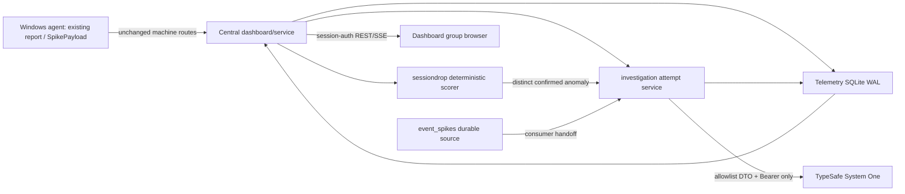
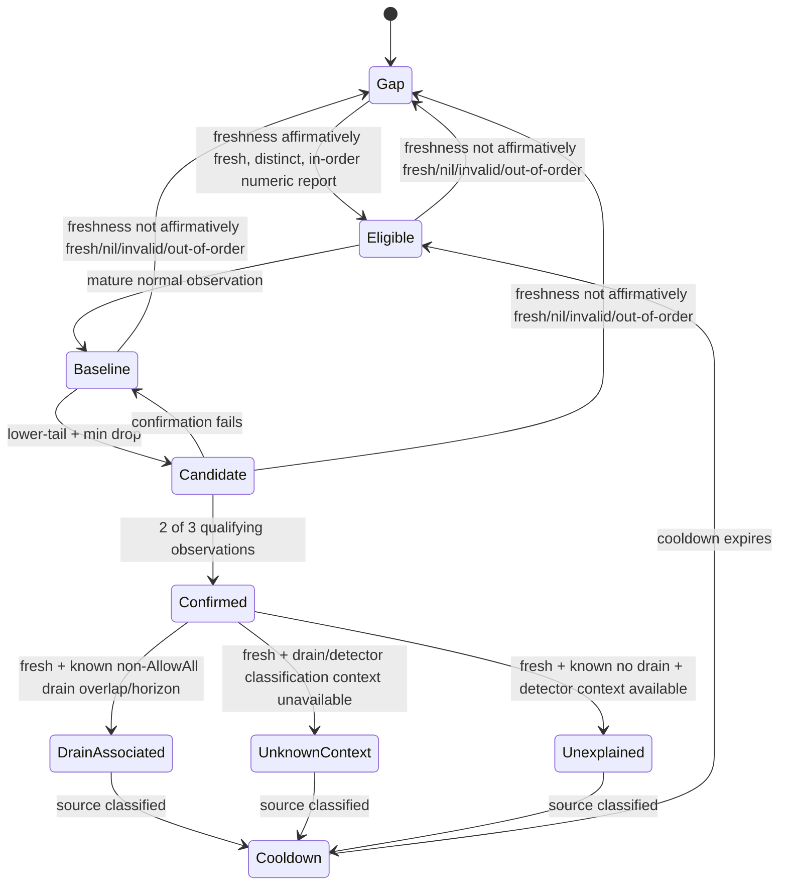

# Implementation Plan: AI Anomaly Investigation (013)

**Branch**: `013-ai-anomaly-investigation` | **Date**: 2026-09-26 | **Spec**: [spec.md](./spec.md)
**Input**: Clarified feature specification, repository architecture, TypeSafe System One OpenAPI, and TypeSafe privacy policy.

## Summary

Add an opt-in, centrally owned investigation service that records a bounded, sanitized snapshot for confirmed durable evtspike events and new deterministic lower-tail session-drop anomalies, sends one authenticated request per immutable attempt to the sole `typesafe_jev` System One endpoint, and displays only strict typed hypotheses and safe failure state.

**Approach in one sentence:** extend the existing Windows dashboard/service, JSON/DPAPI configuration, SQLite WAL store, authenticated dashboard APIs, and SSE broker with additive schema-v4 stores, a single bounded investigation worker, and a separate deterministic session-drop detector—without changing agents, `SpikePayload`, report payloads, notifications, drain control, or remediation.

## Technical Context

| Concern | Decision |
|---|---|
| Language/runtime | Go 1.26.2, every new Go source file guarded by `//go:build windows`; Svelte 5 with Vite 8 for the dashboard. |
| Existing dependencies | `modernc.org/sqlite` SQLite WAL telemetry database, existing DPAPI config helpers, existing dashboard session/SSPI authorization and SSE broker. No provider SDK or new binary. |
| Provider | Direct `net/http` JSON POST only to `https://api.typesafe.ai/v1/systemone`; normal TLS 1.2+ validation; mandatory `Authorization: Bearer <credential>`. No configurable endpoint, redirects, query, fragment, or second provider. |
| Storage | Existing `config.json` through current atomic/scoped update flow; existing SQLite telemetry DB receives additive schema v4 records. |
| Target | Central Windows dashboard/service is the only provider caller and scorer. Dashboard-group browser sessions are the only interactive authority. Agents and machine-account routes remain provider-blind. |
| Throughput bounds | One worker; at most 100 queued/running attempts; 10 requests/minute with burst 2; 30-second request timeout; one wire transmission per attempt. |
| Egress bounds | Versioned allowlist evidence with `snapshot_at_ms >= source_time_ms` and the exact window `from_ms = source_time_ms - 30m`, `to_ms = min(source_time_ms + 30m, snapshot_at_ms)` (maximum span 60 minutes); System One state <=8,000 UTF-8 bytes; request <=16 KiB; response headers <=16 KiB; decompressed body <=32 KiB; discarded error body <=4 KiB. |
| Detector bounds | Each host owns 96 local-time slots plus one all-hours fallback trained only by that host; slot readiness is seven distinct eligible local days, all-hours readiness is at least 20 eligible normal observations spanning at least 24 hours, with decayed baselines, lower-tail probability default `1e-4`, minimum loss 3 and 30%, 2-of-3 confirmation, and 60-minute host cooldown. |
| Verification | Go unit tests for pure validation/detector logic; injected-transport backend provider integration tests at the fixed URL; a real-browser provider-fixture surface using the production frontend, an in-process dashboard harness, and an injected fixed-URL `RoundTripper`; and a separate actual installed Windows service/dashboard smoke with no real key or network. Then run `go test ./...`, `just lint`, and configured pre-commit checks with no bypasses/warnings. |

## Evidence and Decision Record

| Decision | Evidence | Planned result / rejected alternative |
|---|---|---|
| Keep all provider work central | The specification assigns configuration, evidence assembly, calls, attempts, and lower-tail scoring to the dashboard/service; `/api/v1/config` is a machine route. | The dashboard process owns the worker and stores. Adding agent credentials/calls would breach the trust boundary and alter agents. |
| Use TypeSafe System One directly | The authoritative OpenAPI defines Bearer-authenticated POST `/v1/systemone`, typed choice/score/noul answers, and no idempotency header. | Build one `net/http` client with a fixed URL. An SDK, custom endpoint, generic LLM, or retrying transport adds egress behavior and is rejected. |
| Persist before sending; never silently retry | The provider offers no idempotency header and the spec requires one wire transmission per attempt. | Create evidence and queued attempt transactionally before send; transition to running before exactly one POST. Network, timeout, rate-limit, auth, and upstream failures are terminal. Only an operator creates a linked retry. |
| Use a strict, DTO-first privacy boundary | Canonical registered host identity remains required in durable deterministic source records (`event_spikes` and session drops) and may be displayed only to an authenticated dashboard-group operator; the provider boundary allowlists only anonymous evidence, not identifiers, prose, raw structures, Event Log content, paths, URLs, credentials, or files. TypeSafe's privacy policy says API Input is collected, may be processed in the US/through providers, is not used to train/fine-tune, and has no fixed public retention term. | Field-by-field evidence substitutes `source`/`peer_n`; typed response decoder, persisted sanitized evidence/result/provenance, provider errors, and diagnostics never duplicate the hostname. Sending existing report JSON, `AuditRecord`, maps, or logs is rejected. |
| Reuse SQLite WAL and retention worker | `internal/telemetry/schema.go` is currently schema v3; `Retention` already performs chunked deletes and maintenance over WAL. | Add v4 tables/indexes and deletion by `created_at`/`AuditDays`; a separate DB, JSON file, or browser store would split durability/retention and is rejected. |
| Keep lower-tail detection independent | `event_spikes` persists confirmed upper-tail events; `SpikePayload` and `/api/v1/spike` are agent contracts. `TotalSessions` is already retained from accepted reports. | New `internal/sessiondrop` identity, store, API and SSE events. Reusing `SpikePayload`, treating nil as zero, or making the provider determine drops is rejected. |
| Preserve existing config secrecy | `config.go` has DPAPI secret conventions and dashboard setting views redact notification secrets with `has_secret`. | Store provider credential as write-only DPAPI data with preserve/replace/clear semantics; expose its safe view only through dedicated dashboard-session investigation routes. Plaintext configuration, dashboard echoing, shared settings projection, or agent config projection is rejected. |

## Constitution Check — Pre-design

| Gate | Plan | Result |
|---|---|---|
| I. Windows-First Delivery | `config.go`, telemetry, dashboard, investigation, and session-drop additions execute only in the Windows service/dashboard. Every new Go file, including tests where applicable, carries `//go:build windows`. Root package: config only; `cmd/drainctl`, `cmd/cshared`, and PowerShell commands: intentionally unchanged; Windows service/dashboard: updated; installer: intentionally unchanged because no new binary, privilege, or artifact; dashboard: updated. | PASS |
| II. Stable Operator Surfaces | Add authenticated session-only investigation/status/config APIs and additive SSE/API types. Config gains an opt-in provider/session-drop block; existing report, `SpikePayload`, evtspike endpoints, notification triggers, CLI/DLL/PowerShell automation output, and agent config remain unchanged. Existing installs default disabled; older readers ignore new records. | PASS |
| III. Tests and Zero-Noise Verification | Plan requires unit and cross-boundary tests, including injected-transport backend provider integration at the fixed URL, a production-frontend real-browser provider-fixture harness, and a separate actual zero-network installed Windows service/dashboard smoke, plus final `go test ./...`, `just lint`, and repository pre-commit checks, all clean. Tests cover egress boundary, persistent lifecycle/recovery, authorization, SQLite, detector transitions, APIs/SSE, compatibility, and unchanged operations. | PASS |
| IV. Config and Release Discipline | Provider/session-drop settings remain in `config.json` using existing atomic DPAPI/scoped-update machinery. SQLite v4 is additive; no hand-maintained version, release artifact, installer, or config subsystem is introduced. Upgrade/rollback rules are defined below. | PASS |
| V. Operational Observability | Durable attempt history, safe provider state, typed status/results, structured diagnostics, maintenance result, APIs, and SSE expose every feature outcome without raw evidence, secrets, or provider prose. | PASS |

## Architecture and Ownership Flow



1. `internal/dashboard/store.go` is the common accepted-report seam: after a successful registered-host `Update` persists the existing `CheckResult`, it invokes one new accepted-report callback with the canonical host, typed result, accepted timestamp, and existing freshness/order/drain context. Both HTTP `handleReport` and local `internal/svc/check.go` already enter through this method, so neither path gets a second scorer and `CheckResult` and every report wire/audit contract remain unchanged.
2. `internal/telemetry/event_spikes.go` owns only bounded durable evtspike storage and source-by-ID lookup, while preserving `Insert`, `Recent`, and `Range`. `internal/dashboard/interfaces.go` exposes that lookup to consumers. Dashboard/investigation consumption receives the durable ID and stable source kind/ID, deduplicates automatic root work by that identity, and never changes evtspike detection, notification, `SpikePayload`, agent posting, or existing consumers.
3. `internal/investigation` owns source eligibility, deterministic evidence assembly, automatic-root orchestration, attempt creation/recovery/worker scheduling, strict provider request/response handling, and lifecycle policy. Its source resolver uses source-by-ID interfaces; source/list/detail handlers authorize first, then resolve canonical host from the linked deterministic `event_spikes` or `session_drop_anomalies` row. A post-commit `unexplained` session-drop handoff invokes automatic-root orchestration only when automatic mode is enabled; it deduplicates by source identity and performs zero attempt work for disabled or ineligible sources. Attempts retain only stable source kind/ID. `internal/telemetry` owns durable records and transactions. Dashboard handlers are authorization/projection layers, not provider callers.
4. `internal/svc/service_loop.go` constructs and starts the dashboard investigation dependencies on both real dashboard paths: initial `dashCfg.Enabled` startup and a later config-reload re-enable after a disabled runtime. Both paths receive the same telemetry stores and callback wiring; disabling stops the runtime without losing durable rows.
5. Dashboard-group session authorization is checked before detailed reads, manual request, retry, or dedicated provider settings/status routes. Machine-account routes—including `GET /api/v1/config`—get no provider configuration, investigation data, or action route.

### Provider and evidence lifecycle

1. Default configuration is disabled. Enabling provider access requires persisted acknowledgement of third-party processing, US/service-provider processing, non-training/non-fine-tuning of API Input, no fixed external retention period, and lack of DrainCtl deletion control. Automatic investigation is a separate false-by-default switch.
2. An automatic source creates at most one prospective root attempt. An authorized manual request may create a root only when no attempt exists; queued/running duplicates return its ID; a completed source creates none. A failed or insufficient attempt alone permits one explicit linked retry with a fresh snapshot. For a retry, authorization and predecessor lookup occur before source lookup; if the deterministic source row has expired, return `404 source_not_found` before evidence assembly, new-attempt creation, or provider work, and never reuse stale evidence.
3. In one SQLite transaction, write only stable source kind/ID, initiation type, `queued` row, retry predecessor (if any), and serialized sanitized evidence. Attempt creation does not copy canonical host; authorized source/list/detail handlers resolve it from the linked deterministic source row. Missing retained facts use their applicable closed evidence omission enum. Missing required evidence becomes `insufficient_evidence` when durable storage is available; it never triggers broad data gathering.
4. The worker claims a queued row under the single-worker policy, validates current configuration immediately before first send, marks it `running`, and emits safe status. Invalid/disabled configuration cancels unsent queued work; it never sends.
5. The builder serializes only its versioned field-by-field DTO in this order: anonymized source facts; freshness/drain/detector status; local aggregates; anonymous fleet aggregates. It substitutes the source host with `source` and peers with `peer_n`; the canonical hostname is never in System One `state`, an attempt row, the persisted sanitized evidence snapshot, or a provider artifact. Channels are recognized codes or `custom_channel`. It requires `snapshot_at_ms >= source_time_ms`, records `from_ms = source_time_ms - 30m` and `to_ms = min(source_time_ms + 30m, snapshot_at_ms)`, and truncates state/fields in deterministic order, recording only the closed omission enum, until all byte limits hold.
6. The direct client refuses non-fixed URL/redirect behavior, bounds headers/body while reading, and performs exactly one POST. Only a valid decoded provider response persists closed local provenance: `provider_profile=typesafe_jev`, `requested_model=jev-latest`, request timing/byte counts, and `validation_outcome=accepted|insufficient_evidence`. Rejected, malformed, failed, and local pre-send insufficient outcomes have no provenance row. The provider response `model` is untrusted bounded input used only to validate response shape, then discarded; it is never persisted, logged, projected, or included in provenance.
7. The strict decoder accepts only the four required typed answers: likely cause enum, impact enum, sufficiency enum, and human-review enum, with validated bounded probability/confidence and safe reason enums. A valid response is terminal `completed` or `insufficient_evidence`; malformed, oversized, unavailable, auth, timeout, limit, or storage failure is `failed` with a safe reason. All UI text calls every classification a hypothesis; insufficient results suppress cause/impact conclusions.
8. On startup, recovery marks every durable `running` attempt `failed/interrupted`; it may resume queued attempts only after the same current-config validation. It never resends running work.

### Session-drop state machine



- A successful `TotalSessions == 0` is numeric and valid. Only affirmative `fresh` freshness permits scoring or classification. Nil enumeration, invalid input, duplicate/out-of-order accepted reports, and stale, missing, or otherwise unknown freshness are gaps: they break confirmation, do not update baseline, and create no anomaly. They never become zero or `unknown_context`. A duplicate accepted report records the exact gap enum `duplicate_report_epoch`.
- Each eligible source-local observation maps to one of its host's 96 slots; use its mature slot or its own mature all-hours fallback. A slot requires seven distinct eligible local days; the fallback requires at least 20 eligible normal observations spanning at least 24 hours. The score is lower-tail only and additionally requires the default minimum absolute and relative loss from the last eligible observation.
- Candidate and confirmed values never train or lower the baseline. For a confirmed observation with affirmative `fresh` freshness, a known non-`AllowAll` drain overlap, or one confirmation horizon after known drain end, takes precedence and classifies the source as `drain_associated`. Only when drain or other detector-classification context is unavailable does that fresh observation classify as `unknown_context`; it is not investigation-eligible. With known no-drain context and available detector classification, it is `unexplained` and investigation-eligible.
- Permanent removal uses `internal/telemetry/exclusions.go`'s existing atomic tombstone transaction and additionally clears that host's session-drop baseline, observation/order, candidate, and cooldown state in the same cleanup boundary. It does not erase retained source/attempt audit history; on later restore/re-registration the host starts a fresh deterministic baseline.

## SQLite v4, Retention, Rollback, and Concurrency

**Schema/migration.** Extend `internal/telemetry/schema.go` from v3 to v4 with additive `CREATE TABLE IF NOT EXISTS` DDL and indexes, inside the existing `applySchema` transaction. Add focused stores, not dashboard-owned SQL:

- `investigation_attempts`: immutable stable source kind/ID, ordered attempt number, initiation, optional predecessor, lifecycle timestamps/state, sanitized evidence/version/omissions, typed result or safe failure, and closed local provenance only for a valid decoded provider response (`provider_profile=typesafe_jev`, `requested_model=jev-latest`, request timing/byte counts, `validation_outcome=accepted|insufficient_evidence`). Rejected, malformed, failed, and local pre-send insufficient outcomes have no provenance row. It contains no canonical host or provider-controlled model/version. Evidence/result/provenance and provider error/diagnostic fields must never duplicate the hostname; uniqueness enforces one root and ordered retry lineage.
- `session_drop_anomalies`: durable lower-tail source identity including canonical registered host, timing, baseline/confirmation facts, drain/freshness context, classification, and provider eligibility; host-keyed identity prevents duplicate event creation and supports authorized list/detail lookup.
- `session_drop_baselines` (canonical host/slot plus that host's all-hours fallback state) and minimal observation/order/cooldown state needed for restart-safe exactly-once scoring and confirmation. These records are detector state, not external evidence.

Use typed columns and bounded JSON only for the versioned sanitized DTO/typed safe arrays; no generic maps, raw reports, provider-bound hostname, provider body, or credential. Canonical host remains only in deterministic source records/baselines and is resolved after authorization for authenticated dashboard-group source/list/detail projections; it is never copied into attempts or browser-local durable state. Add indexes for source kind/ID lookup/dedupe, nonterminal worker queue order, attempt history, expiry by `created_at`, and session-drop host/time lookup. The exact schema design must retain all and only fields needed by the stated UI/provenance/query contracts.

**Retention.** Extend the existing retention pass with chunked deletes for full attempt lineage (evidence, result, provenance) where `created_at < now - AuditDays`; delete dependent rows atomically or in foreign-key-safe order. Its retention anchor is attempt creation, not source event time; source `event_spikes`, metrics, audits, and existing retention windows remain unchanged. Independently delete session-drop source rows in chunks where `detected_at < now - AuditDays`; this must not delete session-drop baselines, observation/order, candidate, or cooldown state, which persist until permanent host removal. Report affected-row count and safe failure through `maintenance_jobs`/diagnostics; keep WAL checkpoint and incremental vacuum behavior unchanged.

**Concurrency and crash behavior.** SQLite remains the authoritative serial writer under WAL; normal readers use snapshots. Attempt creation/dedupe and root/retry eligibility are transactional. The one worker claims FIFO queued work transactionally, retaining at most 100 nonterminal rows. Persist evidence before changing to running; storage failure means zero egress and a structured local diagnostic (durable failure only when writing becomes possible). A durable terminal row is never overwritten. Report intake scores each distinct in-order accepted report under per-host transactional ordering/state; concurrent requests cannot score or confirm a report twice. Startup recovery transitions only running rows to `failed/interrupted`, then considers queued rows; it cannot cause retransmission.

**Upgrade, mixed version, and rollback.** Existing v1–v3 tables/data/config stay readable. New service initializes v4 additively and records unavailable pre-upgrade evidence context only as `pre_upgrade_context`, rather than backfilling. New browser receives additive REST/SSE data; old browsers ignore unfamiliar event types and retain existing pages. Old agents retain existing report and spike routes because neither contract changes. An older binary may ignore v4 records and, if it rewrites `config.json`, may drop unknown provider fields; it preserves pre-existing known config/data. After re-upgrade, provider access stays disabled until valid provider fields and the acknowledgement are restored. Downgrade neither deletes v4 tables nor sends/queues provider work; no migration reverses or rewrites retained v4 rows.

## API, UI, and Compatibility

- Preserve existing `GET/PUT /api/v1/settings` and their `handleGetSettings` projection unchanged. Add dedicated dashboard-session-only `GET/PUT /api/v1/investigation/settings` for the safe provider/session-drop settings view and credential preserve/replace/clear command, plus `GET /api/v1/investigation/status` for provider operational status. Every provider-settings `PUT` requires an explicit `preserve`, `replace`, or `clear` credential command; omission is invalid and preserve is never implicit. These routes alone expose profile identifier/fixed endpoint metadata, access acknowledgement and enabled booleans, automatic-enabled boolean, session-drop validated settings, operational state, and `has_credential`; never add provider fields to `GET /api/v1/settings` or machine `GET /api/v1/config`.
- Add session-authenticated handlers for investigation source history/detail; create manual investigation; and retry a failed/insufficient attempt. Authorization and predecessor lookup precede source lookup; an expired deterministic source returns `404 source_not_found` before evidence build, row creation, or provider work. Attempt history/detail responses expose stable source kind/ID only; authorized source, session-drop list, and source-detail handlers resolve and may display canonical registered host from the linked durable source row. Provider evidence/result/provenance and browser-local durable state must not contain it.
- Add distinct session-drop list/detail API and SSE types, plus investigation attempt/status SSE types. Authenticated deterministic source/list/detail projections may resolve canonical host after authorization; attempt/SSE/provider artifact payloads use stable source kind/ID only. Keep `server_update`, `detector_status`, `recent_spike`, `/api/v1/report`, `/api/v1/spike`, and existing evtspike REST shapes untouched. Document every additive route/schema/event in `internal/dashboard/openapi.yaml`.
- `frontend/src/lib/api.js` adds typed fetch wrappers and safe request DTOs for the dedicated investigation settings/status routes; `state.svelte.js` owns bounded in-memory attempt/session-drop view state and SSE reducers; and `frontend/src/App.svelte`'s actual `EventSource` dispatcher routes the new investigation/session-drop SSE event types into those reducers. `ServerDetail.svelte` shows authorized observed deterministic facts separately from host-free hypothesis/history. `ConfigModal.svelte` provides acknowledged provider controls and write-only credential UX backed only by the dedicated routes. New focused investigation/session-drop panels render the exact evidence/dashboard omission enum, failed, and insufficient states without recommendations/actions; expose manual root creation only for an allowed source with no prior attempt; expose retry only for failed/insufficient attempts when current eligibility/state permits; and render safe route errors without mutating local state.
- No notification target, trigger, webhook/email/ntfy payload, CLI command/output, `cmd/cshared` API, PowerShell command, installer action, agent configuration, or `SpikePayload`/`CheckResult` field is added or changed. No direct provider action is available to machine accounts.

## Observability Contract

| Signal/surface | What it proves | Sensitive-data rule |
|---|---|---|
| Provider status API/config panel | Disabled, configured/ready, automatic enabled, degraded, or failing; `has_credential`; safe latest reason | No credential, canonical host, raw evidence, response, provider prose, or excluded identifiers. |
| Durable attempt history/detail | Stable source kind/ID, state/timestamps, initiation/retry lineage, evidence version/omission summary, strict typed hypothesis, and closed local provenance | Dashboard-group session only; provenance is exactly `provider_profile=typesafe_jev`, `requested_model=jev-latest`, request timing/byte counts, and `validation_outcome=accepted|insufficient_evidence`; no provider-controlled model/version, canonical host, or insufficient cause/impact conclusion. |
| Session-drop source/list/detail API | Canonical registered host resolved after authorization from the durable source row, durable source ID, deterministic anomaly, classification, eligibility, candidate/confirmation and drain context | Dashboard-group session only; source identity is distinct from attempts, provider evidence, and results; no notification. |
| Investigation/SSE broker events | Queued/running/terminal updates and configuration/degradation changes | Additive types; stable source kind/ID and safe reason/counts only—never canonical host, evidence, result/provenance, or provider diagnostics. |
| Structured service diagnostics | Storage-before-egress failure, validation/transport/limit failures, queue/rate limiting, detector gaps | Reason/category/count and stable source kind/ID only; no canonical host, credentials, raw bodies, free text, provider evidence/result/provenance, or error payload. Existing operational telemetry/audit/dashboard host identity remains unchanged. |
| Retention maintenance record | Investigation rows purged and failed maintenance state | Aggregate rows/reason only. |
| Existing dashboard/evtspike/freshness/drain surfaces | Deterministic detection and operations continue while investigation is disabled/degraded | No provider-derived state changes to them. |

## Delivery Phases

1. **Configuration, contracts, and schema v4**
   - Add validated opt-in provider/session-drop config, acknowledgement and DPAPI write-only projection through dedicated dashboard-session investigation settings routes; leave existing settings and agent projections unchanged.
   - Add v4 migration, investigation/session-drop stores, source/attempt/result data types, source-by-ID lookup interfaces, indexes, attempt and independent session-drop-source retention, restart recovery, and permanent-removal-only baseline-state cleanup.
2. **Deterministic session-drop detection**
   - Add the one accepted-report callback in `internal/dashboard/store.go`, preserving `CheckResult`, so the existing HTTP and local service report paths score each successfully persisted report exactly once.
   - Implement restart-safe baseline/order/confirmation/cooldown persistence; treat non-fresh, missing, or unknown freshness as no-anomaly gaps, then for affirmatively fresh confirmed observations classify known drain first, unavailable drain or other detector-classification context as `unknown_context`, and remaining eligible sources as `unexplained`; publish durable additive dashboard/SSE data, and hand off only post-commit unexplained sources to the investigation automatic-root owner when automatic mode is enabled; keep disabled and ineligible sources at zero attempt work.
3. **Bounded investigation worker**
   - Wire both `internal/svc/service_loop.go` dashboard construction paths (initial enabled startup and config-reload re-enable) to the same stores, source consumers, callback, and worker lifecycle.
   - Implement source dedupe/retry lifecycle including authorization/predecessor-first missing-source `404`, field-by-field allowlist builder, byte enforcement, fixed TypeSafe client, strict decoder and provider-model discard, single-worker rate limit, cancellation/recovery, and safe diagnostics.
4. **Dashboard operator surface**
   - Add dedicated session-only investigation settings/status, history, and action handlers/OpenAPI/broker; reject provider-settings `PUT` without an explicit credential command; update frontend API/state/config/server detail panels and `App.svelte`'s actual SSE dispatch; make immutable histories and hypothesis/insufficiency distinctions clear, with eligibility/state-gated manual creation and failed/insufficient retry actions plus safe route errors.
5. **Documentation and verification**
   - Update `README.md`, `docs/guide.html`, and `CHRONICLE.md` with opt-in setup, acknowledgement/privacy boundary, write-only credential handling, no-remediation limitation, diagnostic/retention behavior, downgrade recovery, and session-drop semantics.
   - Execute the required unit/boundary/mixed-version coverage, injected-`RoundTripper` backend provider integration coverage, real-browser provider-fixture coverage using the production frontend and in-process dashboard harness, and the separate actual zero-network installed Windows service/dashboard smoke, then the final repository quality gates.

## Required Acceptance Coverage

- Evidence builder table tests prove ordered deterministic use of only `pre_upgrade_context`, `retention_expired`, `freshness_unavailable`, `drain_unavailable`, `detector_unavailable`, `local_points`, `fleet_points`, `local_aggregate`, and `fleet_aggregate`; require `snapshot_at_ms >= source_time_ms`; prove the exact window `from_ms = source_time_ms - 30m`, `to_ms = min(source_time_ms + 30m, snapshot_at_ms)` and its 60-minute maximum; and cover all byte limits, canonical-host substitution with `source`/`peer_n`, forbidden-category absence, known/custom channel substitution, and separate mandatory Bearer-header handling.
- Injected-`RoundTripper` provider integration tests at the fixed `https://api.typesafe.ai/v1/systemone` URL prove completed and authorized manual lifecycles plus safe provider-failure lifecycles, including fixed URL/TLS/redirect rejection, exact one-send rule, timeout, rate limit, authentication error, malformed/prose/unsupported enum, oversized headers/body/error body, strict typed answer/probability/confidence validation, and zero canonical-host/raw persistence in sanitized evidence, result, provenance, provider errors, and diagnostics. Provider `model` echo canaries containing a credential, host/IP, URL/path, and prose prove shape validation followed by discard from persistence, logs, projections, and provenance. They inject only at the provider-client boundary.
- Attempt-store/lifecycle tests cover automatic dedupe over ten evtspike redeliveries, source-by-ID resolution while preserving `EventSpikeStore.Insert`/`Recent`/`Range`, manual authorization-before-create, retry authorization/predecessor-first missing-source `404`, stable source kind/ID-only attempt creation with no canonical-host column or value, terminal immutability, retry eligibility/lineage, queue cap/rate behavior, current-config cancellation, storage-before-egress failure, restart interruption, AuditDays expiry, and WAL reader/writer contention.
- Session-drop matrix tests cover canonical-host-keyed persistence/query and baseline isolation as well as normal/mature scoring, each host's all-hours fallback readiness, valid zero, nil/invalid/stale/missing/unknown-freshness/out-of-order gaps that break confirmation, do not train or score, and create no anomaly, exact `duplicate_report_epoch` handling for duplicate reports, threshold/minimum-loss/2-of-3/cooldown, candidate/confirmed baseline exclusion, known drain overlap/post-drain-horizon precedence, `unknown_context` only for affirmatively fresh confirmed observations with unavailable drain or detector-classification context, restart state, independent chunked source deletion by `detected_at`/AuditDays with baseline state retained, permanent-removal baseline cleanup, post-commit automatic-root handoff for unexplained sources with dedupe, and zero attempt work for disabled or ineligible sources.
- Dashboard/service integration tests cover the common post-commit accepted-report callback from both HTTP and local report paths without changing `CheckResult`; both initial and config-reload dashboard construction paths; dedicated investigation settings/status route explicit credential-command omission rejection and safe read/write/clear/preserve DPAPI semantics; dashboard-group authorization; authorized source/list/detail canonical-host resolution from linked deterministic source rows; host-free attempt rows/evidence/result/provenance/diagnostics/SSE/browser-durable state; unchanged shared `GET /api/v1/settings` projection; and explicit absence of all provider fields from machine `GET /api/v1/config`. They also cover history/detail/API/OpenAPI/SSE serialization, `App.svelte` dispatch into state reducers, and the canonical provenance enum.
- Real-browser provider-fixture validation uses the production frontend against an in-process dashboard harness whose fixed `https://api.typesafe.ai/v1/systemone` client is intercepted by an injected `RoundTripper`. It is distinct from backend provider integration and installed smoke, and visibly exercises allowed manual creation, live attempt SSE, completed hypothesis rendering, provider/local insufficiency, human-review suppression, failure rendering, and permitted retry.
- Actual installed Windows service/dashboard smoke uses no real credential, no network request, and no injected `RoundTripper` or transport. It proves default-disabled provider behavior, deterministic source creation, authenticated REST/SSE/UI visibility, clear/restart behavior, and unchanged existing evtspike/report, notification, drain, freshness, and ordinary dashboard operations. Final completion runs `go test ./...`, `just lint`, and pre-commit checks.

## Project Structure

### Documentation

```text
specs/013-ai-anomaly-investigation/
├── spec.md
├── plan.md
├── research.md
├── data-model.md
├── quickstart.md
├── contracts/
│   ├── dashboard-investigations.md
│   ├── provider-evidence.md
│   └── session-drop-events.md
└── tasks.md

README.md                         # operator setup and boundaries
CHRONICLE.md                      # durable implementation lessons/constraints
docs/guide.html                   # dashboard provider/session-drop operating guide
```

### Source and tests

```text
config.go                         # EDIT: investigation/session-drop config, validation, DPAPI semantics
internal/
├── investigation/                # NEW: Windows-tagged allowlist, typed result, fixed client, worker/lifecycle
│   ├── evidence.go
│   ├── provider.go
│   ├── attempts.go
│   ├── worker.go
│   └── *_test.go
├── sessiondrop/                  # NEW: Windows-tagged lower-tail baseline, scorer, confirmation state
│   ├── detector.go
│   ├── baseline.go
│   ├── status.go
│   └── *_test.go
├── telemetry/
│   ├── schema.go                 # EDIT: additive schema v4
│   ├── event_spikes.go           # EDIT: preserve Insert/Recent/Range; add durable source-by-ID lookup
│   ├── exclusions.go             # EDIT: permanent-removal cleanup of session-drop baseline state
│   ├── investigation_attempts.go # NEW: attempt/evidence/result/provenance store
│   ├── session_drops.go          # NEW: anomaly and detector-state stores
│   ├── retention.go              # EDIT: AuditDays attempt cleanup
│   └── *_test.go                 # EDIT/NEW: source lookup, baseline cleanup, retention, store lifecycle
├── dashboard/
│   ├── server.go                 # EDIT: construct/wire owners and routes
│   ├── store.go                  # EDIT: shared post-commit accepted-report callback for HTTP/local paths
│   ├── interfaces.go             # EDIT: consumer-side event-spike source-by-ID interface
│   ├── subsystem_windows.go      # EDIT: central lifecycle/wiring
│   ├── handlers_investigations.go # NEW: dedicated session-only investigation settings/status/history/action handlers
│   ├── handlers_sessiondrop.go   # NEW: session-drop handlers
│   ├── broker.go                 # EDIT: additive safe SSE types
│   ├── openapi.yaml              # EDIT: additive session API/SSE contracts
│   └── *_test.go                 # EDIT/NEW: authorization, callback, REST/SSE integration
└── svc/
    ├── service_loop.go           # EDIT: initial and config-reload dashboard construction/wiring
    ├── check.go                  # EDIT only to invoke existing shared acceptance path; report shape unchanged
    └── *_test.go                 # EDIT/NEW: both dashboard construction paths and no-network smoke fixtures
frontend/src/
├── App.svelte                    # EDIT: actual EventSource dispatch for investigation/session-drop events
├── lib/api.js                    # EDIT: safe investigation/session-drop API wrappers
├── lib/state.svelte.js           # EDIT: bounded view state and SSE reducers
└── components/
    ├── ServerDetail.svelte       # EDIT: source facts and investigation entry/history
    ├── ConfigModal.svelte        # EDIT: acknowledged provider/write-only credential controls
    ├── InvestigationPanel.svelte # NEW: typed hypothesis/lifecycle panel
    └── SessionDropPanel.svelte   # NEW: deterministic lower-tail panel
```

**Structure decision:** retain the single Windows service/dashboard architecture. The two focused packages isolate the two independent state machines; stores remain in `internal/telemetry`; dashboard handlers/broker only project already-owned central data. There are no new commands, binaries, SDKs, databases, background services, or installer components.

## Constitution Check — Post-design Re-check

All five gates remain **PASS**. The concrete design uses Windows build tags; names every touched and intentionally untouched delivery surface; adds only backward-compatible config/SQLite/API/SSE records; uses existing JSON, DPAPI, WAL, sessions, and retention; specifies unit and boundary quality gates; and provides durable/operator-visible diagnostics. The new packages/tables are justified below, no release artifact/versioning change is required, and no unresolved design decision remains.

## Complexity Tracking

| Potential complexity | Why needed | Simpler alternative rejected because |
|---|---|---|
| `internal/investigation` | Encapsulates a strict privacy/egress boundary, immutable durable attempt lifecycle, restart-safe queue, and fixed-provider parser apart from HTTP handlers and telemetry SQL. | Embedding this in dashboard handlers would let request paths own provider calls/lifecycle and makes authorization, egress, recovery, and test boundaries inseparable. |
| `internal/sessiondrop` | Separates lower-tail baseline/confirmation/drain semantics from evtspike's upper-tail `SpikePayload` contract and makes it independently testable. | Extending evtspike or using a generic anomaly type would change its semantics/consumer contract and blur nil-vs-zero/deterministic eligibility behavior. |
| Additive SQLite v4 persistence | Required for immutable auditable evidence/results, exactly-once source/attempt behavior, crash recovery, independent retention, and restart-safe detector state. | In-memory queues/baselines or browser storage lose lifecycle/dedupe correctness on restart; a second database adds operational ownership and migration burden. |
