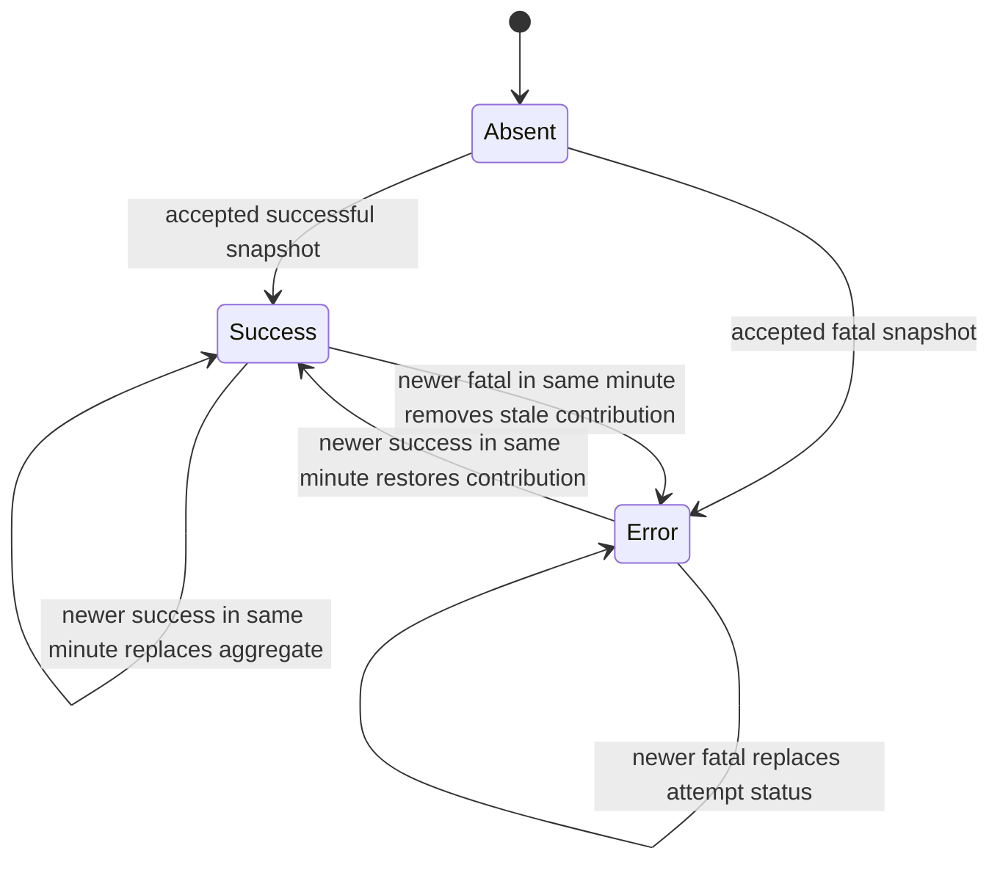

# Data Model: Fleet Session Operator Metrics

## Anonymous Host Workload Aggregate

One row represents one host in one tier bucket. It contains no session or user identity.

| Field | Type | Meaning |
|---|---|---|
| `bucket_ts` | INTEGER | UTC bucket start in Unix milliseconds |
| `canonical_host` | TEXT | Canonical host key used for selected-host filtering |
| `status` | INTEGER | `0=success`, `1=collection_error` |
| `base_sample_count` | INTEGER | Successful base samples represented by this row |
| `successful_empty_count` | INTEGER | Successful base samples with no real user sessions |
| `error_sample_count` | INTEGER | Fatal collection attempts represented by this row |
| `cpu_sum` | REAL | Sum of normalized valid CPU observations |
| `cpu_count` | INTEGER | Count of valid CPU observations |
| `cpu_histogram` | BLOB | Versioned fixed-bin aggregate distribution |
| `cpu_ge_5_sum` | REAL | Sum of concurrent `≥5%` counts across base samples |
| `cpu_ge_20_sum` | REAL | Sum of concurrent `≥20%` counts across base samples |
| `cpu_observed_series` | BLOB | Base-slot CPU denominator counts for exact selected-host concurrency |
| `cpu_ge_5_series` | BLOB | Base-slot `≥5%` counts for exact selected-host maximum |
| `cpu_ge_20_series` | BLOB | Base-slot `≥20%` counts for exact selected-host maximum |
| `memory_sum_bytes` | REAL | Sum of valid working-set observations |
| `memory_count` | INTEGER | Count of valid memory observations |
| `memory_histogram` | BLOB | Versioned sparse logarithmic aggregate distribution |

### Identity boundary

Rows MUST NOT contain username, domain, SID, WTS session ID, station, client address/name, process, action, logon timestamp, or history episode identifier. The host key is retained because host filtering is an explicit fleet telemetry requirement.

## Tables

Three tables share the same aggregate columns and `PRIMARY KEY (canonical_host, bucket_ts)`:

- `session_workload_raw`: one replaceable host contribution per one-minute interval.
- `session_workload_5min`: merge of eligible raw rows for one host/five-minute bucket.
- `session_workload_hourly`: merge of eligible five-minute rows for one host/hour bucket.

Indexes on `bucket_ts` support retention and range scans.

## Ingestion state transitions

A stale or duplicate generation/sequence changes neither current state nor workload rows.

## Eligibility and normalization

For each real user session already admitted by WTS selection:

- CPU: finite non-negative `CPUPercent` and validated logical CPU count; normalize as `CPUPercent / logical_cpu_count`, require result in `0..100`, then add to sum/count/histogram and evaluate `≥5`/`≥20` on the unrounded normalized value.
- Memory: non-null working set in SQLite range; add bytes to sum/count/log histogram.
- Missing values do not increment count.
- Zero values increment count and the zero histogram bucket.
- Connected, active, idle, and disconnected rows are eligible; listener/service pseudo-sessions never enter the snapshot's real-user rows.

## Histogram contracts

### CPU

- 201 bins representing `0, 0.5, ..., 100`.
- Nearest-bin assignment.
- Quantile is nearest-rank: rank `ceil(0.95 * N)`, minimum 1.
- Reconstruction error ≤0.25 percentage point due to quantization.

### Memory

- Dedicated zero count.
- Positive values map to logarithmic index `floor(log(value)/log(1.02))`.
- Sparse `(delta-index, count)` unsigned-varint encoding, ordered by index.
- Representative is the geometric center of the bin.
- Quantile uses nearest-rank over merged counts.
- Representative relative error <2%.

Both blob formats begin with a codec version byte; unknown versions fail the query/rollup rather than return plausible data.

## Fleet Workload Point

A query merges only selected host rows for the resolved tier bucket.

| Field | Derivation |
|---|---|
| CPU AVG | `Σ cpu_sum / Σ cpu_count` |
| CPU P95 | nearest-rank P95 of merged CPU histogram |
| Memory AVG/P95 | corresponding memory sum/count/histogram |
| `≥5`/`≥20` average | `Σ threshold_sum / represented base-slot count` |
| `≥5`/`≥20` max | maximum of the selected hosts' aligned base-slot count vectors |
| threshold rate | average threshold count / average CPU-observed concurrent count |
| contributing hosts | distinct selected hosts with successful coverage in the bucket |
| expected hosts | selected host count supplied by handler |
| error hosts | distinct selected hosts represented only by error coverage |
| unsupported/stale/offline hosts | expected hosts without a successful/error row, classified from registered-host state |

Successful-empty rows increase contributing and successful-empty coverage but not observation counts. If contributing hosts is zero, numeric metrics are absent and the frontend renders a gap.
